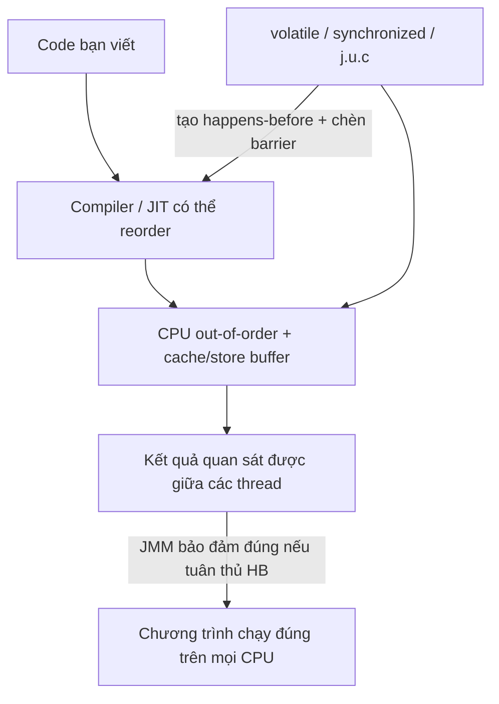

## Mục lục

- [Tổng quan](#tổng-quan)
- [1. JMM là gì](#1-jmm-là-gì)
- [2. Vì sao cần JMM](#2-vì-sao-cần-jmm)
- [Ví dụ đời thường: hai cái bảng trắng](#ví-dụ-đời-thường-hai-cái-bảng-trắng)
- [3. Ba vấn đề cốt lõi](#3-ba-vấn-đề-cốt-lõi)
  - [3.1 Visibility (tính hiển thị)](#31-visibility-tính-hiển-thị)
  - [3.2 Ordering (thứ tự)](#32-ordering-thứ-tự)
  - [3.3 Atomicity (tính nguyên tử)](#33-atomicity-tính-nguyên-tử)
- [4. Mục tiêu thiết kế của JMM](#4-mục-tiêu-thiết-kế-của-jmm)
- [5. Bức tranh tổng thể](#5-bức-tranh-tổng-thể)
- [Tài liệu tham khảo](#tài-liệu-tham-khảo)

---

## Tổng quan

**Java Memory Model (JMM)** là phần đặc tả trong Java Language Specification (JLS)
quy định **cách các thread tương tác với bộ nhớ**: khi nào một thread thấy được
thay đổi của thread khác, lệnh có thể bị sắp xếp lại tới đâu, và thao tác nào là
nguyên tử.

> [!IMPORTANT]
> JMM là "hợp đồng" giữa lập trình viên và JVM/CPU. Nếu bạn tuân thủ đúng các
> quy tắc đồng bộ (volatile, synchronized, java.util.concurrent), JMM bảo đảm
> code chạy đúng trên **mọi** CPU/kiến trúc — bạn không cần quan tâm tới chi tiết
> phần cứng.

## 1. JMM là gì

Trong chương trình đơn luồng, mọi thứ rất trực quan: lệnh chạy lần lượt theo đúng
thứ tự bạn viết. Nhưng khi có nhiều thread, **mỗi thread có thể có bản sao biến
trong cache của CPU/registers**, và compiler/CPU được phép sắp xếp lại lệnh để
chạy nhanh hơn. Hệ quả: một thread có thể **không thấy** thay đổi của thread khác,
hoặc thấy theo thứ tự "lạ".

JMM định nghĩa các quy tắc để kiểm soát những điều này, mà cốt lõi là quan hệ
[happens-before](/jmm/02-happens-before/).

> [!NOTE]
> **Hình dung nhanh**: mỗi CPU core như một nhân viên có **cuốn sổ tay riêng**
> (cache/registers). Họ thường ghi nháp vào sổ tay cho nhanh, thỉnh thoảng mới
> chép lên **bảng chung** (main memory). Nếu không có quy định "khi nào phải chép
> lên bảng và khi nào phải đọc lại từ bảng", hai nhân viên sẽ thấy hai phiên bản
> số liệu khác nhau. JMM chính là bản **quy định** đó.

## 2. Vì sao cần JMM

Hãy xét đoạn code tưởng chừng vô hại sau:

```java
int x = 0;
boolean ready = false;

// Thread 1 (writer)
x = 42;
ready = true;

// Thread 2 (reader)
while (!ready) { /* chờ */ }
System.out.println(x);   // kỳ vọng in 42
```

Trực giác nói rằng khi `ready == true` thì `x` chắc chắn là `42`. Nhưng **không
có JMM guarantee** ở đây vì `x` và `ready` đều là biến thường:

- Thread 2 có thể **không bao giờ** thấy `ready = true` (visibility) → vòng lặp vô hạn.
- Hoặc thấy `ready = true` nhưng `x` vẫn là `0` (do reorder/visibility) → in ra `0`.

JMM tồn tại để cho bạn các công cụ (`volatile`, `synchronized`, ...) biến những
giả định trực giác này thành **bảo đảm chính thức**.

### Chạy thử để thấy bug (đầy đủ, copy chạy được)

```java
public class VisibilityDemo {
    static int x = 0;
    static boolean ready = false;   // KHÔNG volatile → có thể kẹt

    public static void main(String[] args) throws InterruptedException {
        Thread writer = new Thread(() -> {
            x = 42;
            ready = true;           // (A)
        });
        Thread reader = new Thread(() -> {
            while (!ready) { }      // (B) có thể chạy mãi không thoát
            System.out.println(x);  // (C) có thể in 0, có thể in 42
        });
        reader.start();
        writer.start();
        writer.join();
        reader.join();
    }
}
```

> [!WARNING]
> Trên nhiều JVM/CPU (đặc biệt khi bật JIT `-server`), `reader` có thể **treo vô
> hạn** ở dòng (B): nó đọc `ready` từ cache của core nó và **không bao giờ** thấy
> giá trị `true` mà `writer` đã ghi. Đây không phải bug của bạn — đây là điều JMM
> **cho phép** vì `ready` không được đồng bộ. Chỉ cần đổi thành
> `volatile boolean ready` là vòng lặp thoát ngay và `x` chắc chắn in `42`.

**Vì sao có thể in `0`?** Kể cả khi (B) thoát, hai lệnh trong `writer` có thể bị
[reorder](/jmm/03-reordering/) thành `ready = true;` **trước** `x = 42;`. Lúc đó
`reader` thấy `ready == true` nhưng `x` vẫn là `0`:

| Bước | writer | reader | x | ready |
|------|--------|--------|---|-------|
| 1 | `ready = true` (bị đảo lên trước) | | 0 | true |
| 2 | | thấy `ready==true`, thoát vòng lặp | 0 | true |
| 3 | | `print(x)` → **in 0** ❌ | 0 | true |
| 4 | `x = 42` (chạy muộn) | | 42 | true |

## 3. Ba vấn đề cốt lõi

Mọi bug đồng thời liên quan tới bộ nhớ đều quy về ba nhóm sau:

| Vấn đề | Câu hỏi cốt lõi | Công cụ JMM |
|--------|------------------|-------------|
| **Visibility** | Thread B có thấy giá trị mới nhất mà A đã ghi không? | volatile, synchronized, final |
| **Ordering** | Các lệnh có bị sắp xếp lại không? | volatile, synchronized, memory barrier |
| **Atomicity** | Thao tác có bị xen ngang không? | synchronized, CAS/Atomic |

### 3.1 Visibility (tính hiển thị)

Khi thread A ghi vào một biến, thay đổi đó có thể nằm trong cache của core đang
chạy A và **chưa được flush** ra main memory. Thread B chạy ở core khác có thể
vẫn đọc giá trị cũ trong cache của nó.

> [!NOTE]
> Visibility = "thread B có **nhìn thấy** thay đổi của thread A hay không".

### 3.2 Ordering (thứ tự)

Compiler, JIT và CPU được phép **sắp xếp lại** thứ tự lệnh (xem
[Reordering](/jmm/03-reordering/)). Trong một thread điều này vô hại, nhưng giữa
nhiều thread có thể tạo ra kết quả bất ngờ.

### 3.3 Atomicity (tính nguyên tử)

Một thao tác **atomic** hoặc thực hiện trọn vẹn, hoặc không thực hiện gì — không
bị thread khác "xen ngang". Ví dụ `count++` **không** atomic vì gồm 3 bước
(read → +1 → write), nên hai thread có thể ghi đè kết quả của nhau (lost update).

```java
// KHÔNG atomic — gồm 3 bước, dễ mất update
count++;
```

## 4. Mục tiêu thiết kế của JMM

- **Đảm bảo tính nhất quán (consistency)** của dữ liệu khi chạy đa luồng.
- **Đưa ra quy tắc rõ ràng** về visibility, ordering, atomicity giữa các thread.
- **Ẩn đi sự khác biệt phần cứng** (x86, ARM, ...) và compiler optimization — code
  đúng theo JMM sẽ chạy đúng ở mọi nơi.
- **Cân bằng giữa tính đúng đắn và hiệu năng** — không cấm hết reorder (sẽ rất
  chậm), mà chỉ cấm những reorder phá vỡ happens-before.

## 5. Bức tranh tổng thể



> [!TIP]
> Lộ trình học tiếp theo: hiểu [happens-before](/jmm/02-happens-before/) (nền tảng
> của toàn bộ JMM) → [reordering](/jmm/03-reordering/) → [memory barriers](/jmm/04-memory-barriers/)
> → các công cụ cụ thể (`volatile`, `synchronized`, CAS, ...).

## Tài liệu tham khảo

- [JLS — Chapter 17: Threads and Locks](https://docs.oracle.com/javase/specs/jls/se21/html/jls-17.html)
- [JSR-133 (Java Memory Model) FAQ](https://www.cs.umd.edu/~pugh/java/memoryModel/jsr-133-faq.html)
- Tiếp theo: [Happens-before & Program Order](/jmm/02-happens-before/)
