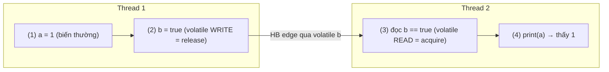

## Mục lục

- [Tổng quan](#tổng-quan)
- [1. Happens-before là gì](#1-happens-before-là-gì)
- [2. Happens-before vs Program Order](#2-happens-before-vs-program-order)
- [3. Ví dụ minh họa](#3-ví-dụ-minh-họa)
- [4. Các HB rules quan trọng](#4-các-hb-rules-quan-trọng)
- [5. Tính bắc cầu (transitivity)](#5-tính-bắc-cầu-transitivity)
- [Tài liệu tham khảo](#tài-liệu-tham-khảo)

---

## Tổng quan

**Happens-before (HB)** là quan hệ thứ tự logic giữa hai hành động (action) A và B.

> [!IMPORTANT]
> Nếu **A happens-before B** thì:
> 1. Mọi thay đổi bộ nhớ mà A thực hiện đều **được B nhìn thấy** (visibility), và
> 2. A được coi là "xảy ra trước" B về mặt quan sát (ordering).

HB là **khái niệm trung tâm của toàn bộ JMM**. Gần như mọi bảo đảm về đồng bộ đều
được phát biểu dưới dạng "X happens-before Y".

> [!NOTE]
> **Hình dung bằng chạy tiếp sức**: HB giống việc **trao gậy** trong chạy tiếp
> sức. Vận động viên A phải hoàn tất phần của mình **rồi mới trao gậy** cho B; B
> chỉ chạy **sau khi** nhận gậy. Nhờ "điểm trao gậy" đó, mọi thứ A làm **chắc chắn**
> đã xong và B nhìn thấy. Nếu **không có** điểm trao gậy (không đồng bộ), hai người
> chạy độc lập — B có thể xuất phát khi A chưa làm gì, hoặc không thấy kết quả của A.

## 1. Happens-before là gì

Điểm cốt lõi cần nhớ: HB **không** có nghĩa "A chạy trước B theo thời gian thực".
Nó có nghĩa: *nếu* A happens-before B thì B **được đảm bảo thấy** kết quả của A.

Ngược lại, nếu giữa hai hành động ở hai thread **không có** quan hệ HB, JMM
**không đảm bảo gì** về thứ tự hay visibility — đó chính là định nghĩa của
[data race](/jmm/08-data-race-vs-race-condition/).

## 2. Happens-before vs Program Order

| Khái niệm | Phạm vi | Ý nghĩa |
|-----------|---------|---------|
| **Program order** | Trong **một** thread | Thứ tự lệnh bạn viết trong code. JMM bảo toàn program order ở mức single-thread (as-if-serial). |
| **Happens-before** | **Giữa các** thread | Thứ tự quan sát được, tạo ra bởi cơ chế đồng bộ (volatile, synchronized, j.u.c). |

Nói cách khác:
- Program order là điều kiện "miễn phí" trong một thread.
- Happens-before giữa hai thread **chỉ tồn tại khi bạn dùng cơ chế đồng bộ**.

## 3. Ví dụ minh họa

```java
// Thread 1
a = 1;        // (1)
b = true;     // (2)

// Thread 2
if (b) {      // (3)
    print(a); // (4)
}
```

Phân tích:

```text
Program order:
  T1: (1) → (2)
  T2: (3) → (4)

Happens-before:
  Nếu b là volatile: (2) HB (3)  → kết hợp program order → (1) HB (4)
                     ⇒ khi (3) thấy b == true thì (4) chắc chắn thấy a == 1.
  Nếu b KHÔNG volatile: không có HB giữa T1 và T2
                     ⇒ (4) có thể in a == 0.
```

> [!TIP]
> Mẹo đọc HB: tìm một **cặp release/acquire** (ví dụ volatile write → volatile
> read trên cùng biến). Cặp đó tạo "cây cầu" HB, rồi dùng program order ở hai đầu
> cầu để suy ra visibility cho các biến thường xung quanh.

Đây là "cây cầu HB" nhìn bằng sơ đồ: biến `b` (volatile) là nhịp cầu, còn biến
thường `a` "quá giang" qua cầu đó:



Khi (3) đọc thấy `b == true`, mọi thứ ghi **trước** (2) ở Thread 1 (gồm cả
`a = 1`) đều được Thread 2 nhìn thấy — đó là ý nghĩa "quá giang qua cầu".

## 4. Các HB rules quan trọng

JMM định nghĩa sẵn một số quan hệ happens-before. Đây là danh sách cần thuộc:

| # | Rule | Phát biểu |
|---|------|-----------|
| 1 | **Program order** | Trong cùng một thread, mỗi hành động HB hành động đứng sau nó trong code. |
| 2 | **Monitor lock** | `unlock` trên một monitor HB mọi `lock` sau đó trên **cùng** monitor. |
| 3 | **Volatile** | Ghi một biến `volatile` HB mọi lần đọc sau đó trên **cùng** biến đó. |
| 4 | **Thread start** | `Thread.start()` HB mọi hành động bên trong thread vừa start. |
| 5 | **Thread join** | Mọi hành động trong một thread HB khi thread khác trở về từ `join()` trên thread đó. |
| 6 | **Thread interrupt** | Lời gọi `interrupt()` HB việc thread bị ngắt phát hiện ra interrupt. |
| 7 | **Finalizer** | Kết thúc constructor của object HB khi `finalize()` của nó bắt đầu. |
| 8 | **Transitivity** | Nếu A HB B và B HB C thì A HB C (xem mục 5). |

> [!NOTE]
> Các tiện ích trong `java.util.concurrent` đều được xây dựng dựa trên các rule
> này (chủ yếu là volatile + lock), nên chúng cũng tạo HB edges — xem
> [Happens-before trong java.util.concurrent](/jmm/11-happens-before-juc/).

## 5. Tính bắc cầu (transitivity)

Đây là tính chất giúp ghép các HB edge nhỏ thành chuỗi dài:

```text
A HB B  và  B HB C   ⇒   A HB C
```

Ví dụ thực tế với cặp volatile:

```java
// Thread 1
data = buildExpensiveObject();  // (A) ghi biến thường
ready = true;                   // (B) volatile write

// Thread 2
if (ready) {                    // (C) volatile read
    use(data);                  // (D) đọc biến thường
}
```

Chuỗi suy luận: `(A) HB (B)` (program order) — `(B) HB (C)` (volatile rule) —
`(C) HB (D)` (program order). Bắc cầu ⇒ `(A) HB (D)` ⇒ `(D)` chắc chắn thấy
`data` đã dựng xong.

## Tài liệu tham khảo

- [JLS 17.4.5 — Happens-before Order](https://docs.oracle.com/javase/specs/jls/se21/html/jls-17.html#jls-17.4.5)
- [JSR-133 FAQ](https://www.cs.umd.edu/~pugh/java/memoryModel/jsr-133-faq.html)
- Trước: [Tổng quan JMM](/jmm/01-tong-quan/)
- Tiếp theo: [Reordering](/jmm/03-reordering/)
