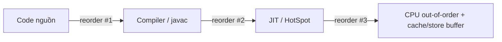

## Mục lục

- [Tổng quan](#tổng-quan)
- [1. Ba nguồn gây reorder](#1-ba-nguồn-gây-reorder)
- [2. Vì sao cần reordering](#2-vì-sao-cần-reordering)
- [3. Khi nào reorder hợp pháp](#3-khi-nào-reorder-hợp-pháp)
- [4. Reorder gây bug như thế nào](#4-reorder-gây-bug-như-thế-nào)
- [5. Chặn reorder](#5-chặn-reorder)
- [Tài liệu tham khảo](#tài-liệu-tham-khảo)

---

## Tổng quan

**Reordering** = thứ tự thực thi **thực tế** của các lệnh khác với thứ tự bạn viết
trong code. Đây không phải lỗi — nó là tối ưu hóa cần thiết để chạy nhanh. Vấn đề
chỉ phát sinh khi reorder bị quan sát bởi thread khác mà không có đồng bộ.

## 1. Ba nguồn gây reorder



| Nguồn | Lý do reorder |
|-------|---------------|
| **Compiler (javac)** | Tối ưu hóa code, gộp/bỏ lệnh thừa, phá phụ thuộc giả, đổi thứ tự không ảnh hưởng logic đơn luồng. |
| **JIT (HotSpot)** | Khi runtime biết nhiều hơn (kiểu biến, nhánh phổ biến) → reorder để chạy nhanh hơn. |
| **CPU (hardware)** | Out-of-order execution: nếu lệnh A chờ dữ liệu từ RAM, CPU chạy lệnh B độc lập trước. Cache/store buffer cũng làm thao tác ghi "trông như" bị reorder từ góc nhìn core khác. |

## 2. Vì sao cần reordering

- Nếu lệnh A phải chờ dữ liệu từ RAM (vài trăm chu kỳ), CPU không "ngồi chờ" mà
  chạy lệnh B độc lập trước → tận dụng pipeline.
- Khi ghi dữ liệu, CPU thường ghi vào **store buffer** trước rồi flush ra RAM sau
  → từ góc nhìn thread khác, thứ tự ghi có thể bị đảo.

> [!NOTE]
> Reorder bản chất là **tốt** (tăng hiệu năng). Nó chỉ nguy hiểm khi tạo ra
> [data race](/jmm/08-data-race-vs-race-condition/) cần được kiểm soát.

## 3. Khi nào reorder hợp pháp

Reorder được phép khi thỏa **cả hai**:

1. **Không đổi kết quả single-thread** — gọi là **as-if-serial semantics**.
2. **Không phá vỡ happens-before** giữa các thread.

> [!IMPORTANT]
> **As-if-serial:** Compiler, JIT và CPU được phép sắp xếp lại lệnh **miễn là**
> kết quả quan sát được **trong một thread đơn** vẫn giống hệt như khi chạy tuần
> tự theo đúng thứ tự code. Nói cách khác, reorder là "vô hình" với chính thread
> đó, nhưng **có thể nhìn thấy** từ thread khác.

## 4. Reorder gây bug như thế nào

```java
// Thread 1
a = 1;        // (1)
flag = true;  // (2)  -- nếu là biến thường, (1) và (2) có thể bị đảo

// Thread 2
if (flag) {   // (3)
    print(a); // (4)  -- có thể in 0 nếu (2) bị đẩy lên trước (1)
}
```

Với một thread, đảo `(1)` và `(2)` không ảnh hưởng gì. Nhưng Thread 2 có thể thấy
`flag == true` **trước khi** `a` được ghi → in `0`. Đây là lý do cần đồng bộ.

## 5. Chặn reorder

Khi bạn dùng các cơ chế sau, JVM sẽ chèn [memory barrier](/jmm/04-memory-barriers/)
để chặn những reorder nguy hiểm:

| Cơ chế | Barrier (tóm tắt) |
|--------|-------------------|
| `volatile` write | `StoreStore` + `StoreLoad` |
| `volatile` read | `LoadLoad` + `LoadStore` |
| `synchronized` unlock | `StoreStore` + `StoreLoad` |
| `synchronized` lock | `LoadLoad` + `LoadStore` |
| `java.util.concurrent` | Đã tích hợp barrier/CAS bên trong |

> [!TIP]
> Bạn **không** tự chèn barrier. Bạn chỉ cần dùng đúng primitive (volatile,
> synchronized, Atomic, Lock...) và JIT lo phần barrier thật phía dưới.

## Tài liệu tham khảo

- [JSR-133 FAQ — Reordering](https://www.cs.umd.edu/~pugh/java/memoryModel/jsr-133-faq.html)
- Trước: [Happens-before](/jmm/02-happens-before/)
- Tiếp theo: [Memory Barriers](/jmm/04-memory-barriers/)
