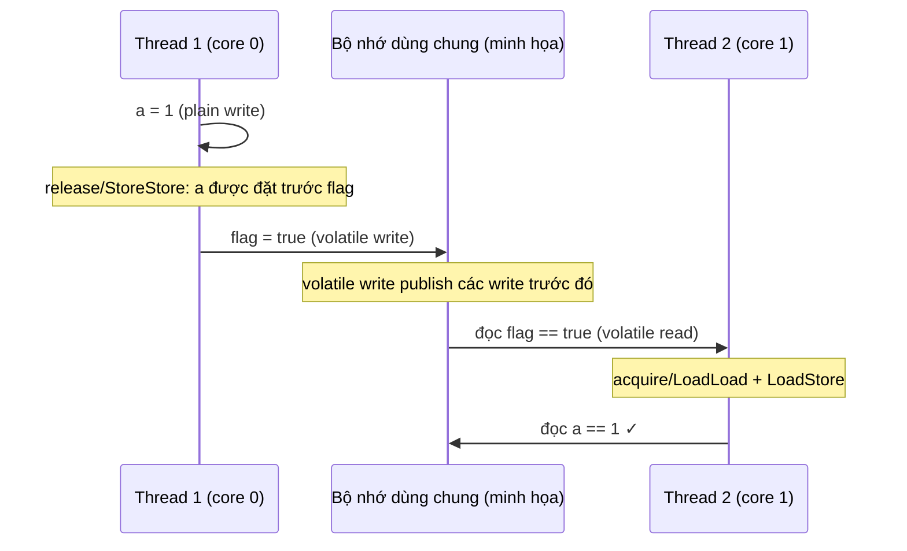

## Mục lục

- [Tổng quan](#tổng-quan)
- [1. Memory barrier là gì](#1-memory-barrier-là-gì)
- [2. Bốn loại barrier](#2-bốn-loại-barrier)
- [3. Barrier trong JMM](#3-barrier-trong-jmm)
- [4. Ví dụ: JMM xử lý volatile](#4-ví-dụ-jmm-xử-lý-volatile)
- [5. Mapping xuống CPU](#5-mapping-xuống-cpu)
- [Tài liệu tham khảo](#tài-liệu-tham-khảo)

---

## Tổng quan

**Memory barrier** (hàng rào bộ nhớ, còn gọi *fence*) là chỉ thị mức thấp ra lệnh
cho CPU/compiler: **"không được sắp xếp lại lệnh qua hàng rào này, và phải đồng bộ
cache tại đây"**.

> [!IMPORTANT]
> Barrier **không làm thay đổi dữ liệu**. Nó chỉ làm 2 việc:
> 1. **Chặn reorder** qua ranh giới barrier.
> 2. **Ép đồng bộ cache** — invalidate cache cũ (đọc lại từ main memory) và flush
>    cache mới (publish ra main memory).

## 1. Memory barrier là gì

Cụ thể, một barrier đảm bảo: mọi thao tác bộ nhớ **trước** barrier phải hoàn thành
và nhìn thấy được **trước khi** thực hiện bất kỳ thao tác bộ nhớ nào **sau** barrier.

> [!NOTE]
> **Hình dung bằng cửa an ninh sân bay**: hành khách (lệnh) bình thường có thể
> chen lấn, vượt nhau cho nhanh. Nhưng tại **cửa kiểm tra an ninh** (barrier),
> mọi người phải xếp hàng đúng thứ tự: ai tới trước phải qua cửa trước, và **không
> ai** được nhảy từ bên này sang bên kia cửa. Barrier chính là cái cửa đó — nó
> không thay đổi hành khách, chỉ ép thứ tự qua cửa và đảm bảo "đã qua thì thấy nhau".

- **Dọn dẹp (invalidate)**: bỏ giá trị cũ trong cache, ép đọc từ main memory.
- **Cập nhật (flush)**: đảm bảo khi đọc xong biến báo hiệu thì các biến liên quan
  cũng đã được load mới nhất.

## 2. Bốn loại barrier

| Barrier | Đảm bảo | Diễn giải |
|---------|---------|-----------|
| `LoadLoad` | Không reorder giữa 2 lệnh load | Đọc A xong mới được đọc B |
| `StoreStore` | Không reorder giữa 2 lệnh store | Ghi A xong mới được ghi B |
| `LoadStore` | Không reorder giữa load → store | Đọc A xong mới được ghi B |
| `StoreLoad` | **Mạnh nhất** — không reorder store → load | Ghi A xong mới được đọc B |

> [!NOTE]
> `StoreLoad` là barrier **đắt nhất** và mạnh nhất. Nó được dùng cho `volatile
> write → read` vì phải đảm bảo store đã publish ra main memory trước khi bất kỳ
> load nào sau đó được phép chạy.

## 3. Barrier trong JMM

JMM **không** định nghĩa barrier trực tiếp. Nhưng khi bạn dùng `volatile`,
`synchronized` hay API đồng bộ, JVM **tự chèn** barrier vào bytecode/machine code:

| Hành động | Barrier được chèn |
|-----------|-------------------|
| Volatile write | `StoreStore` + `StoreLoad` |
| Volatile read | `LoadLoad` + `LoadStore` |
| Unlock monitor | `StoreStore` + `StoreLoad` (release) |
| Lock monitor | `LoadLoad` + `LoadStore` (acquire) |

## 4. Ví dụ: JMM xử lý volatile

Đoạn code minh họa dưới đây giả sử `a` và `flag` là **field dùng chung** của cùng
một object. `volatile` không thể khai báo cho biến local trong một method.

```java
class Example {
    private int a = 0;                    // plain field
    private volatile boolean flag = false; // shared flag

    // Thread 1
    void publish() {
        a = 1;       // normal write
        flag = true; // volatile write
    }

    // Thread 2
    void consume() {
        if (flag) {  // volatile read
            System.out.println(a); // chắc chắn in 1
        }
    }
}
```

Giả sử Thread 1 chỉ ghi `a` và `flag` một lần, Thread 2 chỉ đọc chúng, và Thread 2
đã đọc được `flag == true`. Khi đó JVM có thể được hình dung như sau:

```java
// Thread 1
a = 1;            // normal write
// [StoreStore]   <- các store trước phải đứng trước volatile store
flag = true;      // volatile write (release)
// [StoreLoad]    <- các load sau không được chạy trước volatile write

// Thread 2
if (flag) {       // volatile read (acquire)
    // [LoadLoad]  <- các load sau không được chạy trước volatile read
    // [LoadStore] <- các store sau không được chạy trước volatile read
    print(a);     // đọc a sau khi đã thấy flag == true
}
```

Các barrier trong hình là **mô hình logic** để giải thích semantics; chúng không phải
là các dòng Java mà ta tự chèn, và JVM không nhất thiết phát ra đúng bốn lệnh fence
riêng biệt trên mọi CPU.

### 1. Trước hết, điều gì có thể sai?

Nếu `flag` cũng là biến thường, CPU/compiler có thể làm cho phép ghi `flag = true`
được thread khác quan sát trước khi phép ghi `a = 1` được quan sát. Đây là thứ tự
quan sát có thể xảy ra:

```text
Thread 1:  flag = true  ──đã nhìn thấy──>  Thread 2
           a = 1        ──chưa publish──>
Thread 2:  thấy flag == true, nhưng đọc a == 0
```

Trong source code, `a = 1` được viết trước `flag = true`, nhưng khi không có cơ chế
đồng bộ thì thứ tự viết trong source không đủ để tạo ra thứ tự nhìn thấy giữa hai
thread.

### 2. `StoreStore` trước volatile write làm gì?

`StoreStore` là rào chắn giữa **store trước** và **store sau** nó:

```text
store a = 1  ──StoreStore──>  store flag = true
```

Nó ngăn compiler/CPU sắp xếp volatile store lên trước các store thường trước đó.
Nói cách khác, JVM phải duy trì quy tắc publish:

> Không được để `flag = true` trở thành tín hiệu công khai trước khi việc ghi `a = 1`
> đã đứng trước nó trong thứ tự bộ nhớ.

Cụm “ghi ra main memory” trong sơ đồ chỉ là cách hình dung. JMM không quy định một
“main memory” cụ thể hay bắt JVM phải flush cache bằng một lệnh cụ thể; điều JMM cần
là các thread quan sát được thứ tự và visibility phù hợp. `StoreStore` cũng không tự
đọc hộ `a` cho Thread 2 và không phải là lock.

### 3. Volatile write `flag = true` làm gì?

Một volatile write có **release semantics**. Nó phát hành (publish) các thao tác bộ
nhớ trước nó, ở đây gồm `a = 1`. Vì vậy, trong mô hình JMM, ta có:

```text
a = 1  -- program order / happens-before -->  flag = true
```

`StoreStore` trong bảng chỉ là cách mô tả phần ordering này ở mức barrier. Ta không
nên hiểu là code Java tự thực hiện thêm một phép ghi `a`.

`StoreLoad` sau volatile write ngăn một **load về sau** bị đẩy lên trước volatile
write. Trong ví dụ tối giản này Thread 1 không có load nào sau `flag = true`, nên
`StoreLoad` không trực tiếp tạo ra kết quả `a == 1`; nó là một phần của mapping tổng
quát cho volatile write và có ý nghĩa khi phía sau còn phép đọc khác.

### 4. Thread 2 đọc volatile như thế nào?

`if (flag)` là volatile read, có **acquire semantics**. Khi lần đọc này thấy
`true` do lần ghi của Thread 1 công bố, các thao tác sau nó không được chạy trước
lần đọc `flag`:

- `LoadLoad`: các phép đọc sau (đặc biệt là đọc `a`) phải đứng sau volatile read.
- `LoadStore`: các phép ghi sau cũng phải đứng sau volatile read.

Vì thế lời gọi `System.out.println(a)` đọc `a` **sau khi** Thread 2 đã thấy
`flag == true`.

### 5. Vì sao Thread 2 chắc chắn thấy `a == 1`?

Mấu chốt là chuỗi **happens-before** sau đây:

```text
Thread 1: a = 1
              │ program order
              ▼
Thread 1: flag = true (volatile write)
              │ synchronizes-with
              ▼
Thread 2: đọc flag == true (volatile read)
              │ program order
              ▼
Thread 2: đọc a / print(a)
```

Quan hệ `happens-before` có tính bắc cầu, nên:

```text
a = 1  happens-before  lần đọc a của Thread 2
```

Nếu không có một phép ghi khác vào `a` chen vào giữa, lần đọc đó bắt buộc thấy `1`.
`a` không cần khai báo `volatile` trong **mẫu publish một lần** này; chính cặp
volatile write/read trên `flag` tạo cầu visibility cho các dữ liệu được ghi trước
đó. Nếu Thread 2 đọc `a` trước khi thấy `flag == true`, hoặc `a` tiếp tục bị nhiều
thread ghi đồng thời, kết luận này không còn áp dụng.

Sơ đồ dưới đây dùng “main memory” để dễ hình dung; đây là mô hình minh họa, không
phải cam kết về một thao tác flush vật lý cụ thể:



## 5. Mapping xuống CPU

Cùng một barrier logic của JMM được hiện thực bằng các lệnh CPU **khác nhau** tùy
kiến trúc:

| Kiến trúc | Đặc tính bộ nhớ | Ghi chú về barrier |
|-----------|------------------|--------------------|
| **x86 / x86-64** | "strong" (TSO — Total Store Order) | Phần lớn `LoadLoad`/`LoadStore`/`StoreStore` gần như miễn phí; chỉ cần lệnh đắt như `mfence` / `lock`-prefixed cho `StoreLoad` (volatile write). |
| **ARM / ARMv8** | "weak" memory model | Cần lệnh `dmb` (data memory barrier) rõ ràng cho hầu hết barrier → volatile/synchronized **đắt hơn** trên ARM so với x86. |
| **PowerPC** | "weak" | Dùng `lwsync` / `sync` cho các loại barrier. |

> [!TIP]
> Vì x86 là TSO (chỉ cho phép reorder `StoreLoad`), nhiều bug đồng thời "ẩn" trên
> x86 nhưng lại lộ ra trên ARM (điện thoại, Apple Silicon, server ARM). Luôn tuân
> thủ JMM thay vì dựa vào hành vi may rủi của một CPU cụ thể.

## Tài liệu tham khảo

- [Doug Lea — The JSR-133 Cookbook for Compiler Writers](https://gee.cs.oswego.edu/dl/jmm/cookbook.html)
- Trước: [Reordering](/jmm/03-reordering/)
- Tiếp theo: [Volatile](/jmm/05-volatile/)
