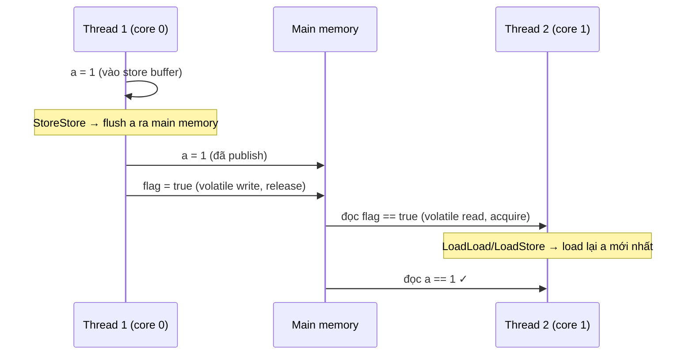

## Mục lục

- [Tổng quan](#tổng-quan)
- [1. Memory barrier là gì](#1-memory-barrier-là-gì)
- [2. Bốn loại barrier](#2-bốn-loại-barrier)
- [3. Barrier trong JMM](#3-barrier-trong-jmm)
- [4. Ví dụ: JMM xử lý volatile](#4-ví-dụ-jmm-xử-lý-volatile)
- [5. Mapping xuống CPU](#5-mapping-xuống-cpu)
- [Tài liệu tham khảo](#tài-liệu-tham-khảo)

---

## Tổng quan

**Memory barrier** (hàng rào bộ nhớ, còn gọi *fence*) là chỉ thị mức thấp ra lệnh
cho CPU/compiler: **"không được sắp xếp lại lệnh qua hàng rào này, và phải đồng bộ
cache tại đây"**.

> [!IMPORTANT]
> Barrier **không làm thay đổi dữ liệu**. Nó chỉ làm 2 việc:
> 1. **Chặn reorder** qua ranh giới barrier.
> 2. **Ép đồng bộ cache** — invalidate cache cũ (đọc lại từ main memory) và flush
>    cache mới (publish ra main memory).

## 1. Memory barrier là gì

Cụ thể, một barrier đảm bảo: mọi thao tác bộ nhớ **trước** barrier phải hoàn thành
và nhìn thấy được **trước khi** thực hiện bất kỳ thao tác bộ nhớ nào **sau** barrier.

> [!NOTE]
> **Hình dung bằng cửa an ninh sân bay**: hành khách (lệnh) bình thường có thể
> chen lấn, vượt nhau cho nhanh. Nhưng tại **cửa kiểm tra an ninh** (barrier),
> mọi người phải xếp hàng đúng thứ tự: ai tới trước phải qua cửa trước, và **không
> ai** được nhảy từ bên này sang bên kia cửa. Barrier chính là cái cửa đó — nó
> không thay đổi hành khách, chỉ ép thứ tự qua cửa và đảm bảo "đã qua thì thấy nhau".

- **Dọn dẹp (invalidate)**: bỏ giá trị cũ trong cache, ép đọc từ main memory.
- **Cập nhật (flush)**: đảm bảo khi đọc xong biến báo hiệu thì các biến liên quan
  cũng đã được load mới nhất.

## 2. Bốn loại barrier

| Barrier | Đảm bảo | Diễn giải |
|---------|---------|-----------|
| `LoadLoad` | Không reorder giữa 2 lệnh load | Đọc A xong mới được đọc B |
| `StoreStore` | Không reorder giữa 2 lệnh store | Ghi A xong mới được ghi B |
| `LoadStore` | Không reorder giữa load → store | Đọc A xong mới được ghi B |
| `StoreLoad` | **Mạnh nhất** — không reorder store → load | Ghi A xong mới được đọc B |

> [!NOTE]
> `StoreLoad` là barrier **đắt nhất** và mạnh nhất. Nó được dùng cho `volatile
> write → read` vì phải đảm bảo store đã publish ra main memory trước khi bất kỳ
> load nào sau đó được phép chạy.

## 3. Barrier trong JMM

JMM **không** định nghĩa barrier trực tiếp. Nhưng khi bạn dùng `volatile`,
`synchronized` hay API đồng bộ, JVM **tự chèn** barrier vào bytecode/machine code:

| Hành động | Barrier được chèn |
|-----------|-------------------|
| Volatile write | `StoreStore` + `StoreLoad` |
| Volatile read | `LoadLoad` + `LoadStore` |
| Unlock monitor | `StoreStore` + `StoreLoad` (release) |
| Lock monitor | `LoadLoad` + `LoadStore` (acquire) |

## 4. Ví dụ: JMM xử lý volatile

Đoạn code gốc:

```java
// Thread 1
a = 1;                        // normal write
volatile boolean flag = true; // volatile write

// Thread 2
if (flag) {                   // volatile read
    print(a);
}
```

JVM sẽ chèn barrier như sau:

```java
// Thread 1
a = 1;            // normal write
// [StoreStore]   <- chèn TRƯỚC volatile write: ép ghi a=1 ra main memory trước
flag = true;      // volatile write
// [StoreLoad]    <- chèn SAU volatile write: chặn load sau nhảy lên trước

// Thread 2
if (flag) {       // volatile read
    // [LoadLoad]  <- chặn đọc sau nhảy lên trước volatile read
    // [LoadStore] <- chặn ghi sau nhảy lên trước volatile read
    print(a);     // chắc chắn thấy a == 1
}
```

Giải thích từng bước:

1. **`StoreStore` trước volatile write**: yêu cầu mọi ghi thường trước đó (ở đây là
   `a = 1`) phải được publish ra main memory trước.
2. **`StoreLoad` sau volatile write**: ngăn các load sau bị đẩy lên trước lệnh ghi
   `flag`.
3. **`LoadLoad` + `LoadStore` sau volatile read**: ngăn các đọc/ghi sau `if (flag)`
   bị reorder lên trước lần đọc volatile.

Kết quả: Thread 2 đọc `flag == true` thì **bắt buộc** thấy `a == 1`.

Nhìn theo dòng thời gian "store buffer → main memory":



## 5. Mapping xuống CPU

Cùng một barrier logic của JMM được hiện thực bằng các lệnh CPU **khác nhau** tùy
kiến trúc:

| Kiến trúc | Đặc tính bộ nhớ | Ghi chú về barrier |
|-----------|------------------|--------------------|
| **x86 / x86-64** | "strong" (TSO — Total Store Order) | Phần lớn `LoadLoad`/`LoadStore`/`StoreStore` gần như miễn phí; chỉ cần lệnh đắt như `mfence` / `lock`-prefixed cho `StoreLoad` (volatile write). |
| **ARM / ARMv8** | "weak" memory model | Cần lệnh `dmb` (data memory barrier) rõ ràng cho hầu hết barrier → volatile/synchronized **đắt hơn** trên ARM so với x86. |
| **PowerPC** | "weak" | Dùng `lwsync` / `sync` cho các loại barrier. |

> [!TIP]
> Vì x86 là TSO (chỉ cho phép reorder `StoreLoad`), nhiều bug đồng thời "ẩn" trên
> x86 nhưng lại lộ ra trên ARM (điện thoại, Apple Silicon, server ARM). Luôn tuân
> thủ JMM thay vì dựa vào hành vi may rủi của một CPU cụ thể.

## Tài liệu tham khảo

- [Doug Lea — The JSR-133 Cookbook for Compiler Writers](https://gee.cs.oswego.edu/dl/jmm/cookbook.html)
- Trước: [Reordering](/jmm/03-reordering/)
- Tiếp theo: [Volatile](/jmm/05-volatile/)
