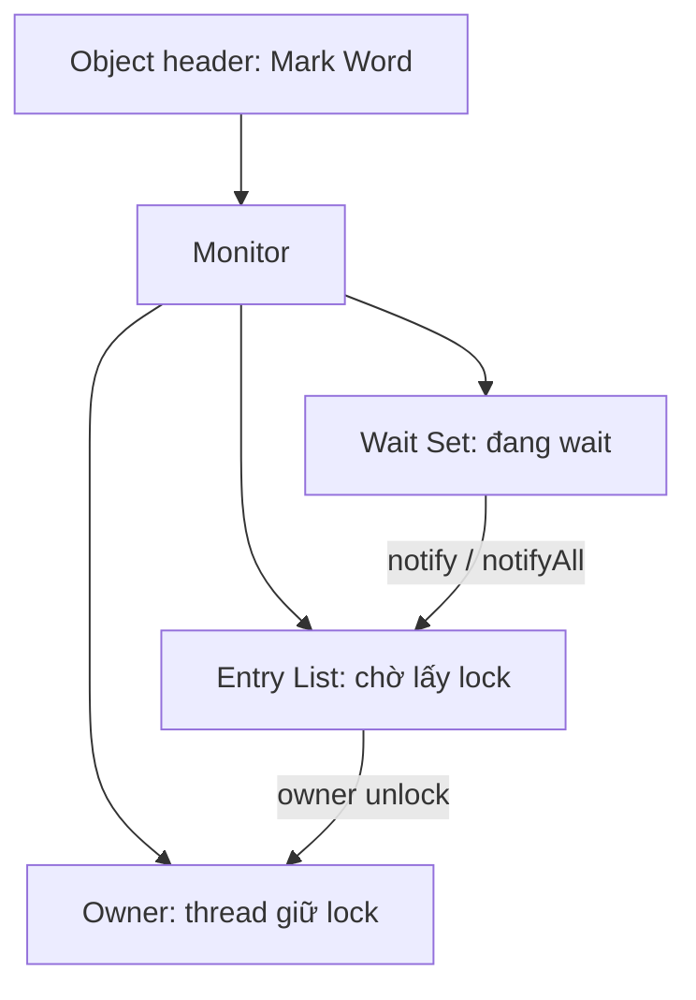

## Mục lục

- [Tổng quan](#tổng-quan)
- [1. Lock object](#1-lock-object)
- [2. synchronized trên method](#2-synchronized-trên-method)
- [3. Monitor trong JVM](#3-monitor-trong-jvm)
- [4. Nguyên lý synchronized trong JMM](#4-nguyên-lý-synchronized-trong-jmm)
- [5. Mutual exclusion](#5-mutual-exclusion)
- [6. Happens-before edges](#6-happens-before-edges)
- [7. Barrier vs Mutual Exclusion](#7-barrier-vs-mutual-exclusion)
- [Tài liệu tham khảo](#tài-liệu-tham-khảo)

---

## Tổng quan

`synchronized` cung cấp **hai** thứ cùng lúc: **mutual exclusion** (chỉ một thread
trong critical section) và **happens-before edges** (tạo visibility/ordering). Nhờ
vậy nó giải quyết được cả [data race lẫn race condition](/jmm/08-data-race-vs-race-condition/).

> [!NOTE]
> **Hình dung bằng nhà vệ sinh có một chìa khóa duy nhất**: chỉ ai cầm chìa (giữ
> lock) mới vào được (mutual exclusion); người khác phải xếp hàng chờ (Entry List).
> Quan trọng hơn: khi bạn **trả chìa** (unlock), bạn dọn dẹp sạch sẽ để lại (flush
> ra main memory); người vào sau **cầm chìa** (lock) sẽ thấy đúng hiện trạng bạn để
> lại (đọc dữ liệu mới nhất). "Trả chìa → cầm chìa" chính là cặp HB release/acquire.

## 1. Lock object

`synchronized` dùng một object làm **điểm đồng bộ hóa trung tâm**. JVM không cho
phép hai thread cùng giữ lock trên cùng một object.

```java
final Object lock = new Object();

synchronized (lock) {
    // critical section
}
```

### Lock object không khóa toàn bộ object

`lock` ở đây chỉ là **monitor/chiếc chìa khóa**, không phải lệnh khóa mọi
method hoặc field của một object. JVM chỉ chặn các thread cùng cố acquire chính
monitor đó:

```java
class Counter {
    private final Object lock = new Object();
    private int value;

    void increment() {
        synchronized (lock) {
            value++;
        }
    }

    void print() {
        System.out.println(value); // không tự động bị chặn
    }
}
```

Các lời gọi `increment()` đồng thời sẽ lần lượt vào block vì cùng dùng `lock`,
nhưng `print()` vẫn có thể chạy song song. Vì vậy lock chỉ bảo vệ dữ liệu khi
mọi đường truy cập liên quan cùng tuân thủ quy ước lock; nó không biến toàn bộ
object thành vùng độc quyền.

Lock có thể là bất kỳ object nào, nhưng **tránh**:

- `this` nếu class bị lộ ra ngoài (code khác có thể "vô tình" lock chung).
- String literal (vì được intern → dễ va chạm toàn cục).

> [!TIP]
> Nên dùng `private final Object lock = new Object();` để không ai bên ngoài lock
> được trên cùng object.

> [!NOTE]
> Khi một thread "cướp" được lock, nó được coi là **ready to run** — nhưng có chạy
> thực sự hay không còn phụ thuộc **OS Scheduler + JVM scheduler** cấp phát một OS
> thread. Lock đã giữ mà không được cấp CPU thì code vẫn không chạy và lock vẫn bị
> giữ. **Convoy effect**: một thread giữ lock quá lâu/bị chậm → các thread khác
> xếp hàng chờ → cả hàng chậm theo.

## 2. synchronized trên method

`synchronized` trên method instance sẽ lock object `this`. Nó không phải là
một loại lock gắn với method; monitor vẫn gắn với object, còn phạm vi giữ lock là
**toàn bộ thân method**:

```java
class Demo {
    public synchronized void foo() { /* ... */ } // lock 'this'
    public void bar() { /* ... */ }              // KHÔNG lock
}
```

Về ý nghĩa, `foo()` tương đương với:

```java
public void foo() {
    synchronized (this) {
        /* ... */
    }
}
```

Tương tự, `static synchronized` sẽ lock trên `Demo.class`, không phải trên một
instance cụ thể.

| Lời gọi | Kết quả |
|---------|---------|
| T1 gọi `obj.foo()` | Giữ lock trên `obj` |
| T2 gọi `obj.foo()` | ❌ Bị block (obj đang bị lock) |
| T3 gọi `obj.bar()` | ✅ Vẫn chạy (bar không cần lock) |
| T4 gọi `obj2.foo()` | ✅ Chạy song song (lock của obj2 khác) |

> [!IMPORTANT]
> Lock gắn với **instance**, không phải với method. Hai synchronized method trong
> cùng một object dùng **chung** lock `this` → loại trừ lẫn nhau. Nhưng hai object
> khác nhau có hai lock độc lập → chạy song song được.

## 3. Monitor trong JVM

Mỗi object trong Java có header gồm:

- **Mark Word**: trạng thái lock (lock flag, hashcode, age...).
- **Monitor** (liên kết ngoài) với các trường:
  - **Owner**: thread nào đang giữ lock.
  - **Entry List**: các thread đang chờ lấy lock.
  - **Wait Set**: các thread đang `wait()` trên lock này.



### 3.1 Entry List

- **Vào** Entry List: thread gọi `monitorenter(lock)` nhưng lock đã bị thread khác
  giữ.
- **Ra** Entry List: khi owner gọi `monitorexit(lock)`, JVM chọn một thread trong
  Entry List (thường **không** đảm bảo fairness, nhưng thường thread vào trước
  được lock trước), chuyển nó sang Running và cho acquire lock. Không cần
  notify/notifyAll — chỉ cần nhả lock là đủ.

### 3.2 Wait Set

- **Vào** Wait Set: chỉ khi thread đang giữ lock gọi `wait()` trên chính lock đó →
  JVM thả lock (giống `monitorexit` tạm thời), thread chuyển vào Wait Set và block
  hoàn toàn.
- **Ra** Wait Set: khi thread khác giữ cùng lock gọi `notify()`/`notifyAll()` →
  JVM chuyển thread từ Wait Set **sang Entry List** (chưa chạy ngay). Thread phải
  tranh lại lock trong Entry List như bình thường trước khi chạy tiếp.

## 4. Nguyên lý synchronized trong JMM

```java
synchronized (lock) {
    // critical section
}
```

JVM thực hiện hai hành động đặc biệt:

- **Monitor Enter (acquire)** — khi vào vùng synchronized:
  - Chặn reorder của các lệnh sau nhảy lên trước.
  - Buộc đọc dữ liệu mới nhất mà thread khác đã publish khi nhả cùng lock.
- **Monitor Exit (release)** — khi ra khỏi vùng (kể cả do return/exception):
  - Chặn reorder của các lệnh trước bị đẩy xuống sau.
  - Flush toàn bộ ghi của thread hiện tại ra main memory.

```java
final Object lock = new Object();
int data = 0;

Thread t1 = new Thread(() -> {
    synchronized (lock) {  // Monitor Enter (acquire)
        data = 42;
    }                      // Monitor Exit (release) → flush data
});

Thread t2 = new Thread(() -> {
    synchronized (lock) {  // Monitor Enter (acquire) → load data mới
        System.out.println(data); // luôn thấy 42
    }
});
```

Barrier mà JVM chèn:

| Hành động | Barrier |
|-----------|---------|
| Monitor Enter | `LoadLoad` + `LoadStore` (acquire) |
| Monitor Exit | `StoreStore` + `StoreLoad` (release) |

## 5. Mutual exclusion

**Mutual exclusion** = chỉ một thread được chạy trong critical section (vùng
synchronized trên cùng một lock object) tại một thời điểm.

- `monitorenter` (acquire): lấy lock → nếu bận, thread vào Entry List.
- `monitorexit` (release): nhả lock → chọn thread từ Entry List để cấp lock.

**Tác dụng**: ngăn race condition; cho phép nhiều thao tác liên quan chạy như một
khối atomic.

**Giới hạn**:

- Chỉ có ý nghĩa **trên cùng lock object**.
- **Không** tự đảm bảo fairness (không FIFO).
- **Không** tận dụng đa core cho cùng lock.

## 6. Happens-before edges

> [!IMPORTANT]
> - **Release khi unlock**: mọi write bên trong critical section phải flush ra
>   main memory trước khi nhả lock.
> - **Acquire khi lock**: thread vào critical section thấy mọi giá trị đã được
>   publish bởi thread vừa nhả **cùng** lock.

Đây chính là HB rule "unlock HB lock sau đó trên cùng monitor".

## 7. Barrier vs Mutual Exclusion

| Cơ chế | Mục tiêu | Xử lý data race? | Xử lý race condition logic? |
|--------|----------|------------------|------------------------------|
| **Memory barrier** (volatile) | Visibility + ordering | ✅ Có | ❌ Không (chỉ đồng bộ, không chặn truy cập đồng thời) |
| **Lock object** (`synchronized`) | Mutual exclusion + tạo HB | ✅ Có (lock tạo HB) | ✅ Có (loại bỏ truy cập đồng thời) |

> [!NOTE]
> Kết luận: barrier (chặn reorder) giải quyết **data race**; mutual exclusion
> (lock) giải quyết được **cả** data race **và** race condition logic phức tạp.

## Tài liệu tham khảo

- [JLS 17.1 — Synchronization](https://docs.oracle.com/javase/specs/jls/se21/html/jls-17.html#jls-17.1)
- Trước: [Volatile](/jmm/05-volatile/)
- Tiếp theo: [Final Field & Safe Publication](/jmm/07-final-field-safe-publication/)
