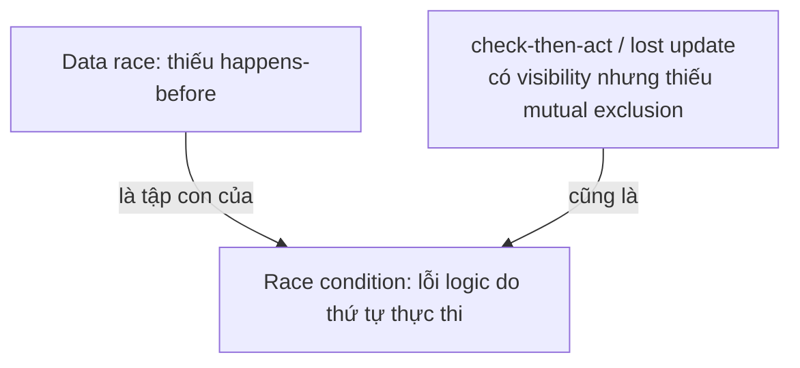

## Mục lục

- [Tổng quan](#tổng-quan)
- [1. Data race (theo JMM)](#1-data-race-theo-jmm)
- [2. Race condition (rộng hơn)](#2-race-condition-rộng-hơn)
- [3. Quan hệ giữa hai khái niệm](#3-quan-hệ-giữa-hai-khái-niệm)
- [4. Benign vs Harmful races](#4-benign-vs-harmful-races)
- [5. Bảng tổng kết](#5-bảng-tổng-kết)
- [Tài liệu tham khảo](#tài-liệu-tham-khảo)

---

## Tổng quan

Hai thuật ngữ thường bị nhầm lẫn:

- **Data race** là vấn đề ở tầng **bộ nhớ/JMM**: hai thread đụng vào cùng một
  biến xung đột nhưng không có `happens-before`.
- **Race condition** là vấn đề ở tầng **logic**: kết quả đúng/sai phụ thuộc vào
  thứ tự các thread chạy.

Mẹo phân biệt:

1. Có truy cập đọc/ghi cùng biến mà thiếu `happens-before` không? → **data race**.
2. Đổi thứ tự chạy có thể làm kết quả sai khác không? → **race condition**.

Vì vậy, data race là khái niệm hẹp hơn; race condition bao quát cả lỗi đồng bộ
bộ nhớ và lỗi ghép nhiều thao tác không nguyên tử.

## 1. Data race (theo JMM)

> [!IMPORTANT]
> **Data race** xảy ra khi hai (hoặc nhiều) thread truy cập **cùng một biến**,
> **ít nhất một** là write, và **không có happens-before** giữa các truy cập đó.

Không phải cứ hai thread cùng dùng một biến là data race: hai lần đọc không xung
đột; còn nếu các truy cập xung đột được sắp thứ tự bằng cơ chế đồng bộ thì đã có
`happens-before` giữa chúng. Một hệ quả thường gặp của data race là thread đọc
thấy giá trị cũ hoặc thấy các ghi không theo thứ tự mong đợi.

```java
int x = 0;            // biến thường
boolean ready = false;

void writer() {
    x = 42;           // write 1
    ready = true;     // write 2 (không volatile, không sync)
}

void reader() {
    if (ready) {                 // read 1
        System.out.println(x);   // read 2 → có thể in 0 (reorder/visibility)
    }
}
```

**Fix**: cho `ready` thành `volatile`, hoặc bọc bằng `synchronized`/công cụ
concurrent → tạo HB edge.

## 2. Race condition (rộng hơn)

> [!IMPORTANT]
> **Race condition** = kết quả **logic** phụ thuộc vào thứ tự thực thi giữa các
> thread. Nó rộng hơn data race: lỗi có thể nằm ở việc ghép nhiều thao tác riêng
> lẻ, dù từng thao tác đã có visibility hoặc atomic ở mức riêng.

Ví dụ lost update — đã dùng `volatile` nhưng vẫn sai:

```java
volatile int counter = 0;

void inc() {
    counter++;   // read -> add -> write, KHÔNG atomic
}
```

Thực tế, `counter++` gồm 3 bước:

```text
1. đọc counter
2. cộng thêm 1
3. ghi lại counter
```

`volatile` giúp mỗi lần đọc/ghi có visibility và ordering, nhưng không biến cả 3
bước thành một thao tác. Hai thread có thể cùng đọc `0`, rồi lần lượt ghi `1`; kết
quả là `1` thay vì `2`. Đây là **race condition** kiểu lost update. Đừng hiểu
`volatile` là giải pháp cho mọi race: nó không giải quyết tính atomic của một
chuỗi thao tác. **Fix**: `AtomicInteger.incrementAndGet()` hoặc `synchronized`.

Race condition thậm chí vẫn có thể xảy ra khi dùng một biến nguyên tử, nếu tách
`check` và `act` thành hai thao tác:

```java
AtomicInteger stock = new AtomicInteger(1);

boolean buy() {
    if (stock.get() > 0) {       // CHECK
        stock.decrementAndGet(); // ACT
        return true;
    }
    return false;
}
```

Hai thread đều có thể vượt qua `CHECK` rồi cùng `ACT`. Các thao tác của
`AtomicInteger` tự chúng là atomic, nhưng cả cặp `CHECK + ACT` chưa atomic. Cần
CAS để gộp chúng thành một thao tác hoặc dùng `synchronized`/`Lock`.

### Ví dụ đời thường: rút tiền hai cây ATM cùng lúc

Tài khoản còn `100k`. Hai người cùng rút `100k` ở hai cây ATM (hai thread):

```java
void withdraw(int amount) {
    if (balance >= amount) {   // (1) CHECK
        balance -= amount;     // (2) ACT
    }
}
```

| Bước | ATM A (rút 100k) | ATM B (rút 100k) | balance |
|------|------------------|------------------|---------|
| 1 | check `100 >= 100` ✅ | | 100 |
| 2 | | check `100 >= 100` ✅ | 100 |
| 3 | `balance -= 100` → 0 | | 0 |
| 4 | | `balance -= 100` → -100 | **-100** ❌ |

Cả hai đều "thấy" đủ tiền nên cùng rút → tài khoản âm. Đây là **race condition**
kiểu *check-then-act*: dù `balance` có là `volatile` (visibility tốt) vẫn sai, vì
khoảng giữa CHECK và ACT bị thread khác xen vào. **Fix**: bọc cả `if + trừ tiền`
trong `synchronized`/`Lock`, hoặc dùng CAS để "kiểm tra và trừ" thành một bước.

## 3. Quan hệ giữa hai khái niệm



> [!NOTE]
> Data race thường được xem là một dạng race condition ở tầng memory, nhưng
> **race condition không nhất thiết là data race** (ví dụ: check-then-act không
> khóa, dù từng lần đọc/ghi đã có visibility).

| Sửa bằng | Diệt data race? | Diệt race condition logic? |
|----------|-----------------|----------------------------|
| `volatile` | ✅ cho visibility/publication đơn giản | ❌ (vẫn lost update) |
| `synchronized` / `Lock` | ✅ nếu mọi access dùng cùng lock | ✅ |
| `Atomic*` / CAS | ✅ cho operation được atomic hóa | ✅ nếu gộp đúng cả check + update |

## 4. Benign vs Harmful races

Không phải race nào cũng cần sửa — cần đánh giá hậu quả, vì sửa race luôn có cái
giá về performance.

### 4.1 Benign race (lành tính)

```java
// Ghi log best-effort, chấp nhận trùng thứ tự / thiếu vài dòng
logger.debug("tick=" + tick);
// Đọc một biến chỉ để hint tối ưu (heuristic), sai số nhỏ chấp nhận được.
```

### 4.2 Harmful race (gây hại)

- Làm sai kết quả, vi phạm bất biến, crash, NPE, security bug...

> [!TIP]
> Trong một số trường hợp, chấp nhận race là hợp lý (vd: counter thống kê gần
> đúng). Quyết định "sửa hay không" nên dựa trên: hậu quả nếu sai × xác suất xảy
> ra × chi phí đồng bộ.

## 5. Bảng tổng kết

| Tiêu chí | Data race | Race condition |
|----------|-----------|----------------|
| Phạm vi | Truy cập bộ nhớ (mức JMM) | Tính đúng đắn logic (mức thiết kế) |
| Định nghĩa | Thiếu HB giữa các truy cập (≥1 write) | Kết quả phụ thuộc thứ tự thực thi |
| Ví dụ điển hình | Đọc biến thường chưa publish → thấy giá trị cũ | check-then-act, lost update |
| Công cụ sửa | volatile / synchronized / atomic | synchronized / atomic / thiết kế lại |

## Tài liệu tham khảo

- [JLS 17.4.5 — Happens-before & Data Races](https://docs.oracle.com/javase/specs/jls/se21/html/jls-17.html#jls-17.4.5)
- Trước: [Final Field & Safe Publication](/jmm/07-final-field-safe-publication/)
- Tiếp theo: [CAS, Atomic, VarHandle, StampedLock](/jmm/09-cas-atomic-varhandle-stampedlock/)
