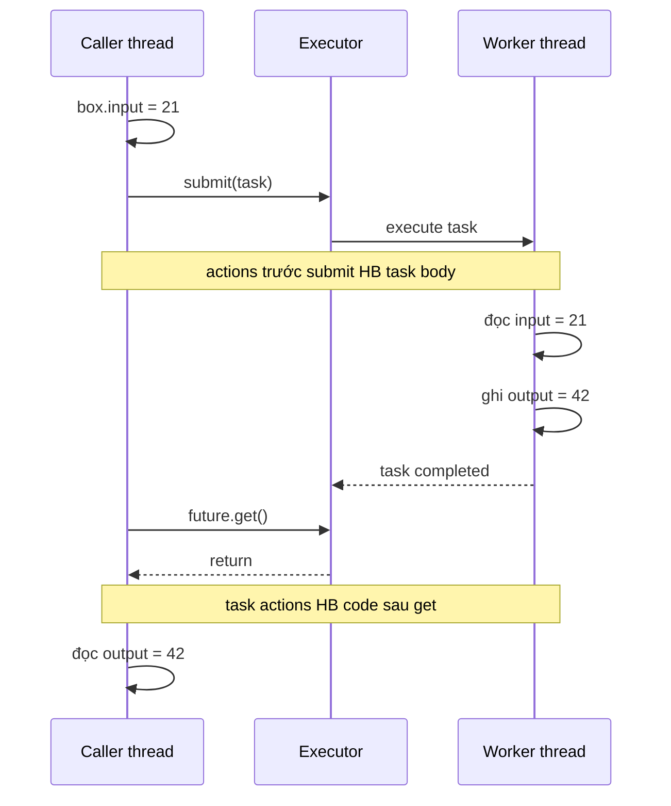

## Mục lục

- [Tổng quan](#tổng-quan)
  - [Cách đọc một guarantee happens-before](#cách-đọc-một-guarantee-happens-before)
  - [Bảng tra nhanh](#bảng-tra-nhanh)
- [1. Executor: bàn giao dữ liệu từ caller sang task](#1-executor-bàn-giao-dữ-liệu-từ-caller-sang-task)
  - [1.1 Cầu happens-before của submit](#11-cầu-happens-before-của-submit)
  - [1.2 Submit không có nghĩa task chạy ngay](#12-submit-không-có-nghĩa-task-chạy-ngay)
  - [1.3 Mutation sau submit vẫn có thể data race](#13-mutation-sau-submit-vẫn-có-thể-data-race)
  - [1.4 execute và submit khác nhau ở đâu](#14-execute-và-submit-khác-nhau-ở-đâu)
- [2. Future: bàn giao dữ liệu từ task về caller](#2-future-bàn-giao-dữ-liệu-từ-task-về-caller)
  - [2.1 Future.get vừa chờ vừa tạo visibility](#21-futureget-vừa-chờ-vừa-tạo-visibility)
  - [2.2 Ghép submit và get thành một HB chain](#22-ghép-submit-và-get-thành-một-hb-chain)
  - [2.3 Nếu không gọi get](#23-nếu-không-gọi-get)
  - [2.4 Task hoàn thành với exception](#24-task-hoàn-thành-với-exception)
  - [2.5 Chờ đúng Future](#25-chờ-đúng-future)
  - [2.6 Cancellation và timeout](#26-cancellation-và-timeout)
- [3. CompletableFuture và CompletionStage](#3-completablefuture-và-completionstage)
  - [3.1 Chuỗi stage là chuỗi bàn giao](#31-chuỗi-stage-là-chuỗi-bàn-giao)
  - [3.2 thenApply và thenApplyAsync](#32-thenapply-và-thenapplyasync)
  - [3.3 get và join](#33-get-và-join)
  - [3.4 complete từ thread khác](#34-complete-từ-thread-khác)
  - [3.5 allOf và nhiều computation](#35-allof-và-nhiều-computation)
  - [3.6 Các lỗi thường gặp](#36-các-lỗi-thường-gặp)
- [4. BlockingQueue và concurrent collections](#4-blockingqueue-và-concurrent-collections)
  - [4.1 Publish phần tử qua queue](#41-publish-phần-tử-qua-queue)
  - [4.2 Queue thread-safe không làm phần tử thread-safe](#42-queue-thread-safe-không-làm-phần-tử-thread-safe)
  - [4.3 SynchronousQueue là một rendezvous](#43-synchronousqueue-là-một-rendezvous)
  - [4.4 Các concurrent collection khác](#44-các-concurrent-collection-khác)
- [5. ConcurrentHashMap](#5-concurrenthashmap)
  - [5.1 Guarantee theo key và value](#51-guarantee-theo-key-và-value)
  - [5.2 computeIfAbsent atomic đến đâu](#52-computeifabsent-atomic-đến-đâu)
  - [5.3 Aggregate operation không phải snapshot transaction](#53-aggregate-operation-không-phải-snapshot-transaction)
- [6. Lock, Condition và AQS](#6-lock-condition-và-aqs)
- [7. Semaphore, CountDownLatch và StampedLock](#7-semaphore-countdownlatch-và-stampedlock)
- [8. CyclicBarrier, Phaser và Exchanger](#8-cyclicbarrier-phaser-và-exchanger)
  - [8.1 CyclicBarrier](#81-cyclicbarrier)
  - [8.2 Phaser](#82-phaser)
  - [8.3 Exchanger](#83-exchanger)
- [9. Happens-before không bảo đảm điều gì](#9-happens-before-không-bảo-đảm-điều-gì)
- [10. Phương pháp tìm HB edge trong code JUC](#10-phương-pháp-tìm-hb-edge-trong-code-juc)
- [11. Checklist và lỗi thường gặp](#11-checklist-và-lỗi-thường-gặp)
- [Tóm tắt](#tóm-tắt)
- [Tài liệu tham khảo](#tài-liệu-tham-khảo)

---

## Tổng quan

`java.util.concurrent` — viết tắt là **JUC** — cung cấp các công cụ để thread bàn
giao dữ liệu, quyền truy cập hoặc tín hiệu cho nhau. Mỗi công cụ có những điểm
synchronization cụ thể tạo quan hệ **happens-before** (HB).

Nếu action A happens-before action B, Java Memory Model bảo đảm:

- các write trước A được B quan sát theo ordering mà contract cho phép;
- compiler, JIT và CPU không được reorder theo cách phá guarantee đó;
- dữ liệu đã được publish qua đúng protocol không mắc lỗi visibility chỉ vì chạy
  trên thread khác.

HB không có nghĩa “A chạy ngay trước B theo thời gian”. Nó là quan hệ ordering và
visibility ở mức ngôn ngữ.

> [!IMPORTANT]
> JUC chỉ tạo HB khi code đi qua đúng **cặp hành động** mà API quy định. Gọi
> `submit()` tạo chiều caller → task; nó không tự tạo chiều task → caller. Muốn có
> chiều về, thường phải dùng `Future.get()`, `CompletableFuture.join()`, latch,
> queue hoặc một synchronization action tương ứng.

### Cách đọc một guarantee happens-before

Ví dụ:

```text
Actions trước executor.submit(task)
    happens-before
Actions trong task khi được chạy
```

Hãy đọc thành:

> Nếu caller hoàn tất các write rồi mới submit task, worker chạy task phải quan sát
> các write đó. Không cần đoán cache của CPU đã flush hay chưa; implementation và
> JMM phải thực hiện synchronization phù hợp.

Quan hệ HB có tính bắc cầu:

```text
A HB B
B HB C
──────
A HB C
```

Nhờ đó có thể ghép nhiều điểm bàn giao thành một pipeline.

### Bảng tra nhanh

| Công cụ | Hành động phía trước | Hành động phía sau |
|---|---|---|
| Thread | actions trước `thread.start()` | actions trong thread được start |
| Thread | mọi action trong thread | thread khác trở về từ `join()` |
| Executor | actions trước khi submit `Runnable`/`Callable` | task bắt đầu thực thi |
| Future | actions của asynchronous computation | actions sau `Future.get()` tương ứng |
| Concurrent collection | actions trước khi đặt một element | access/removal thành công của element đó ở thread khác |
| Lock | actions trước `unlock()` | actions sau `lock()` thành công trên cùng lock |
| Semaphore | actions trước `release()` | actions sau `acquire()` thành công |
| CountDownLatch | actions trước `countDown()` | actions sau `await()` trả về vì count đã bằng 0 |
| CyclicBarrier | actions trước `await()` | barrier action, rồi actions sau `await()` tương ứng |
| Exchanger | actions trước `exchange()` của mỗi thread | actions sau `exchange()` của thread đối tác |
| Volatile | write volatile | read volatile quan sát write đó hoặc write sau trong synchronization order |

Đây là bảng định hướng. Phần còn lại giải thích đối tượng nào được bàn giao, chiều
nào được bảo đảm và điều gì vẫn có thể race.

## 1. Executor: bàn giao dữ liệu từ caller sang task

### 1.1 Cầu happens-before của submit

Giả sử `Box.input` là field thường, không phải `volatile`:

```java
import java.util.concurrent.ExecutorService;
import java.util.concurrent.Executors;

class Box {
    int input;
}

ExecutorService executor =
    Executors.newFixedThreadPool(2);

Box box = new Box();
box.input = 21;

executor.submit(() -> {
    System.out.println(box.input); // phải thấy 21
});
```

HB chain:

```text
Caller thread                          Worker thread

box.input = 21
      │
      │ program order
      ▼
submit(task)
      │
      └──────────── happens-before ──► task bắt đầu
                                            │
                                            ▼
                                      đọc input = 21
```

`submit()` safely publishes task cùng state đã được chuẩn bị trước đó. Task có thể
capture một reference đến `box`; object không bị copy, nhưng các write trước
submission được publish cho worker.

Guarantee này áp dụng cho submission qua `Executor`/`ExecutorService`, không chỉ
single-thread executor.

### 1.2 Submit không có nghĩa task chạy ngay

```java
Future<?> future = executor.submit(task);
```

có nghĩa executor đã nhận task. Task có thể đang:

- chạy trên worker rảnh;
- nằm trong work queue;
- chờ task khác;
- chờ scheduler cấp CPU.

```text
12:00:00.000 caller submit
12:00:00.010 task vẫn trong queue
12:00:01.000 worker bắt đầu task
```

HB bảo đảm “khi task chạy thì thấy dữ liệu đúng”, không bảo đảm “task phải chạy
ngay”.

### 1.3 Mutation sau submit vẫn có thể data race

Chỉ actions trước submission nằm ở phía publish của guarantee:

```java
Box box = new Box();
box.input = 21;

executor.submit(() -> {
    System.out.println(box.input);
});

box.input = 100; // xảy ra sau submit
```

Worker có thể in `21` hoặc `100`. Không có ordering xác định giữa write `100` và
read trong task:

```text
submit ───────────────► task read
   │
   └── caller write 100

write 100 và task read không được order với nhau
```

Nếu cần gửi update sau submission, dùng protocol bổ sung như `volatile`, atomic,
lock, concurrent collection hoặc message queue.

### 1.4 execute và submit khác nhau ở đâu

Cả hai đều submit công việc vào executor và tạo publication caller → task:

```java
executor.execute(runnable);
Future<T> future = executor.submit(callable);
```

Khác biệt chính:

| API | Kết quả | Quan sát completion/exception |
|---|---|---|
| `execute(Runnable)` | Không trả `Future` | Cần protocol khác hoặc exception handler |
| `submit(Runnable/Callable)` | Trả `Future` | Dùng `get()`, timeout, cancel |

`execute()` đủ cho chiều caller → task. Nếu cần chiều task → caller, phải tự có
điểm bàn giao như latch/queue hoặc dùng `submit()` và `Future.get()`.

## 2. Future: bàn giao dữ liệu từ task về caller

### 2.1 Future.get vừa chờ vừa tạo visibility

```java
class ResultBox {
    int result;
}

ResultBox box = new ResultBox();

Future<?> future = executor.submit(() -> {
    box.result = 42;
});

future.get();
System.out.println(box.result); // phải thấy 42
```

`get()` có hai vai trò:

1. Chờ computation tương ứng hoàn thành.
2. Tạo điểm acquire để actions trong computation HB code chạy sau `get()`.

```text
Worker thread                         Caller thread

box.result = 42
      │
      ▼
task hoàn thành
      │
      └──── happens-before ────────► future.get() hoàn tất
                                            │
                                            ▼
                                      đọc result = 42
```

Field `result` không cần `volatile` chỉ để thực hiện đúng bàn giao một lần này.
Nếu các thread tiếp tục mutate nó sau điểm bàn giao, cần synchronization cho các
mutation mới.

### 2.2 Ghép submit và get thành một HB chain

```java
class Box {
    int input;
    int output;
}

Box box = new Box();
box.input = 21;

Future<?> future = executor.submit(() -> {
    int value = box.input;
    box.output = value * 2;
});

future.get();
System.out.println(box.output); // 42
```

Toàn bộ chain:



Theo tính bắc cầu:

```text
caller ghi input
    HB qua submit
worker đọc input và ghi output
    HB qua Future.get
caller đọc output
```

Đây là mental model quan trọng nhất của Executor/Future:

```text
submit = cầu đi
get    = cầu về
```

### 2.3 Nếu không gọi get

Code sau không được bảo đảm in `42`:

```java
executor.submit(() -> box.result = 42);
System.out.println(box.result);
```

Caller có thể đọc trước khi task chạy:

```text
caller submit
caller đọc result = 0
worker ghi result = 42
```

Ngay cả khi task “thường chạy nhanh”, timing không phải synchronization. Không dùng
`sleep()` để thay `get()`:

```java
Thread.sleep(100); // không tạo HB với task completion
```

Sleep chỉ trì hoãn thread; nó không xác nhận task đã hoàn thành và không phải cầu
publication theo contract của Future.

### 2.4 Task hoàn thành với exception

Task ném exception vẫn chuyển `Future` sang trạng thái hoàn thành bất thường:

```java
Future<?> future = executor.submit(() -> {
    box.result = 42;
    throw new IllegalStateException("failed");
});

try {
    future.get();
} catch (ExecutionException e) {
    log(e.getCause());
}
```

`get()` báo computation failure bằng `ExecutionException`. “Hoàn thành bất
thường” vẫn là completion, không phải task còn đang chạy.

Tuy nhiên, đừng mặc định shared fields được ghi trước failure là một business
result hợp lệ. Visibility và tính hợp lệ nghiệp vụ là hai vấn đề khác nhau. Thông
thường nên trả result hoàn chỉnh hoặc truyền failure qua `Future` thay vì đọc
partial mutable state.

### 2.5 Chờ đúng Future

Cầu trực tiếp gắn với computation tương ứng:

```java
Future<?> updateFuture = executor.submit(
    () -> box.result = 42
);
Future<?> otherFuture = executor.submit(
    this::doSomethingElse
);

updateFuture.get();
System.out.println(box.result);
```

Không nên thay bằng `otherFuture.get()` rồi suy luận kết quả của task đầu đã được
publish. Một executor cụ thể có thể tạo ordering phụ, nhưng code tổng quát nên
synchronize qua đúng handle đại diện cho computation cần quan sát.

### 2.6 Cancellation và timeout

Timed get:

```java
Result result = future.get(500, TimeUnit.MILLISECONDS);
```

Nếu ném `TimeoutException`, caller **chưa quan sát completion**. Task có thể vẫn
đang chạy. Không được đọc shared result như thể task đã hoàn thành.

Cancellation:

```java
boolean requested = future.cancel(true);
```

`cancel(true)` yêu cầu interrupt task đang chạy nếu có thể. Nó không bảo đảm task
đã dừng ngay, vì task có thể bỏ qua interrupt hoặc đang chạy code không
interruptible.

```text
cancel request ≠ task chắc chắn đã dừng tại dòng kế tiếp
```

Thiết kế cancellation phải định nghĩa rõ:

- task phản ứng với interrupt ở đâu;
- cleanup đặt trong `finally` như thế nào;
- partial state có được publish hay rollback không;
- caller nhận trạng thái cancelled qua API nào.

## 3. CompletableFuture và CompletionStage

`CompletableFuture` vừa là `Future`, vừa là `CompletionStage`. Nó cho phép nối các
computation thành một dependency graph thay vì block sau từng task.

### 3.1 Chuỗi stage là chuỗi bàn giao

```java
CompletableFuture<Integer> result =
    CompletableFuture
        .supplyAsync(() -> loadValue())
        .thenApply(value -> value * 2)
        .thenApply(value -> value + 1);

int finalValue = result.join();
```

Flow:

```text
supplyAsync hoàn thành value
        ↓
thenApply nhận value
        ↓
thenApply tiếp theo nhận result
        ↓
join quan sát completion cuối
```

Dependent stage chỉ được kích hoạt sau khi prerequisite stage hoàn thành. Kết quả
được publish qua completion protocol của `CompletableFuture`; không cần tự thêm
`volatile` chỉ để chuyển value từ stage trước sang stage sau.

Ưu tiên truyền dữ liệu trực tiếp qua stage parameter:

```java
.thenApply(value -> transform(value))
```

thay vì ghi và đọc một shared mutable field bên ngoài graph.

### 3.2 thenApply và thenApplyAsync

```java
future.thenApply(value -> transform(value));
```

Non-async continuation có thể chạy trên thread hoàn thành stage trước, hoặc trên
thread caller nếu stage đã hoàn thành khi continuation được đăng ký. Không giả
định nó luôn chạy trên worker riêng.

```java
future.thenApplyAsync(value -> transform(value));
```

Async continuation được schedule bất đồng bộ, mặc định thường dùng common pool.
Có thể cung cấp executor rõ ràng:

```java
future.thenApplyAsync(
    value -> transform(value),
    applicationExecutor
);
```

Khác biệt là execution policy, không phải việc value có được publish hay không.
Stage phụ thuộc nhận result sau completion của stage trước.

### 3.3 get và join

```java
int a = future.get();
int b = future.join();
```

Cả hai quan sát completion và trả result. Khác biệt chính là exception API:

| API | Interrupt | Failure wrapper | Timeout overload |
|---|---:|---|---:|
| `get()` | Có thể ném `InterruptedException` | `ExecutionException` | Có |
| `join()` | Không khai báo checked interrupt | `CompletionException` | Không |

`CompletableFuture` implement `Future`, nên `get()` có memory-consistency effect
của Future. `join()` cũng quan sát trạng thái completion được publish an toàn bởi
implementation và là terminal operation thông thường của pipeline.

Dùng `get()` khi caller cần interrupt/timeout checked rõ ràng. Dùng `join()` khi
đang compose code theo `CompletionStage` và muốn exception unchecked.

### 3.4 complete từ thread khác

`CompletableFuture` có thể được hoàn thành thủ công:

```java
CompletableFuture<Config> ready = new CompletableFuture<>();

// Initializer thread
Config config = loadConfig();
ready.complete(config);

// Consumer thread
Config observed = ready.join();
```

`complete(config)` publish completion và result. Consumer quan sát result sau
`join()`/dependent stage.

Chỉ một completion thắng:

```java
boolean first = ready.complete(configA);
boolean second = ready.complete(configB);
```

Nếu `first == true`, lần complete thứ hai bình thường trả `false`. Đừng dùng nhiều
producer cạnh tranh completion nếu business protocol không định nghĩa ai được
thắng.

### 3.5 allOf và nhiều computation

```java
CompletableFuture<User> user = loadUser();
CompletableFuture<List<Order>> orders = loadOrders();

CompletableFuture<Void> all =
    CompletableFuture.allOf(user, orders);

all.join();

User u = user.join();
List<Order> os = orders.join();
```

`allOf()` hoàn thành khi tất cả component future hoàn thành. Nó không tự đóng gói
các result thành collection, nên vẫn lấy result từ từng future sau khi `all` hoàn
thành.

Nếu một component hoàn thành exceptionally, `allOf()` cũng hoàn thành
exceptionally. Hãy thiết kế failure policy: fail-fast ở graph nghiệp vụ, gom mọi
lỗi, fallback riêng từng stage, hoặc cancel phần việc còn lại.

### 3.6 Các lỗi thường gặp

| Lỗi | Vì sao sai | Cách xử lý |
|---|---|---|
| Giả định `thenApply` luôn chạy thread khác | Non-async stage có thể chạy inline | Không phụ thuộc thread identity; dùng async + executor nếu cần |
| Dùng common pool cho blocking I/O dài | Có thể làm nghẽn worker dùng chung | Cung cấp executor phù hợp |
| Gọi `join()` sớm ở từng stage | Biến pipeline async thành tuần tự/blocking | Compose trước, chờ ở boundary |
| Mutate shared state ngoài graph | Tạo race khó thấy | Truyền immutable result qua stage |
| Nuốt `CompletionException` | Mất failure gốc | Kiểm tra `getCause()` và có policy lỗi |
| Timeout rồi dùng result | Computation có thể vẫn chạy | Cancel/ignore theo protocol; không đọc partial state |

## 4. BlockingQueue và concurrent collections

### 4.1 Publish phần tử qua queue

Package contract của JUC bảo đảm: actions trước khi đặt một object vào concurrent
collection HB actions sau khi thread khác access hoặc remove đúng object đó.

```java
class Task {
    String endpoint;
    int retries;
}

BlockingQueue<Task> queue =
    new LinkedBlockingQueue<>();

// Producer
Task task = new Task();
task.endpoint = "/payments";
task.retries = 3;
queue.put(task);

// Consumer
Task received = queue.take();
process(received.endpoint, received.retries);
```

HB chain:

```text
Producer ghi fields
        ↓
queue.put(task)
        │ HB
        ▼
queue.take() trả đúng task
        ↓
Consumer đọc fields
```

Các cặp thành công khác như `offer`/`poll` cũng bàn giao element khi consumer thực
sự nhận đúng element đó. Một `poll()` trả `null` không chứng minh publication của
một element chưa nhận.

### 4.2 Queue thread-safe không làm phần tử thread-safe

Sau `put()`, nếu producer tiếp tục sửa cùng object trong khi consumer đọc, vẫn có
data race:

```java
queue.put(task);
task.retries = 10; // mutation sau publication
```

`put()` publish những action trước nó. Nó không bảo vệ mọi mutation tương lai.
Pattern tốt:

- dùng immutable message;
- producer không đụng object sau khi enqueue;
- hoặc phần tử tự có synchronization phù hợp.

```java
record Task(String endpoint, int retries) {}
queue.put(new Task("/payments", 3));
```

### 4.3 SynchronousQueue là một rendezvous

`SynchronousQueue` không lưu phần tử như queue có capacity. Mỗi insertion phải bắt
cặp trực tiếp với một removal:

```text
Producer put(message)  ◄──── handshake ────► Consumer take()
```

Dữ liệu trước `put()` được publish cho consumer nhận message. Producer có thể phải
chờ consumer và ngược lại, tùy operation blocking/timed được dùng.

### 4.4 Các concurrent collection khác

Guarantee publication theo element áp dụng cho các concurrent collection như
`ConcurrentLinkedQueue`, `CopyOnWriteArrayList` và các implementation phù hợp
trong JUC.

Nhưng mỗi collection có consistency model riêng:

- iterator có thể weakly consistent;
- snapshot iterator của copy-on-write nhìn một phiên bản cố định;
- aggregate query có thể phản ánh trạng thái đang thay đổi;
- thread safety của method riêng lẻ không tự làm chuỗi nhiều method atomic.

Luôn đọc Javadoc của operation cụ thể thay vì suy luận “concurrent collection =
mọi chuỗi thao tác là transaction”.

## 5. ConcurrentHashMap

### 5.1 Guarantee theo key và value

`ConcurrentHashMap` publish value theo key. Một retrieval không-null cho một key
có quan hệ HB với insertion/update tương ứng tạo ra value được quan sát.

```java
ConcurrentHashMap<String, Config> cache =
    new ConcurrentHashMap<>();

// Producer
Config config = new Config();
config.host = "db.internal";
cache.put("database", config);

// Consumer
Config observed = cache.get("database");
if (observed != null) {
    use(observed.host); // thấy state được chuẩn bị trước put
}
```

Điều kiện quan trọng là consumer quan sát value được publish. Một `get()` trả
`null` không tạo bằng chứng rằng một `put()` concurrent đã hoàn thành trước nó.

Sau `put()`, tiếp tục mutate `config` vẫn cần synchronization riêng. Map bảo vệ
mapping và publication, không biến value mutable thành thread-safe.

### 5.2 computeIfAbsent atomic đến đâu

```java
Config config = cache.computeIfAbsent(
    "database",
    key -> loadConfig(key)
);
```

Operation được thực hiện atomically theo mapping/key liên quan: các thread cạnh
tranh cùng key không nên tự viết pattern sai:

```java
if (!cache.containsKey(key)) {
    cache.put(key, loadConfig(key));
}
```

Pattern check-then-act trên gồm nhiều operation riêng, nên thread khác có thể xen
vào giữa.

`computeIfAbsent` không phải transaction toàn map. Mapping function nên ngắn, không
block lâu và không cố update đệ quy mapping gây xung đột. Đừng giữ network call rất
chậm bên trong nếu nó làm contention theo key/bin trở thành vấn đề; có thể cache
`CompletableFuture<Value>` để biểu diễn load đang diễn ra nếu failure/retry policy
được thiết kế rõ.

### 5.3 Aggregate operation không phải snapshot transaction

Trong lúc map bị update concurrent:

```java
map.size();
map.isEmpty();
map.forEach(...);
map.reduceValues(...);
```

có thể phản ánh trạng thái tại nhiều thời điểm trong quá trình operation. Chúng
phù hợp cho monitoring, bulk processing chịu được concurrent updates, hoặc logic
được thiết kế theo consistency model đó. Không dùng chúng để suy ra invariant
transactional trên nhiều key.

```text
Atomic theo một key
    ≠
Atomic trên nhiều key
    ≠
Snapshot toàn map
```

Nếu invariant nối nhiều key, cần thiết kế synchronization/transaction ở tầng cao
hơn.

## 6. Lock, Condition và AQS

Cầu HB của lock:

```text
Thread A: writes → unlock(L)
                         happens-before
Thread B:          lock(L) thành công → reads
```

Phải là cùng synchronization object/protocol. Unlock lock A không publish cho
thread chỉ acquire lock B.

`Condition.await()` nhả lock, chờ tín hiệu, rồi acquire lại lock trước khi trả về.
`signal()` chỉ chuyển waiter sang quá trình cạnh tranh lock; nó không trao lock
ngay lập tức. Predicate luôn phải kiểm tra bằng `while`.

Phần implementation của `ReentrantLock`, AQS queue, `park/unpark`, fairness và
condition queue đã có tài liệu riêng:

- [Lock interface và ReentrantLock](/jmm/11a-lock-interface/)
- [AbstractQueuedSynchronizer từ nền tảng](/jmm/11b-abstract-queued-synchronizer/)

> [!NOTE]
> `Lock` là interface; không phải mọi implementation đều dùng AQS. Ngược lại,
> nhiều synchronizer dùng AQS nhưng không implement `Lock`.

## 7. Semaphore, CountDownLatch và StampedLock

Ba protocol này có thể nhớ ngắn gọn:

```text
Semaphore      → release permit HB successful acquire permit
CountDownLatch → countDown actions HB await trở về sau count = 0
StampedLock    → read/write/optimistic-read protocol bằng stamp
```

- `Semaphore` dùng AQS shared mode; state là permit còn lại. Nó không có ownership
  như exclusive lock.
- `CountDownLatch` dùng AQS shared mode; state là count còn lại. Nó là one-shot,
  không reset.
- `StampedLock` không dùng AQS. Optimistic read phải copy local trước,
  `validate(stamp)` sau, rồi fallback sang read lock nếu validation thất bại.

Cách hoạt động, memory effects, fair/non-fair semaphore, latch propagation và
StampedLock state được trình bày tại:

[Semaphore, CountDownLatch và StampedLock](/jmm/11c-semaphore-countdownlatch-stampedlock/)

## 8. CyclicBarrier, Phaser và Exchanger

### 8.1 CyclicBarrier

`CyclicBarrier` cho một số participant cố định gặp nhau tại một barrier point:

```java
CyclicBarrier barrier = new CyclicBarrier(3, () -> {
    combinePhaseResults();
});

void worker() throws Exception {
    producePhaseResult();
    barrier.await();
    consumeCombinedResult();
}
```

Ordering theo contract:

```text
actions trước await() của participant
    HB
barrier action
    HB
actions sau await() thành công của participant khác
```

Barrier có thể tái sử dụng cho phase tiếp theo sau khi tất cả participant vượt
qua. Nếu một waiter bị interrupt/timeout hoặc barrier action lỗi, barrier có thể
bị broken; các participant khác nhận `BrokenBarrierException`. Failure policy phải
xử lý cả nhóm, không chỉ một thread.

### 8.2 Phaser

`Phaser` hỗ trợ nhiều phase và số participant có thể đăng ký/rời đi động:

```java
Phaser phaser = new Phaser(1); // coordinator

phaser.register();
executor.submit(() -> {
    try {
        doPhaseWork();
        phaser.arriveAndAwaitAdvance();
    } finally {
        phaser.arriveAndDeregister();
    }
});
```

Các action trước khi một party signal arrival HB phase advance và các action sau
khi waiter quan sát advance theo contract của phaser operations liên quan. Vì API
có nhiều method như `arrive`, `awaitAdvance`, `arriveAndAwaitAdvance`, hãy xác định
rõ method nào chỉ signal và method nào thực sự chờ.

`Phaser` phù hợp khi:

- có nhiều phase;
- participant thay đổi động;
- cần phân tầng nhiều phaser;
- `CyclicBarrier` cố định không đủ linh hoạt.

### 8.3 Exchanger

`Exchanger<V>` ghép hai thread để trao đổi object:

```java
Exchanger<Buffer> exchanger = new Exchanger<>();

// Producer
fill(producerBuffer);
Buffer empty = exchanger.exchange(producerBuffer);

// Consumer
Buffer full = exchanger.exchange(consumerBuffer);
consume(full);
```

Memory effect là hai chiều:

```text
actions trước exchange của Thread A
    HB
actions sau exchange của Thread B

và ngược lại

actions trước exchange của Thread B
    HB
actions sau exchange của Thread A
```

Mỗi thread nhận object của đối tác. Mutation sau exchange phải tuân theo protocol
ownership; pattern an toàn thường là sau trao đổi, mỗi buffer chỉ được thread đang
nhận sử dụng cho tới lần bàn giao tiếp theo.

## 9. Happens-before không bảo đảm điều gì

### Không bảo đảm thời gian

```text
submit HB task body
```

không có nghĩa task chạy trong một millisecond hay trước deadline.

### Không bảo đảm scheduler fairness

Một thread đã được unpark hoặc task đã nằm trong executor queue vẫn có thể chưa
được CPU cấp thời gian chạy.

### Không tự tạo atomicity cho nhiều action

```java
if (!map.containsKey(key)) {
    map.put(key, value);
}
```

Mỗi method có thể thread-safe nhưng chuỗi check-then-act không tự atomic. Dùng
compound API như `putIfAbsent`/`computeIfAbsent` hoặc synchronization cao hơn.

### Không bảo vệ mutation ngoài protocol

```java
queue.put(message);
message.setValue(2); // mutation mới, sau điểm publish
```

HB qua `put/take` chỉ order actions trước handoff với actions sau reception. Nó
không tự order mọi write tương lai.

### Không đồng nghĩa business state hợp lệ

Task có thể publish một partial result rồi fail. Visibility chỉ bảo đảm caller
thấy write; nó không bảo đảm write đó thỏa invariant nghiệp vụ.

## 10. Phương pháp tìm HB edge trong code JUC

Khi đọc code concurrent, làm lần lượt:

1. Xác định shared data hoặc object được bàn giao.
2. Tìm write cần publish ở thread A.
3. Tìm synchronization action sau write: `submit`, `put`, `complete`, `unlock`,
   `countDown`, `release`...
4. Tìm matching action ở thread B: task execution, `take`, dependent stage,
   `lock`, `await`, `acquire`...
5. Kiểm tra code đọc nằm **sau** matching action.
6. Kiểm tra hai phía dùng đúng cùng future, element, key, lock, latch hoặc permit
   protocol.
7. Dùng tính bắc cầu để nối nhiều HB edge.
8. Tách riêng câu hỏi atomicity và liveness; HB chỉ trả lời ordering/visibility.

Ví dụ pipeline:

```text
Producer dựng Message
    ↓ trước put
BlockingQueue.put(message)
    HB
Consumer.take() nhận message
    ↓ xử lý trong task
Future completion
    HB
Coordinator Future.get()
```

Nếu một mắt xích không có matching synchronization action, chain bị đứt tại đó.

## 11. Checklist và lỗi thường gặp

| Câu hỏi | Dấu hiệu đúng |
|---|---|
| Input task được publish ở đâu? | Hoàn tất write trước `execute/submit` |
| Output task được quan sát ở đâu? | Sau đúng `Future.get`/`join` hoặc signal tương ứng |
| Có mutate input sau submit không? | Không, hoặc có synchronization riêng |
| Queue bàn giao đúng object không? | Consumer nhận element được producer publish |
| Value trong concurrent map có mutable không? | Immutable hoặc tự đồng bộ mutation sau put |
| Compound map operation có atomic không? | Dùng API compound hoặc lock ở tầng phù hợp |
| Có dùng sleep để “đợi” không? | Thay bằng Future/latch/barrier/queue |
| Timeout có bị hiểu là completion không? | Không; task có thể vẫn chạy |
| Exception/cancellation có policy không? | Cleanup, publication và retry được định nghĩa |
| HB có bị nhầm với fairness/timing không? | Phân tích riêng ordering, atomicity và liveness |

## Tóm tắt

Các cầu bàn giao phổ biến:

```text
Caller writes
    → submit/execute
    → Task reads

Task writes
    → Future completion
    → get/join
    → Caller reads

Producer writes
    → concurrent collection insertion
    → access/removal đúng element
    → Consumer reads

Thread A writes
    → unlock/release/countDown
    → lock/acquire/await thành công
    → Thread B reads
```

Với Executor/Future, công thức quan trọng nhất là:

```text
writes trước submit
    HB
task body
    HB
code sau Future.get
```

`submit()` là cầu đi; `get()` là cầu về. Không gọi matching operation, mutate dữ
liệu sau handoff, hoặc dùng sai future/key/element có thể làm mất chain mà code
đang dựa vào.

## Tài liệu tham khảo

- [Javadoc — java.util.concurrent package memory consistency](https://docs.oracle.com/en/java/javase/21/docs/api/java.base/java/util/concurrent/package-summary.html#MemoryVisibility)
- [Javadoc — Executor](https://docs.oracle.com/en/java/javase/21/docs/api/java.base/java/util/concurrent/Executor.html)
- [Javadoc — ExecutorService](https://docs.oracle.com/en/java/javase/21/docs/api/java.base/java/util/concurrent/ExecutorService.html)
- [Javadoc — Future](https://docs.oracle.com/en/java/javase/21/docs/api/java.base/java/util/concurrent/Future.html)
- [Javadoc — CompletableFuture](https://docs.oracle.com/en/java/javase/21/docs/api/java.base/java/util/concurrent/CompletableFuture.html)
- [Javadoc — BlockingQueue](https://docs.oracle.com/en/java/javase/21/docs/api/java.base/java/util/concurrent/BlockingQueue.html)
- [Javadoc — ConcurrentHashMap](https://docs.oracle.com/en/java/javase/21/docs/api/java.base/java/util/concurrent/ConcurrentHashMap.html)
- Trước: [Thread-safe classes](/jmm/10-thread-safe-classes/)
- Tiếp theo: [Lock interface và ReentrantLock](/jmm/11a-lock-interface/)
