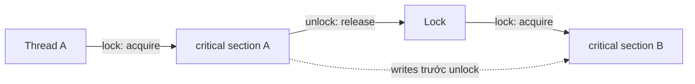

## Mục lục

- [Tổng quan](#tổng-quan)
- [1. Lock interface giải quyết vấn đề gì](#1-lock-interface-giải-quyết-vấn-đề-gì)
- [2. Lock không đồng nghĩa với ReentrantLock](#2-lock-không-đồng-nghĩa-với-reentrantlock)
- [3. Contract và happens-before](#3-contract-và-happens-before)
  - [3.1 Mutual exclusion phụ thuộc implementation](#31-mutual-exclusion-phụ-thuộc-implementation)
  - [3.2 Release/acquire qua unlock và lock](#32-releaseacquire-qua-unlock-và-lock)
- [4. Các method của Lock](#4-các-method-của-lock)
  - [4.1 lock](#41-lock)
  - [4.2 lockInterruptibly](#42-lockinterruptibly)
  - [4.3 tryLock](#43-trylock)
  - [4.4 unlock](#44-unlock)
  - [4.5 newCondition](#45-newcondition)
- [5. Mẫu dùng đúng: try/finally](#5-mẫu-dùng-đúng-tryfinally)
- [6. ReentrantLock](#6-reentrantlock)
  - [6.1 Reentrancy](#61-reentrancy)
  - [6.2 Fair và non-fair](#62-fair-và-non-fair)
  - [6.3 Inspection methods](#63-inspection-methods)
- [7. Condition: nhiều hàng đợi chờ cho một lock](#7-condition-nhiều-hàng-đợi-chờ-cho-một-lock)
  - [7.1 await và signal](#71-await-và-signal)
  - [7.2 Bounded buffer](#72-bounded-buffer)
- [8. Lock và synchronized](#8-lock-và-synchronized)
- [9. Hiệu năng: chọn theo workload, không theo định kiến](#9-hiệu-năng-chọn-theo-workload-không-theo-định-kiến)
- [10. Deadlock, lock ordering và liveness](#10-deadlock-lock-ordering-và-liveness)
- [11. Những lỗi thường gặp](#11-những-lỗi-thường-gặp)
- [12. Chọn công cụ nào](#12-chọn-công-cụ-nào)
- [Tài liệu tham khảo](#tài-liệu-tham-khảo)

---

## Tổng quan

`Lock` là interface trong `java.util.concurrent.locks` cho phép **acquire** và
**release** lock một cách tường minh. Implementation thường gặp nhất là
`ReentrantLock`.

Nó là lựa chọn mở rộng cho monitor lock của `synchronized`, **không phải** cơ chế
thay thế hoàn toàn monitor. Cả hai đều có thể tạo mutual exclusion và quan hệ
happens-before (HB). `Lock` hữu ích khi cần timeout, huỷ lúc đang chờ bằng
interrupt, fairness, hoặc nhiều condition queue.

> [!IMPORTANT]
> `Lock` là **interface**, không phải một loại lock cụ thể. Đừng suy luận mọi
> `Lock` đều độc quyền, reentrant hay fair. Các thuộc tính đó do implementation
> quyết định. Ví dụ `ReentrantLock` là exclusive + reentrant; `ReadLock` của
> `ReentrantReadWriteLock` cũng có kiểu `Lock` nhưng cho nhiều reader cùng giữ.



## 1. Lock interface giải quyết vấn đề gì

Monitor lock có cú pháp ngắn:

```java
synchronized (monitor) {
    updateSharedState();
}
```

Nhưng cách này không hỗ trợ trực tiếp các nhu cầu sau:

- thử lấy lock mà **không chờ**;
- chờ lock trong thời gian giới hạn;
- dừng việc chờ khi thread bị interrupt;
- chọn chính sách fairness;
- tạo nhiều hàng đợi chờ độc lập cho các điều kiện khác nhau.

`Lock` tách thao tác acquire/release khỏi block cú pháp:

```java
Lock lock = new ReentrantLock();

lock.lock();
try {
    updateSharedState();
} finally {
    lock.unlock();
}
```

Sự linh hoạt này có giá trị thật, nhưng cũng tạo trách nhiệm: compiler không tự
chèn `unlock()` như `synchronized`. Bỏ quên `unlock()` có thể làm toàn hệ thống
kẹt.

## 2. Lock không đồng nghĩa với ReentrantLock

`Lock` chỉ định nghĩa contract chung:

```java
public interface Lock {
    void lock();
    void lockInterruptibly() throws InterruptedException;
    boolean tryLock();
    boolean tryLock(long time, TimeUnit unit) throws InterruptedException;
    void unlock();
    Condition newCondition();
}
```

Các implementation/view quan trọng:

| Kiểu | Có phải `Lock`? | Đặc điểm chính |
|---|---:|---|
| `ReentrantLock` | ✅ | Exclusive lock, reentrant, có `Condition`, chọn fair/non-fair |
| `ReentrantReadWriteLock.ReadLock` | ✅ | Nhiều reader có thể cùng giữ |
| `ReentrantReadWriteLock.WriteLock` | ✅ | Writer độc quyền, có `Condition` |
| `StampedLock` | ❌ | API dựa trên `stamp`; không reentrant và không implement `Lock` |

Do đó, `Lock` không có nghĩa tuyệt đối là “chỉ một thread được vào”. Đó là điều
`ReentrantLock` và write lock cam kết. Read lock là phản ví dụ: nhiều thread đọc
song song vẫn đúng vì không thread nào ghi.

## 3. Contract và happens-before

### 3.1 Mutual exclusion phụ thuộc implementation

Với `ReentrantLock`, một thread giữ lock thì thread khác gọi `lock()` trên **cùng
instance** phải chờ. Nhờ vậy đoạn code giữa `lock()` và `unlock()` là critical
section độc quyền.

```java
private final Lock lock = new ReentrantLock();
private int balance;

void deposit(int amount) {
    lock.lock();
    try {
        balance += amount; // read → add → write được bảo vệ như một khối
    } finally {
        lock.unlock();
    }
}
```

Điều kiện quan trọng là mọi đường đọc/ghi cần bảo vệ phải dùng **cùng một instance
lock**. Tạo lock mới trong mỗi method không có tác dụng đồng bộ:

```java
void brokenIncrement() {
    Lock lock = new ReentrantLock(); // mỗi lần gọi là một lock khác
    lock.lock();
    try {
        balance++;
    } finally {
        lock.unlock();
    }
}
```

### 3.2 Release/acquire qua unlock và lock

Theo contract của `Lock`, một `unlock()` thành công có cùng memory synchronization
effects như **monitor unlock**; một `lock()` thành công có effects như **monitor
lock**.

```text
Thread A: write shared state → unlock(L)
                                  happens-before
Thread B:                    lock(L) → read shared state
```

Hệ quả: mọi write của A trước `unlock(L)` được B thấy sau khi B lấy được **cùng
lock L**. Đây là visibility + ordering, không chỉ là “xếp hàng lần lượt”.

```java
private final Lock lock = new ReentrantLock();
private int configVersion;

// Thread A
lock.lock();
try {
    configVersion = 2;
} finally {
    lock.unlock();
}

// Thread B, nếu lock() thành công sau unlock của A
lock.lock();
try {
    System.out.println(configVersion); // thấy 2
} finally {
    lock.unlock();
}
```

> [!WARNING]
> HB chỉ suy ra được khi acquire/release trên **cùng lock** và B thực sự acquire
> sau release liên quan. Lock A không publish dữ liệu cho thread chỉ đang giữ lock
> B.

## 4. Các method của Lock

### 4.1 lock

`lock()` chờ cho đến khi lấy được lock. Nó **không interruptible** trong khi đang
chờ: nếu thread bị `interrupt()`, implementation có thể chỉ ghi nhận interrupt và
thread vẫn tiếp tục chờ cho tới khi có lock.

```java
lock.lock();
try {
    update();
} finally {
    lock.unlock();
}
```

Dùng cho critical section bình thường khi không cần timeout hoặc cancellation.

### 4.2 lockInterruptibly

`lockInterruptibly()` cũng chờ lấy lock, nhưng ném `InterruptedException` nếu
thread bị interrupt lúc đang chờ. Nó phù hợp với tác vụ có thể bị huỷ.

```java
try {
    lock.lockInterruptibly();
    try {
        update();
    } finally {
        lock.unlock();
    }
} catch (InterruptedException e) {
    Thread.currentThread().interrupt(); // khôi phục interrupt status
    return;
}
```

Chỉ gọi `unlock()` sau khi acquire thành công. Trong ví dụ trên, nếu
`lockInterruptibly()` ném exception thì code chưa đi vào `try` bên trong, nên
không nhả một lock mà mình không giữ.

### 4.3 tryLock

`tryLock()` trả về ngay:

- `true`: đã lấy lock, caller phải `unlock()`;
- `false`: lock đang không lấy được, caller chưa sở hữu lock.

```java
if (lock.tryLock()) {
    try {
        update();
    } finally {
        lock.unlock();
    }
} else {
    recordBusy();
}
```

Biến thể có timeout chờ tối đa một khoảng thời gian và có thể bị interrupt:

```java
if (lock.tryLock(200, TimeUnit.MILLISECONDS)) {
    try {
        update();
    } finally {
        lock.unlock();
    }
} else {
    throw new TimeoutException("Không lấy được lock trong 200 ms");
}
```

`tryLock()` không timeout thường là công cụ tốt để tránh deadlock khi cần lấy nhiều
lock: nếu không lấy được lock tiếp theo, hãy nhả lock đang giữ, backoff rồi thử
lại. Tuy nhiên phải thiết kế retry/backoff cẩn thận để tránh livelock.

### 4.4 unlock

`unlock()` nhả lock để thread khác có thể acquire. Với `ReentrantLock`, chỉ owner
hiện tại mới được unlock; unlock sai thread sẽ ném `IllegalMonitorStateException`.

Nếu `ReentrantLock` được cùng thread acquire N lần, nó chỉ thực sự được nhả khi
`unlock()` cũng được gọi N lần. Vì vậy, mỗi lần `lock()` thành công phải có đúng
một `unlock()` tương ứng.

### 4.5 newCondition

`newCondition()` tạo một `Condition` gắn với lock. `Condition` là phiên bản linh
hoạt hơn của `Object.wait()/notify()/notifyAll()`.

```java
Condition notEmpty = lock.newCondition();
```

Không phải implementation nào cũng phải hỗ trợ condition. Một implementation có
thể ném `UnsupportedOperationException`; hãy xem Javadoc của kiểu lock đang dùng.

## 5. Mẫu dùng đúng: try/finally

Đây là mẫu mặc định cho `Lock`:

```java
lock.lock();
try {
    criticalSection();
} finally {
    lock.unlock();
}
```

Sai:

```java
lock.lock();
criticalSection(); // ném exception tại đây → unlock không chạy
lock.unlock();
```

Khi exception xảy ra trong phiên bản sai, lock vẫn bị giữ. Các thread khác chờ
lock có thể chờ vô hạn. Đây là khác biệt an toàn quan trọng so với
`synchronized`: JVM luôn nhả monitor khi rời block do `return` hoặc exception.

## 6. ReentrantLock

`ReentrantLock` là implementation `Lock` phổ biến nhất. Nó cung cấp exclusive
mutual exclusion, reentrancy, optional fairness và nhiều `Condition`.

### 6.1 Reentrancy

Reentrant nghĩa là thread đang giữ lock có thể acquire lại chính lock đó mà không
tự chặn mình.

```java
class Service {
    private final Lock lock = new ReentrantLock();

    void outer() {
        lock.lock();
        try {
            inner();
        } finally {
            lock.unlock();
        }
    }

    void inner() {
        lock.lock();       // hợp lệ: vẫn là owner hiện tại
        try {
            // làm việc với state được bảo vệ
        } finally {
            lock.unlock(); // giảm hold count, chưa nhất thiết nhả hẳn lock
        }
    }
}
```

Trong ví dụ, `outer()` acquire lần một và `inner()` acquire lần hai. `inner()`
nhả một lần, rồi `outer()` nhả lần còn lại. Nếu thiếu một trong hai lần unlock,
lock vẫn bị giữ.

### 6.2 Fair và non-fair

```java
Lock fast = new ReentrantLock();      // non-fair, mặc định
Lock ordered = new ReentrantLock(true); // fair
```

| Chính sách | Hành vi | Đánh đổi |
|---|---|---|
| **Non-fair** | Thread mới có thể lấy lock ngay cả khi đã có thread chờ | Thường throughput tốt hơn, nhưng thứ tự không FIFO và một thread có thể chờ lâu hơn |
| **Fair** | Cố gắng ưu tiên thread đã chờ lâu hơn | Giảm nguy cơ starvation, nhưng thường giảm throughput |

Fair không có nghĩa scheduler chạy thread theo đúng FIFO tuyệt đối. Nó chỉ là
chính sách cấp lock. Sau khi được cấp lock, thread vẫn phụ thuộc OS/JVM scheduler
để thực sự chạy.

> [!TIP]
> Dùng non-fair mặc định trừ khi hệ thống có yêu cầu fairness rõ ràng. Đừng bật
> fair chỉ vì “công bằng hơn”; chi phí scheduling và context switching thường làm
> throughput giảm.

### 6.3 Inspection methods

`ReentrantLock` có các method quan sát như `isLocked()`, `isHeldByCurrentThread()`,
`getHoldCount()` và `getQueueLength()`.

Chúng phù hợp cho logging, metrics hoặc assertion. Không dùng kết quả đó để ra
quyết định đồng bộ:

```java
if (!lock.isLocked()) { // race: lock có thể bị thread khác lấy ngay sau dòng này
    lock.lock();
}
```

Muốn “chỉ lấy nếu đang rảnh”, dùng `tryLock()` vì acquire và kiểm tra diễn ra
trong một operation.

## 7. Condition: nhiều hàng đợi chờ cho một lock

Một object monitor chỉ có một `wait set`. `ReentrantLock` có thể tạo nhiều
`Condition`, mỗi cái là một hàng đợi chờ có ý nghĩa nghiệp vụ riêng.

```text
ReentrantLock
├── sync queue: thread đang chờ lấy lock
├── notEmpty queue: consumer đang chờ có dữ liệu
└── notFull queue: producer đang chờ còn chỗ
```

Điều này giúp producer chỉ đánh thức consumer (`notEmpty.signal()`), thay vì đánh
thức lẫn nhau như khi mọi thread dùng chung một wait set.

### 7.1 await và signal

`await()` chỉ được gọi khi caller đang giữ lock. Nó thực hiện tuần tự:

1. Nhả lock hoàn toàn, kể cả hold count khi reentrant.
2. Đưa thread vào condition queue và park.
3. Khi được `signal()`/`signalAll()` hoặc bị interrupt, thread chuyển sang hàng
   chờ acquire lock.
4. Acquire lại lock rồi mới trở về từ `await()`.

Vì thread có thể bị đánh thức giả (*spurious wakeup*) hoặc một thread khác đã đổi
state trước khi nó acquire lại lock, luôn kiểm tra điều kiện trong `while`.

```java
while (!conditionIsTrue()) {
    condition.await();
}
```

`signal()` và `signalAll()` cũng yêu cầu caller đang giữ chính lock đó. Signal chỉ
là thông báo “hãy kiểm tra lại điều kiện”; nó không chuyển quyền sở hữu lock ngay
lập tức.

### 7.2 Bounded buffer

```java
public final class BoundedBuffer<E> {
    private final Queue<E> queue = new ArrayDeque<>();
    private final int capacity;
    private final Lock lock = new ReentrantLock();
    private final Condition notEmpty = lock.newCondition();
    private final Condition notFull = lock.newCondition();

    public BoundedBuffer(int capacity) {
        this.capacity = capacity;
    }

    public void put(E item) throws InterruptedException {
        lock.lockInterruptibly();
        try {
            while (queue.size() == capacity) {
                notFull.await();
            }
            queue.add(item);
            notEmpty.signal();
        } finally {
            lock.unlock();
        }
    }

    public E take() throws InterruptedException {
        lock.lockInterruptibly();
        try {
            while (queue.isEmpty()) {
                notEmpty.await();
            }
            E item = queue.remove();
            notFull.signal();
            return item;
        } finally {
            lock.unlock();
        }
    }
}
```

`notEmpty` và `notFull` tách consumer khỏi producer. Sau khi producer thêm item,
nó chỉ signal nhóm consumer. Sau khi consumer lấy item, nó chỉ signal nhóm
producer.

> [!NOTE]
> Trong code production, ưu tiên `ArrayBlockingQueue` hoặc `LinkedBlockingQueue`
thay vì tự viết bounded buffer, trừ khi bạn có invariant hoặc policy đặc biệt.

## 8. Lock và synchronized

| Tiêu chí | `synchronized` | `Lock` / `ReentrantLock` |
|---|---|---|
| Kiểu lock | Monitor gắn với object | Object API tường minh |
| Nhả lock khi exception | JVM tự nhả | Caller phải dùng `finally` |
| Mutual exclusion | ✅ | ✅ với `ReentrantLock` / write lock |
| HB / visibility / ordering | ✅ | ✅ khi acquire/release cùng lock |
| Reentrant | ✅ | ✅ với `ReentrantLock` |
| Timeout | ❌ | ✅ `tryLock(timeout)` |
| Interrupt khi chờ acquire | ❌ | ✅ `lockInterruptibly()` |
| Fairness | Không chọn được | Có với `ReentrantLock(true)` |
| Nhiều condition queue | ❌ | ✅ `newCondition()` |

Nếu chỉ cần một critical section nhỏ, `synchronized` thường rõ ràng và khó sai
hơn. Chọn `ReentrantLock` khi bạn thực sự cần một trong các khả năng thêm của nó.

## 9. Hiệu năng: chọn theo workload, không theo định kiến

Không có quy tắc “`ReentrantLock` luôn nhanh hơn `synchronized`”. JVM hiện đại
tối ưu `synchronized` tốt khi không hoặc ít contention. Với đoạn code nhỏ, sự
khác biệt thường không phải bottleneck đáng quan tâm.

Khi contention cao, cả hai đều có thể làm thread xếp hàng. Nút thắt chính thường
là thời gian giữ lock, không phải tên API:

```java
lock.lock();
try {
    callRemoteService(); // không giữ lock qua I/O/network nếu có thể
    updateState();
} finally {
    lock.unlock();
}
```

Cải thiện trước theo thứ tự:

1. Rút ngắn critical section; không giữ lock khi I/O, sleep, callback không kiểm
   soát, hoặc tính toán dài.
2. Giảm chia sẻ state; chia lock theo dữ liệu nếu invariant cho phép.
3. Với counter contention cao, cân nhắc `LongAdder` thay vì một lock chung.
4. Với đọc nhiều, ghi ít, benchmark `ReentrantReadWriteLock` hoặc `StampedLock`.
5. Đo bằng JMH trên workload gần với production; không kết luận từ một micro-test
   `System.nanoTime()` tự viết.

## 10. Deadlock, lock ordering và liveness

Deadlock thường xuất hiện khi hai thread lấy hai lock theo thứ tự ngược nhau:

```text
T1: giữ accountLock  → chờ ledgerLock
T2: giữ ledgerLock   → chờ accountLock
```

Quy tắc phòng ngừa đơn giản nhất: định nghĩa một **global lock order** và mọi code
phải tuân thủ cùng thứ tự.

```java
void transfer(Account from, Account to, int amount) {
    Account first = from.id() < to.id() ? from : to;
    Account second = from.id() < to.id() ? to : from;

    first.lock.lock();
    try {
        second.lock.lock();
        try {
            from.debit(amount);
            to.credit(amount);
        } finally {
            second.lock.unlock();
        }
    } finally {
        first.lock.unlock();
    }
}
```

Có thể dùng `tryLock(timeout)` để giới hạn việc chờ, nhưng timeout không thay thế
cho lock ordering. Retry mà không backoff còn có thể tạo **livelock**: mọi thread
cùng nhả và cùng thử lại mãi mà không tiến triển.

## 11. Những lỗi thường gặp

| Lỗi | Hậu quả | Cách đúng |
|---|---|---|
| Không dùng `finally` | Exception làm lock không được nhả | `lock(); try { ... } finally { unlock(); }` |
| Tạo lock cục bộ mỗi lần gọi | Không thread nào tranh cùng lock | Giữ `private final Lock lock` ổn định |
| Dùng `isLocked()` để kiểm tra-then-act | Race giữa kiểm tra và acquire | Dùng `tryLock()` |
| Gọi `await()` bằng `if` | Spurious wakeup hoặc state đổi lại | Dùng `while` |
| Gọi `await()` / `signal()` ngoài lock | `IllegalMonitorStateException` | Giữ lock trước khi gọi |
| Giữ lock qua I/O/callback | Contention, deadlock hoặc latency cao | Sao chép state cần thiết, unlock rồi mới gọi ngoài |
| Dùng nhiều lock không có thứ tự | Deadlock | Quy ước lock ordering |
| Bật fair mặc định | Throughput có thể giảm | Chỉ bật khi fairness là yêu cầu |

## 12. Chọn công cụ nào

| Nhu cầu | Công cụ nên ưu tiên |
|---|---|
| Critical section ngắn, không cần API nâng cao | `synchronized` |
| Timeout, cancel bằng interrupt, nhiều condition | `ReentrantLock` |
| Nhiều reader, ít writer; đọc đủ nặng để bù overhead | `ReentrantReadWriteLock` |
| Read-mostly, chấp nhận validate/fallback phức tạp | `StampedLock` |
| Một cập nhật atomic trên một field | `AtomicInteger`, `AtomicReference`, CAS |
| Counter cập nhật nhiều dưới contention cao | `LongAdder` |
| Producer-consumer thông thường | `BlockingQueue` |

> [!TIP]
> Đừng bắt đầu bằng lock nếu state có thể immutable hoặc confined trong một thread.
> Khi lock là cần thiết, hãy ưu tiên `synchronized` cho case đơn giản và chỉ tăng
> độ phức tạp lên `Lock` khi có requirement cụ thể.

## Tài liệu tham khảo

- [Javadoc — Lock (Java 21)](https://docs.oracle.com/en/java/javase/21/docs/api/java.base/java/util/concurrent/locks/Lock.html)
- [Javadoc — ReentrantLock (Java 21)](https://docs.oracle.com/en/java/javase/21/docs/api/java.base/java/util/concurrent/locks/ReentrantLock.html)
- [Javadoc — Condition (Java 21)](https://docs.oracle.com/en/java/javase/21/docs/api/java.base/java/util/concurrent/locks/Condition.html)
- Trước: [Happens-before trong java.util.concurrent](/jmm/11-happens-before-juc/)
- Tiếp theo: [AbstractQueuedSynchronizer (AQS) từ nền tảng](/jmm/11b-abstract-queued-synchronizer/)
