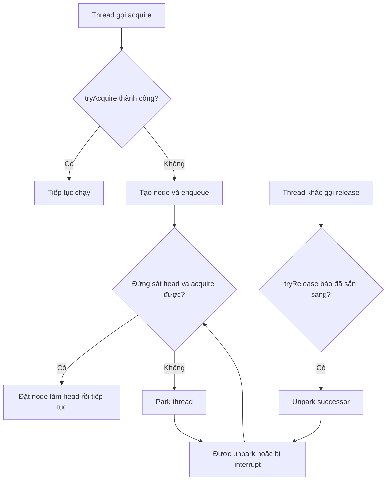
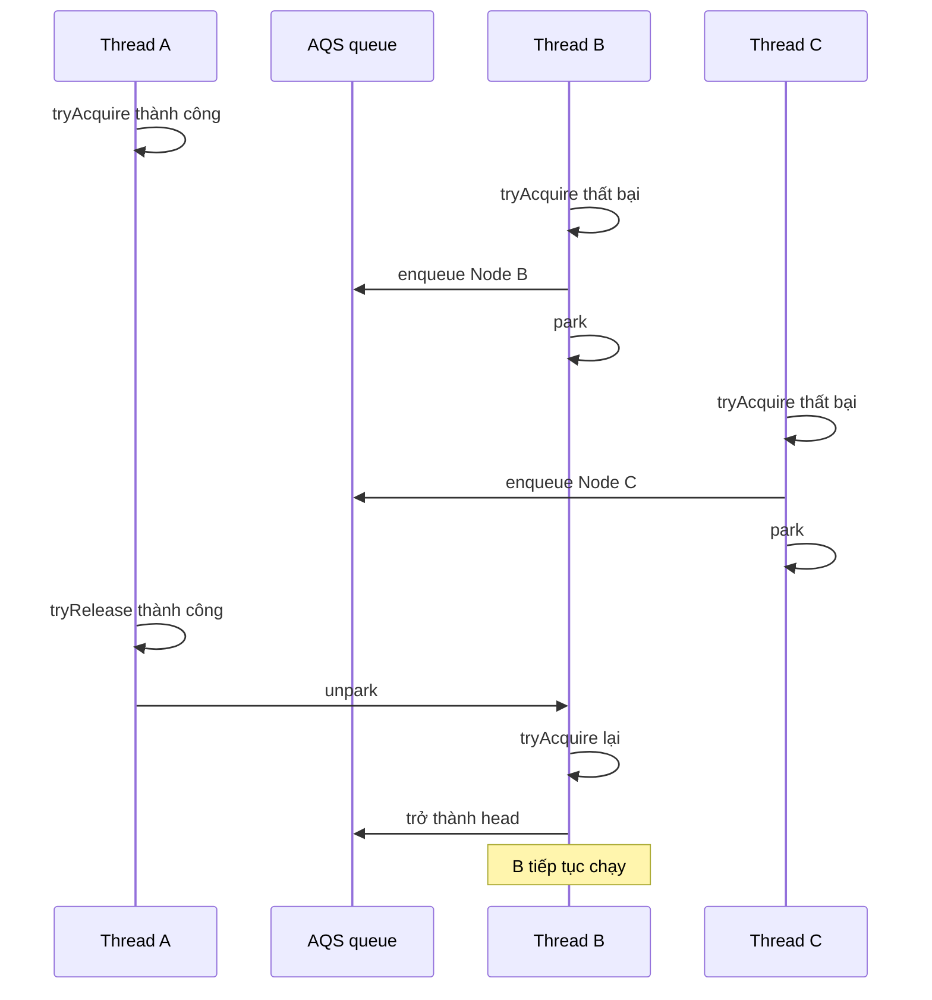
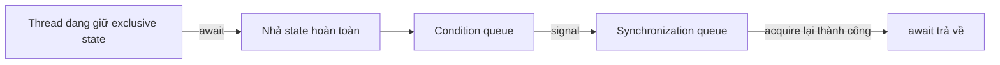

## Mục lục

- [Tổng quan](#tổng-quan)
- [1. AQS nằm ở đâu trong một synchronizer](#1-aqs-nằm-ở-đâu-trong-một-synchronizer)
  - [1.1 AQS làm gì](#11-aqs-làm-gì)
  - [1.2 Subclass phải làm gì](#12-subclass-phải-làm-gì)
- [2. Ba mảnh ghép cốt lõi](#2-ba-mảnh-ghép-cốt-lõi)
  - [2.1 State](#21-state)
  - [2.2 Synchronization queue](#22-synchronization-queue)
  - [2.3 Park và unpark](#23-park-và-unpark)
- [3. Phân biệt acquire với tryAcquire](#3-phân-biệt-acquire-với-tryacquire)
- [4. Exclusive acquire diễn ra như thế nào](#4-exclusive-acquire-diễn-ra-như-thế-nào)
  - [4.1 Đường nhanh: chưa cần queue](#41-đường-nhanh-chưa-cần-queue)
  - [4.2 Acquire thất bại: tạo node và enqueue](#42-acquire-thất-bại-tạo-node-và-enqueue)
  - [4.3 Node đầu hàng thử acquire](#43-node-đầu-hàng-thử-acquire)
  - [4.4 Chưa acquire được thì park](#44-chưa-acquire-được-thì-park)
- [5. Exclusive release diễn ra như thế nào](#5-exclusive-release-diễn-ra-như-thế-nào)
- [6. Walkthrough với bốn thread](#6-walkthrough-với-bốn-thread)
- [7. Hai thread cùng enqueue có làm hỏng queue không](#7-hai-thread-cùng-enqueue-có-làm-hỏng-queue-không)
- [8. Vì sao được unpark vẫn phải acquire lại](#8-vì-sao-được-unpark-vẫn-phải-acquire-lại)
- [9. Fairness có phải do queue tự bảo đảm không](#9-fairness-có-phải-do-queue-tự-bảo-đảm-không)
- [10. Shared mode](#10-shared-mode)
- [11. Ví dụ: synchronizer độc quyền không reentrant](#11-ví-dụ-synchronizer-độc-quyền-không-reentrant)
- [12. Ví dụ: cổng mở một lần bằng shared mode](#12-ví-dụ-cổng-mở-một-lần-bằng-shared-mode)
- [13. Interrupt, timeout và cancellation](#13-interrupt-timeout-và-cancellation)
- [14. Condition queue khác synchronization queue](#14-condition-queue-khác-synchronization-queue)
- [15. Memory semantics](#15-memory-semantics)
- [16. Những điều AQS không tự làm](#16-những-điều-aqs-không-tự-làm)
  - [16.1 AQS, Lock và các synchronizer chuẩn](#161-aqs-lock-và-các-synchronizer-chuẩn)
- [17. Cách đọc source AQS mà không bị ngợp](#17-cách-đọc-source-aqs-mà-không-bị-ngợp)
- [18. Checklist xây synchronizer bằng AQS](#18-checklist-xây-synchronizer-bằng-aqs)
- [19. Câu hỏi thường gặp](#19-câu-hỏi-thường-gặp)
- [Tóm tắt](#tóm-tắt)
- [Tài liệu tham khảo](#tài-liệu-tham-khảo)

---

## Tổng quan

`AbstractQueuedSynchronizer` — viết tắt là **AQS** — là một framework trong
`java.util.concurrent.locks` để xây dựng các synchronizer. Synchronizer là một
object quyết định thread nào được tiếp tục và thread nào phải chờ dựa trên một
trạng thái dùng chung.

AQS kết hợp ba thứ:

```text
state + synchronization queue + park/unpark
```

- `state` biểu diễn trạng thái đồng bộ do subclass tự định nghĩa.
- synchronization queue lưu các thread chưa acquire được.
- `park/unpark` tạm dừng và đánh thức thread mà không bắt thread spin liên tục.

> [!IMPORTANT]
> AQS không phải một lock hoàn chỉnh. Nó không tự biết `state == 0` hay
> `state == 1` có nghĩa gì. Subclass định nghĩa luật acquire/release; AQS lo việc
> xếp hàng, chờ, đánh thức, interrupt, timeout và cancellation.

Sơ đồ tư duy quan trọng nhất:



## 1. AQS nằm ở đâu trong một synchronizer

Một synchronizer xây trên AQS thường có cấu trúc:

```java
public final class MySynchronizer {
    private final Sync sync = new Sync();

    private static final class Sync
            extends AbstractQueuedSynchronizer {
        @Override
        protected boolean tryAcquire(int arg) {
            // Luật acquire riêng
        }

        @Override
        protected boolean tryRelease(int arg) {
            // Luật release riêng
        }
    }

    public void enter() {
        sync.acquire(1);
    }

    public void leave() {
        sync.release(1);
    }
}
```

Có ba tầng trách nhiệm:

```text
API công khai: enter()/leave()
        │
        ▼
Subclass Sync: định nghĩa luật state qua tryAcquire()/tryRelease()
        │
        ▼
AQS: state, queue, CAS, park/unpark và lifecycle chờ
```

### 1.1 AQS làm gì

AQS cung cấp sẵn:

- một `int state` có visibility semantics;
- `getState()`, `setState()` và `compareAndSetState()`;
- một synchronization queue dạng liên kết;
- thêm node vào cuối queue an toàn khi nhiều thread cạnh tranh;
- park thread chưa thể tiến lên;
- unpark thread phù hợp khi state được release;
- exclusive mode và shared mode;
- các biến thể interruptible và có timeout;
- cơ sở để triển khai `ConditionObject`.

### 1.2 Subclass phải làm gì

Subclass phải gán **ý nghĩa** cho `state` và cài đặt các hook phù hợp:

| Chế độ | Hook acquire | Hook release |
|---|---|---|
| Exclusive | `tryAcquire(int)` | `tryRelease(int)` |
| Shared | `tryAcquireShared(int)` | `tryReleaseShared(int)` |

Subclass cũng phải quyết định:

- điều kiện acquire thành công;
- state thay đổi như thế nào;
- có ownership hay không;
- có reentrant hay không;
- có kiểm tra thread gọi release hay không;
- có áp dụng fairness hay không.

> [!WARNING]
> Các hook `tryAcquire*` và `tryRelease*` phải ngắn, không block và không tự park.
> Chúng chỉ kiểm tra/cập nhật state rồi trả kết quả. AQS mới là tầng quản lý việc
> chờ.

## 2. Ba mảnh ghép cốt lõi

### 2.1 State

AQS giữ một số nguyên có dạng khái niệm:

```java
private volatile int state;
```

Subclass truy cập nó qua:

```java
getState();
setState(newState);
compareAndSetState(expected, update);
```

AQS không gắn sẵn ý nghĩa cho con số này. Ví dụ, một subclass có thể quy ước:

```text
state = 0 → chưa có tín hiệu
state = 1 → đã có tín hiệu
```

Một subclass khác có thể quy ước:

```text
state = 0 → hết permit
state = N → còn N permit
```

`volatile` giải quyết visibility và ordering, nhưng không biến chuỗi
đọc–sửa–ghi thành một thao tác atomic:

```java
if (getState() == 0) {
    setState(1); // không an toàn nếu nhiều thread cùng làm
}
```

Hai thread có thể cùng đọc `0`, rồi cùng ghi `1`. Khi chỉ một thread được phép
thắng, phải dùng CAS:

```java
compareAndSetState(0, 1);
```

Nếu A và B cùng gọi CAS:

```text
state ban đầu = 0

Thread A: CAS(0, 1) → thành công
Thread B: CAS(0, 1) → thất bại vì state hiện đã là 1
```

Đọc `state == 0` không cấp quyền. **CAS thành công** mới là điểm thread claim
state.

### 2.2 Synchronization queue

Khi acquire thất bại, AQS tạo một node đại diện cho thread và thêm node vào
synchronization queue:

```text
head                                           tail
  │                                              │
  ▼                                              ▼
[dummy] ◄──► [Thread B] ◄──► [Thread C] ◄──► [Thread D]
```

Mô hình node đơn giản hóa:

```java
class Node {
    Thread waiter;
    Node prev;
    Node next;
    int status;
}
```

Tên field và chi tiết node có thể thay đổi giữa các phiên bản JDK. Các ý tưởng ổn
định là:

- node đại diện cho một waiter;
- `prev`/`next` nối các node;
- `head` là mốc đầu queue;
- `tail` là mốc để enqueue;
- status phục vụ waiting, signalling và cancellation.

AQS queue là một biến thể của **CLH queue** được điều chỉnh để hỗ trợ blocking.
Đây không phải `BlockingQueue` chứa dữ liệu nghiệp vụ.

```text
BlockingQueue: chứa item
AQS queue:      chứa node đại diện cho thread đang chờ synchronization
```

### 2.3 Park và unpark

Nếu chưa thể acquire, AQS có thể gọi:

```java
LockSupport.park(this);
```

`park()` tạm dừng thread. Node của thread vẫn nằm trong queue, nhưng thread không
chạy vòng lặp liên tục để đốt CPU.

Khi state được release, AQS có thể gọi:

```java
LockSupport.unpark(waiter);
```

`unpark()` cấp cho thread một permit để thoát hoặc tránh bị chặn ở `park()`. Nó
**không chuyển ownership** và không bảo đảm thread chạy ngay lập tức.

> [!NOTE]
> `unpark()` có thể xảy ra trước `park()` mà không làm mất tín hiệu. Permit được
> ghi nhận; lần `park()` tương ứng sau đó có thể trả về ngay. Đây là khác biệt quan
> trọng so với cách tưởng tượng đơn giản rằng notify trước wait luôn bị mất.

## 3. Phân biệt acquire với tryAcquire

Tên gần giống nhau nhưng trách nhiệm hoàn toàn khác.

### `tryAcquire(int)`

Subclass cài đặt method này. Nó chỉ trả lời:

> Thread hiện tại có acquire được **ngay bây giờ** không?

```java
@Override
protected boolean tryAcquire(int arg) {
    return compareAndSetState(0, 1);
}
```

Nó không enqueue và không park.

### `acquire(int)`

AQS cung cấp method này. Nó chạy toàn bộ protocol:

```text
tryAcquire
  ├── thành công → return
  └── thất bại   → enqueue → park/unpark → thử lại
```

Pseudocode tối giản:

```java
public final void acquire(int arg) {
    if (!tryAcquire(arg)) {
        enqueueAndWait(arg);
    }
}
```

Tương tự ở phía release:

```text
tryRelease = subclass cập nhật state và báo có cần signal hay không
release    = AQS gọi tryRelease rồi unpark waiter khi phù hợp
```

## 4. Exclusive acquire diễn ra như thế nào

Exclusive mode dùng:

```java
acquire(int arg);
```

Ở chế độ này, một lần acquire thành công thường ngăn waiter khác acquire cho đến
khi state được release. Chính subclass định nghĩa chính xác luật độc quyền.

### 4.1 Đường nhanh: chưa cần queue

Thread trước hết gọi `tryAcquire()`:

```java
if (tryAcquire(arg)) {
    return;
}
```

Nếu state đang cho phép, thread đi tiếp mà không tạo node và không park:

```text
acquire
   ↓
tryAcquire thành công
   ↓
return ngay
```

Queue chỉ cần thiết cho các thread **không acquire được ngay**.

### 4.2 Acquire thất bại: tạo node và enqueue

Nếu `tryAcquire()` trả `false`, AQS tạo node cho current thread và nối nó vào
`tail`:

```text
Trước:

head ◄──► B
          ▲
          tail

Sau khi C enqueue:

head ◄──► B ◄──► C
                  ▲
                  tail
```

Cập nhật `tail` phải atomic vì nhiều thread có thể enqueue đồng thời. AQS sử dụng
CAS và retry thay vì một phép gán không được bảo vệ.

### 4.3 Node đầu hàng thử acquire

Queue thường được mô hình hóa với một head làm node mốc:

```text
head → B → C → D
```

B là node sát head. B được ưu tiên gọi lại `tryAcquire()`:

```java
if (node.prev == head && tryAcquire(arg)) {
    setHead(node);
    return;
}
```

Khi B acquire thành công, node B trở thành head mới:

```text
Trước: [head cũ] → [B] → [C] → [D]
Sau:               [B/head] → [C] → [D]
```

Thông tin waiter của head mới có thể được xóa. C lúc này là waiter gần head nhất.

> [!IMPORTANT]
> `head` không nên được hiểu là “owner”. Head là mốc quản lý queue. Ownership, nếu
> synchronizer cần khái niệm đó, là chính sách riêng của subclass.

### 4.4 Chưa acquire được thì park

Nếu node chưa đứng sát head hoặc `tryAcquire()` vẫn thất bại, thread chuẩn bị
trạng thái chờ rồi park:

```java
for (;;) {
    if (node.prev == head && tryAcquire(arg)) {
        setHead(node);
        return;
    }

    prepareToPark(node);
    LockSupport.park(this);
}
```

Đây là pseudocode để thấy protocol, không phải source chính xác của một phiên bản
JDK cụ thể.

Vòng lặp là bắt buộc vì thread có thể thức dậy do:

- `unpark()`;
- interrupt;
- spurious return;
- thay đổi/cancellation trong queue.

Thức dậy chỉ có nghĩa thread được kiểm tra lại. `tryAcquire()` mới quyết định nó
có được đi tiếp hay không.

## 5. Exclusive release diễn ra như thế nào

Phía release có hai tầng:

```java
release(arg)      // AQS cung cấp
tryRelease(arg)   // subclass cài đặt
```

Pseudocode:

```java
public final boolean release(int arg) {
    if (tryRelease(arg)) {
        signalNextWaiter();
        return true;
    }
    return false;
}
```

Giá trị trả về của `tryRelease()` rất quan trọng:

- `true`: state đã chuyển tới mức một waiter khác có thể tiến lên; AQS nên signal.
- `false`: release chưa đủ để bàn giao; chưa cần đánh thức waiter kế tiếp.

Ví dụ một subclass quy định phải release ba đơn vị:

```text
state 3 → 2: tryRelease trả false
state 2 → 1: tryRelease trả false
state 1 → 0: tryRelease trả true, AQS signal waiter
```

AQS không biết vì sao `1 → 0` là mốc quan trọng. Subclass định nghĩa điều đó.

## 6. Walkthrough với bốn thread

Giả sử subclass quy định chỉ một thread có thể làm `tryAcquire()` thành công tại
một thời điểm.

### Giai đoạn 1: A acquire ngay

```text
state cho phép acquire
queue rỗng
```

A gọi `acquire()`:

```text
A.tryAcquire() → true
A tiếp tục chạy
```

A không xuất hiện trong queue vì nó không phải waiter.

### Giai đoạn 2: B, C, D acquire thất bại

```text
B.tryAcquire() → false → enqueue → park
C.tryAcquire() → false → enqueue → park
D.tryAcquire() → false → enqueue → park
```

Queue:

```text
head → B → C → D
```

### Giai đoạn 3: A release

```text
A gọi release()
tryRelease() → true
AQS unpark B
```

Queue chưa tự động biến mất:

```text
head → B → C → D
```

B chỉ được phép thức dậy và chạy lại protocol.

### Giai đoạn 4: B acquire lại

B thức dậy:

```text
B.prev == head       → đúng
B.tryAcquire()       → true
B trở thành head mới
```

Queue còn lại về mặt waiter:

```text
B/head → C → D
```

Bây giờ C là waiter đầu tiên. Khi B release thành công, AQS signal C.



## 7. Hai thread cùng enqueue có làm hỏng queue không

Không, nếu dùng protocol của AQS. AQS cập nhật `tail` bằng CAS.

Giả sử queue đang có tail là X:

```text
head → X
         ↑
         tail
```

B và C cùng đọc `tail == X`, rồi cùng muốn trở thành tail mới:

```text
B: CAS(tail, X, B)
C: CAS(tail, X, C)
```

Chỉ một CAS thành công. Giả sử B thắng:

```text
head → X → B
              ↑
              tail
```

C thấy CAS thất bại, đọc tail mới là B, nối lại predecessor rồi retry:

```text
C: CAS(tail, B, C) → thành công
```

Kết quả:

```text
head → X → B → C
                  ↑
                  tail
```

Điểm mấu chốt:

```text
Nhiều thread có thể cùng quan sát tail cũ,
nhưng chỉ một thread cập nhật tail thành công cho mỗi bước CAS.
```

## 8. Vì sao được unpark vẫn phải acquire lại

`unpark(B)` không viết state thay B và không trao quyền sở hữu. Nó chỉ làm B có
thể thoát khỏi `park()`.

Timeline có thể là:

```text
1. A release state
2. AQS gọi unpark(B)
3. B chưa được OS scheduler cấp CPU
4. State có thể thay đổi trước khi B chạy
5. B chạy và phải gọi tryAcquire() lại
```

AQS vì vậy luôn dùng vòng lặp kiểm tra điều kiện:

```java
for (;;) {
    if (canTryNow() && tryAcquire(arg)) {
        return;
    }
    parkAgainIfNeeded();
}
```

Nói ngắn gọn:

```text
unpark = “hãy thức dậy và kiểm tra”
không phải
unpark = “acquire đã thành công”
```

## 9. Fairness có phải do queue tự bảo đảm không

Không. Có queue không tự động biến synchronizer thành fair.

AQS cung cấp thông tin để subclass triển khai fairness, nổi bật là:

```java
hasQueuedPredecessors();
```

Một policy fair có thể kiểm tra:

```java
if (!hasQueuedPredecessors()
        && compareAndSetState(0, 1)) {
    return true;
}
```

Một policy non-fair có thể thử CAS ngay mà không kiểm tra queue:

```java
if (compareAndSetState(0, 1)) {
    return true;
}
```

Do đó:

| Thành phần | Trách nhiệm |
|---|---|
| AQS queue | Ghi nhận và điều phối waiter |
| `hasQueuedPredecessors()` | Cho biết có thread chờ trước hay không |
| `tryAcquire()` của subclass | Quyết định có tôn trọng thread chờ trước không |

Fairness cũng không đồng nghĩa thứ tự hoàn thành tuyệt đối FIFO. Scheduler, timeout,
interrupt và cancellation vẫn ảnh hưởng thời điểm thread thực sự chạy.

## 10. Shared mode

Exclusive mode thường chỉ cho một bên tiến lên. Shared mode có thể cho nhiều
thread acquire nếu state cho phép.

API chính:

```java
acquireShared(int arg);
releaseShared(int arg);
```

Subclass cài đặt:

```java
tryAcquireShared(int arg);
tryReleaseShared(int arg);
```

`tryAcquireShared()` trả một `int` thay vì `boolean`:

| Kết quả | Ý nghĩa |
|---:|---|
| `< 0` | Acquire thất bại; thread phải chờ |
| `= 0` | Acquire thành công, nhưng không còn khả năng shared ngay lập tức |
| `> 0` | Acquire thành công và có thể tiếp tục propagate cho waiter shared khác |

Ví dụ state là số permit:

```text
state = 3

B acquire shared → state = 2 → thành công
C acquire shared → state = 1 → thành công
D acquire shared → state = 0 → thành công
E acquire shared → không còn permit → enqueue
```

Shared release có thể khởi động quá trình propagation, đánh thức nhiều waiter theo
chuỗi khi state cho phép. Điều đó khác exclusive release thường chỉ cần mở cơ hội
cho successor tiếp theo.

## 11. Ví dụ: synchronizer độc quyền không reentrant

Ví dụ này chỉ nhằm minh họa cách chia trách nhiệm giữa subclass và AQS. Với code
production, ưu tiên synchronizer chuẩn của JDK nếu phù hợp.

```java
import java.util.concurrent.locks.AbstractQueuedSynchronizer;

public final class BinarySynchronizer {
    private final Sync sync = new Sync();

    private static final class Sync
            extends AbstractQueuedSynchronizer {

        @Override
        protected boolean tryAcquire(int arg) {
            if (arg != 1) {
                throw new IllegalArgumentException("arg must be 1");
            }

            if (compareAndSetState(0, 1)) {
                setExclusiveOwnerThread(Thread.currentThread());
                return true;
            }

            return false;
        }

        @Override
        protected boolean tryRelease(int arg) {
            if (arg != 1) {
                throw new IllegalArgumentException("arg must be 1");
            }

            if (getState() == 0
                    || getExclusiveOwnerThread()
                       != Thread.currentThread()) {
                throw new IllegalMonitorStateException();
            }

            setExclusiveOwnerThread(null);
            setState(0);
            return true;
        }

        @Override
        protected boolean isHeldExclusively() {
            return getState() == 1
                && getExclusiveOwnerThread()
                   == Thread.currentThread();
        }
    }

    public void enter() {
        sync.acquire(1);
    }

    public void enterInterruptibly()
            throws InterruptedException {
        sync.acquireInterruptibly(1);
    }

    public boolean tryEnter() {
        return sync.tryAcquire(1);
    }

    public void leave() {
        sync.release(1);
    }
}
```

Luật riêng nằm trong subclass:

```text
tryAcquire:
  CAS state 0 → 1 thành công thì caller được đi tiếp

tryRelease:
  đúng owner mới được release
  state 1 → 0 rồi trả true để AQS signal waiter
```

Phần AQS lo:

```text
acquire thất bại → enqueue → park
release trả true → tìm waiter → unpark
interruptible acquire → xử lý interrupt/cancellation
```

Synchronizer này không reentrant. Nếu cùng thread gọi `enter()` hai lần mà chưa
`leave()`, lần thứ hai thất bại rồi chính thread đó chờ tài nguyên do nó đang giữ.
Đây là ví dụ cho thấy AQS không tự cung cấp reentrancy.

Cách dùng phải cân bằng acquire/release:

```java
binary.enter();
try {
    criticalSection();
} finally {
    binary.leave();
}
```

## 12. Ví dụ: cổng mở một lần bằng shared mode

Synchronizer sau bắt mọi thread chờ cho đến khi cổng được mở. Sau khi mở, mọi
thread hiện tại và tương lai đều đi qua.

```java
import java.util.concurrent.locks.AbstractQueuedSynchronizer;

public final class OneShotGate {
    private final Sync sync = new Sync();

    private static final class Sync
            extends AbstractQueuedSynchronizer {

        @Override
        protected int tryAcquireShared(int ignored) {
            return getState() == 1 ? 1 : -1;
        }

        @Override
        protected boolean tryReleaseShared(int ignored) {
            setState(1);
            return true;
        }
    }

    public void await() throws InterruptedException {
        sync.acquireSharedInterruptibly(1);
    }

    public void open() {
        sync.releaseShared(1);
    }
}
```

Trước `open()`:

```text
state = 0
B.await() → -1 → enqueue và park
C.await() → -1 → enqueue và park
D.await() → -1 → enqueue và park
```

Sau `open()`:

```text
state = 1
releaseShared trả true
AQS bắt đầu signal/propagate
B, C, D lần lượt thức dậy và acquire shared thành công
```

Thread E gọi `await()` sau khi cổng đã mở sẽ thấy `state == 1` và đi qua ngay.

## 13. Interrupt, timeout và cancellation

AQS cung cấp nhiều biến thể acquire:

| API | Chờ | Phản ứng với interrupt | Timeout |
|---|---|---|---|
| `acquire(arg)` | Có | Không ném ngay; tự interrupt lại khi thích hợp | Không |
| `acquireInterruptibly(arg)` | Có | Ném `InterruptedException` | Không |
| `tryAcquireNanos(arg, nanos)` | Có giới hạn | Ném `InterruptedException` | Có |
| `acquireShared(arg)` | Có | Dạng shared, không ném ngay | Không |
| `acquireSharedInterruptibly(arg)` | Có | Dạng shared, ném exception | Không |
| `tryAcquireSharedNanos(arg, nanos)` | Có giới hạn | Dạng shared, ném exception | Có |

Khi một waiter timeout hoặc bị interrupt trong acquire interruptible, node của nó
phải được đánh dấu cancelled và bỏ qua/unlink khỏi đường tiến của queue.

Ví dụ:

```text
Trước cancellation:
head → B → C → D

C bị cancel:
head → B → [C cancelled] → D

Protocol sửa/bỏ qua liên kết:
head → B → D
```

Đây là một lý do source AQS phức tạp hơn pseudocode. Nó phải bảo đảm D vẫn có thể
được signal dù C rời queue đúng lúc các thread khác đang enqueue hoặc release.

## 14. Condition queue khác synchronization queue

AQS có thể tạo `ConditionObject`, nhưng condition queue không phải synchronization
queue.

```text
AQS synchronizer
├── synchronization queue
│   └── thread đang chờ acquire state
│
└── condition queue
    └── thread đã nhả exclusive state và đang chờ điều kiện
```

Một lifecycle điển hình:



`signal()` không làm thread chạy tiếp ngay. Nó chuyển waiter sang synchronization
queue. Thread chỉ trở về từ `await()` sau khi acquire lại thành công.

Subclass muốn hỗ trợ condition exclusive thường phải cài đặt
`isHeldExclusively()` chính xác. Nếu synchronizer không có ownership phù hợp, không
nên mặc định rằng `ConditionObject` sẽ có semantics đúng.

## 15. Memory semantics

AQS sử dụng volatile/CAS và protocol acquire/release để thiết lập ordering cần
thiết bên trong synchronizer. Tuy nhiên, public memory-consistency guarantee phải
được xác định bởi synchronizer cụ thể.

Mô hình bàn giao mong muốn thường là:

```text
Thread A: writes → successful release
                         happens-before
Thread B:          successful acquire → reads
```

Subclass phải cập nhật state đúng thứ tự. Với exclusive release có owner, pattern
thường là:

```java
setExclusiveOwnerThread(null);
setState(0); // publish trạng thái release sau khi dọn owner
```

Ở phía acquire:

```java
if (compareAndSetState(0, 1)) {
    setExclusiveOwnerThread(Thread.currentThread());
    return true;
}
```

Không nên tự thay thế các accessor của AQS bằng field thường hoặc cập nhật state
ngoài protocol rồi kỳ vọng visibility vẫn đúng.

> [!WARNING]
> AQS giúp cung cấp primitive memory-ordering, nhưng không cứu được một contract
> sai. Nếu subclass cho hai thread cùng “acquire thành công” trong khi dữ liệu yêu
> cầu độc quyền, chương trình vẫn có data race.

## 16. Những điều AQS không tự làm

| Thuộc tính | AQS tự bảo đảm? | Ai quyết định? |
|---|---:|---|
| Ý nghĩa của `state` | Không | Subclass |
| Acquire khi nào thành công | Không | `tryAcquire*()` |
| Release khi nào hoàn tất | Không | `tryRelease*()` |
| Reentrant | Không | Subclass |
| Ownership | Không bắt buộc | Subclass có thể dùng `AbstractOwnableSynchronizer` API |
| Fairness | Không | Policy trong `tryAcquire*()` |
| Exclusive hay shared | Hỗ trợ cả hai | Subclass chọn mode |
| Enqueue thread thất bại | Có | AQS |
| Park/unpark | Có | AQS |
| Interrupt/timeout/cancel | Có framework | AQS + API được gọi |
| Business invariant | Không | Code sử dụng synchronizer |

Câu “dùng AQS thì tự động có fair reentrant lock” là sai. AQS chỉ cung cấp bộ máy;
semantics đến từ subclass.

### 16.1 AQS, Lock và các synchronizer chuẩn

`Lock` và AQS không phải hai cấp trong cùng một interface hierarchy:

```text
Lock = contract/API để acquire và release lock
AQS  = framework có thể dùng để xây synchronizer
```

Một implementation của `Lock` có thể dùng AQS hoặc cơ chế khác. Chiều ngược lại,
một class dùng AQS không bắt buộc phải implement `Lock`.

| Class/công cụ | Dùng AQS | Implement `Lock` trực tiếp | State/protocol chính |
|---|---:|---:|---|
| `ReentrantLock` | Có | Có | Exclusive ownership + hold count |
| `ReentrantReadWriteLock` lock views | Có | Có | Shared readers + exclusive writer |
| `Semaphore` | Có | Không | Số permit còn lại |
| `CountDownLatch` | Có | Không | Số lần `countDown()` còn thiếu |
| `StampedLock` | Không | Không | Read/write state + stamp/version riêng |
| `StampedLock` lock views | Delegate vào `StampedLock` | Có | Adapter sang API `Lock` |

Ba công cụ thường bị nhầm với exclusive lock có semantics khác nhau:

```text
Lock           → ai có quyền vào critical section?
Semaphore      → còn bao nhiêu permit để đi tiếp?
CountDownLatch → sự kiện đã đạt count = 0 chưa?
StampedLock    → truy cập read/write/optimistic-read với stamp nào?
```

`Semaphore` và `CountDownLatch` dùng **shared mode** của AQS:

- `Semaphore`: acquire thành công khi còn đủ permit; release cộng permit.
- `CountDownLatch`: `await()` thành công khi count bằng `0`; `countDown()` giảm
  count và mở cổng vĩnh viễn khi count về `0`.

Chúng không có ownership giống một exclusive lock. Thread gọi `release()` trên
`Semaphore`, hoặc `countDown()` trên latch, không cần là thread đang chờ/acquire.

`StampedLock` là trường hợp ngược lại: nó là một cơ chế read-write locking nhưng
không dùng AQS và không trực tiếp implement `Lock`. API chính trả một `long stamp`
khi acquire và yêu cầu stamp khi unlock. Nó dùng state encoding và waiter queue
riêng để hỗ trợ optimistic read.

> [!IMPORTANT]
> Việc nhiều class cùng “làm thread chờ” không khiến chúng có cùng semantics.
> Queue chỉ là cơ chế chờ; state machine và public contract mới quyết định công cụ
> là lock, semaphore, latch hay một synchronizer khác.

Xem phần phân tích và ví dụ đầy đủ tại
[Semaphore, CountDownLatch và StampedLock](/jmm/11c-semaphore-countdownlatch-stampedlock/).

## 17. Cách đọc source AQS mà không bị ngợp

Đừng bắt đầu bằng toàn bộ class. Hãy đọc theo đường gọi sau:

1. Chọn exclusive hoặc shared mode.
2. Bắt đầu ở `acquire*()`.
3. Tìm nơi gọi `tryAcquire*()`.
4. Theo nhánh acquire thất bại tới enqueue.
5. Theo điều kiện park và lệnh `LockSupport.park()`.
6. Chuyển sang `release*()`.
7. Tìm nơi `tryRelease*()` trả thành công và signal successor.
8. Sau cùng mới đọc cancellation và `ConditionObject`.

Mental model khi đọc:

```text
Fast path:
tryAcquire thành công → không queue

Contended path:
tryAcquire thất bại → enqueue → park → unpark → retry

Release path:
tryRelease thành công → signal successor
```

> [!NOTE]
> Tên class node, status bit và cách spin trước khi park thay đổi giữa các phiên
> bản JDK. Khi đối chiếu source, hãy chọn đúng tag/version OpenJDK đang sử dụng.
> Contract và mental model ổn định hơn chi tiết field nội bộ.

## 18. Checklist xây synchronizer bằng AQS

Trước khi viết subclass, cần trả lời rõ:

1. `state` biểu diễn gì? Mỗi giá trị/range có invariant nào?
2. Synchronizer dùng exclusive mode, shared mode hay cả hai?
3. Acquire có cần ownership không?
4. Có reentrant không? Nếu có, hold count nằm ở đâu?
5. Acquire state bằng CAS hay chỉ owner duy nhất được phép cập nhật?
6. `tryRelease*()` trả `true` chính xác ở transition nào?
7. Có cần fairness và `hasQueuedPredecessors()` không?
8. Có hỗ trợ interrupt và timeout qua public API không?
9. Có hỗ trợ `ConditionObject` không?
10. Overflow/underflow của state được xử lý thế nào?
11. Release sai thread có bị phát hiện không?
12. Memory-consistency guarantee công khai là gì?

Nếu chưa mô tả được state machine trên giấy, chưa nên viết code AQS.

## 19. Câu hỏi thường gặp

### Thread đang giữ tài nguyên có nằm trong queue không?

Không nhất thiết. Thread acquire bằng fast path thường chưa từng vào queue. Queue
chủ yếu biểu diễn waiter chưa acquire được. Head cũng là node mốc, không nên đồng
nhất trực tiếp với owner.

### Queue có khóa riêng để enqueue không?

AQS dựa nhiều vào CAS trên head/tail/status thay vì bao toàn queue bằng một mutex
thông thường. Nếu phải dùng một lock khác để triển khai lock này, thiết kế sẽ vừa
phức tạp vừa mất phần lớn lợi ích.

### Thread đầu queue có chắc acquire thành công không?

Không. Nó chỉ là ứng viên phù hợp nhất để gọi `tryAcquire()` lại. State vẫn có thể
chưa cho phép.

### `unpark()` có thể bị mất nếu xảy ra trước `park()` không?

`LockSupport` duy trì một permit tối đa một đơn vị cho mỗi thread. `unpark()` trước
có thể làm lần `park()` sau trả về ngay. Tuy nhiên nhiều lần `unpark()` không cộng
dồn thành nhiều permit.

### Tại sao không để mọi waiter cùng spin CAS?

Điều đó tạo contention lên cùng cache line chứa state và tiêu tốn CPU. Queue giúp
phần lớn waiter park; thread gần head mới là ứng viên chính để thử tiến lên.

### AQS có luôn FIFO không?

Không tuyệt đối. Queue cung cấp thứ tự chờ gần FIFO, nhưng acquisition policy do
subclass quyết định. Cancellation, scheduler và barging policy cũng ảnh hưởng thứ
tự thực tế.

### Có nên tự viết synchronizer AQS trong ứng dụng không?

Chỉ khi primitive chuẩn như lock, semaphore, latch, barrier, phaser hoặc blocking
queue không biểu diễn đúng protocol cần thiết. AQS subclass rất dễ có lỗi
liveness, ownership, cancellation hoặc memory ordering khó tái hiện.

## Tóm tắt

AQS có thể được ghi nhớ bằng hai tầng:

```text
Subclass
├── định nghĩa ý nghĩa state
├── tryAcquire / tryRelease
├── exclusive/shared/fair/reentrant policy
└── ownership và invariant

AQS framework
├── state access + CAS
├── synchronization queue
├── enqueue an toàn
├── park/unpark
├── retry protocol
├── interrupt/timeout/cancellation
└── ConditionObject infrastructure
```

Luồng quan trọng nhất:

```text
acquire
  ↓
tryAcquire thành công? ── có → tiếp tục
  │
  không
  ↓
enqueue → park
            ↑
release → unpark
            ↓
       tryAcquire lại
```

AQS queue không trực tiếp cấp quyền. `tryAcquire*()` của subclass mới quyết định
acquire thành công. Queue chỉ tổ chức các thread thất bại để chúng chờ hiệu quả và
được đánh thức theo protocol an toàn.

## Tài liệu tham khảo

- [Javadoc — AbstractQueuedSynchronizer (Java 21)](https://docs.oracle.com/en/java/javase/21/docs/api/java.base/java/util/concurrent/locks/AbstractQueuedSynchronizer.html)
- [Javadoc — AbstractOwnableSynchronizer (Java 21)](https://docs.oracle.com/en/java/javase/21/docs/api/java.base/java/util/concurrent/locks/AbstractOwnableSynchronizer.html)
- [Javadoc — LockSupport (Java 21)](https://docs.oracle.com/en/java/javase/21/docs/api/java.base/java/util/concurrent/locks/LockSupport.html)
- [OpenJDK source — AbstractQueuedSynchronizer](https://github.com/openjdk/jdk/blob/master/src/java.base/share/classes/java/util/concurrent/locks/AbstractQueuedSynchronizer.java)
- Trước: [`Lock` interface và `ReentrantLock`](/jmm/11a-lock-interface/)
- Tiếp theo: [Semaphore, CountDownLatch và StampedLock](/jmm/11c-semaphore-countdownlatch-stampedlock/)
