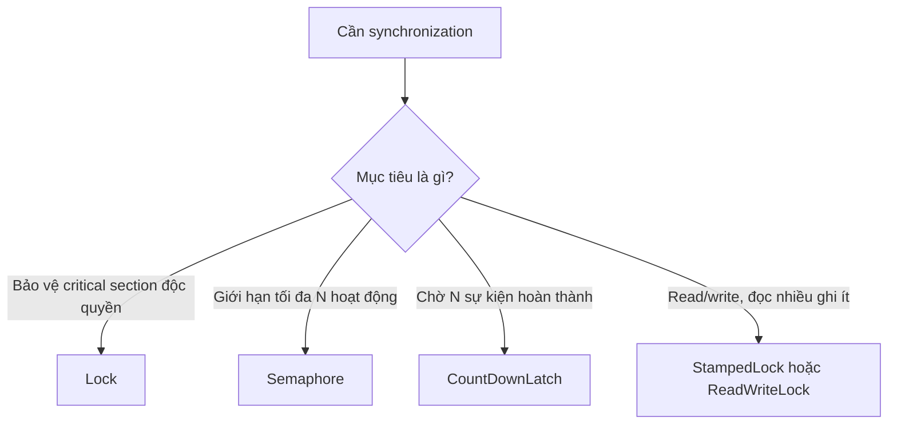
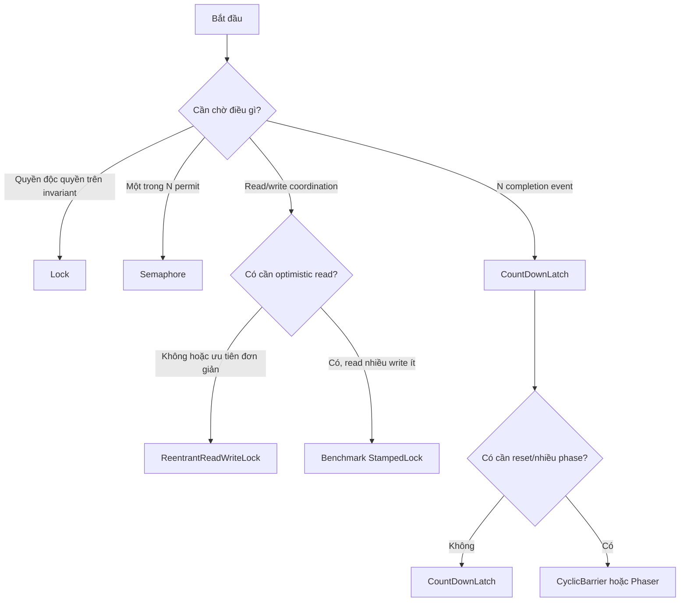

## Mục lục

- [Tổng quan](#tổng-quan)
- [1. Vì sao cả ba không đơn giản là Lock](#1-vì-sao-cả-ba-không-đơn-giản-là-lock)
- [2. Bảng so sánh nhanh](#2-bảng-so-sánh-nhanh)
- [3. Semaphore: bộ đếm permit](#3-semaphore-bộ-đếm-permit)
  - [3.1 Mental model](#31-mental-model)
  - [3.2 Acquire và release](#32-acquire-và-release)
  - [3.3 Semaphore dùng AQS như thế nào](#33-semaphore-dùng-aqs-như-thế-nào)
  - [3.4 Fair và non-fair semaphore](#34-fair-và-non-fair-semaphore)
  - [3.5 Ví dụ giới hạn concurrency](#35-ví-dụ-giới-hạn-concurrency)
  - [3.6 Semaphore nhị phân không hoàn toàn là Lock](#36-semaphore-nhị-phân-không-hoàn-toàn-là-lock)
  - [3.7 Lỗi thường gặp với Semaphore](#37-lỗi-thường-gặp-với-semaphore)
- [4. CountDownLatch: cổng hoàn thành một lần](#4-countdownlatch-cổng-hoàn-thành-một-lần)
  - [4.1 Mental model](#41-mental-model)
  - [4.2 await và countDown](#42-await-và-countdown)
  - [4.3 CountDownLatch dùng AQS như thế nào](#43-countdownlatch-dùng-aqs-như-thế-nào)
  - [4.4 Ví dụ chờ nhiều worker](#44-ví-dụ-chờ-nhiều-worker)
  - [4.5 Start gate và completion gate](#45-start-gate-và-completion-gate)
  - [4.6 One-shot và lựa chọn thay thế](#46-one-shot-và-lựa-chọn-thay-thế)
  - [4.7 Lỗi thường gặp với CountDownLatch](#47-lỗi-thường-gặp-với-countdownlatch)
- [5. StampedLock: read, write và optimistic read](#5-stampedlock-read-write-và-optimistic-read)
  - [5.1 Vì sao không implement Lock trực tiếp](#51-vì-sao-không-implement-lock-trực-tiếp)
  - [5.2 Write lock](#52-write-lock)
  - [5.3 Read lock](#53-read-lock)
  - [5.4 Optimistic read](#54-optimistic-read)
  - [5.5 Stamp và validate thực sự nói gì](#55-stamp-và-validate-thực-sự-nói-gì)
  - [5.6 Convert lock mode](#56-convert-lock-mode)
  - [5.7 StampedLock không dùng AQS](#57-stampedlock-không-dùng-aqs)
  - [5.8 Không reentrant và không có ownership kiểu ReentrantLock](#58-không-reentrant-và-không-có-ownership-kiểu-reentrantlock)
  - [5.9 Lỗi thường gặp với StampedLock](#59-lỗi-thường-gặp-với-stampedlock)
- [6. Memory consistency effects](#6-memory-consistency-effects)
- [7. Cùng một bài toán, chọn công cụ nào](#7-cùng-một-bài-toán-chọn-công-cụ-nào)
- [8. Decision tree](#8-decision-tree)
- [9. Checklist sử dụng an toàn](#9-checklist-sử-dụng-an-toàn)
- [Tóm tắt](#tóm-tắt)
- [Tài liệu tham khảo](#tài-liệu-tham-khảo)

---

## Tổng quan

`Semaphore`, `CountDownLatch` và `StampedLock` đều có thể làm thread phải chờ,
nhưng chúng biểu diễn ba protocol khác nhau:

```text
Semaphore      → quản lý số permit
CountDownLatch → chờ một bộ đếm giảm về 0
StampedLock    → phối hợp reader/writer bằng stamp, có optimistic read
```

Hai class đầu sử dụng `AbstractQueuedSynchronizer` (AQS) ở **shared mode**.
`StampedLock` không dùng AQS; nó có state encoding và waiter queue riêng.

> [!IMPORTANT]
> `Semaphore` và `CountDownLatch` không phải implementation của interface `Lock`.
> `StampedLock` là một locking mechanism nhưng API chính cũng không implement
> `Lock`. Chúng cùng thuộc nhóm synchronization tools, không cùng một contract.

## 1. Vì sao cả ba không đơn giản là Lock

Exclusive lock thường trả lời:

> Thread nào đang có quyền độc quyền để chạy critical section?

Ba công cụ trong trang này trả lời câu hỏi khác:

| Công cụ | Câu hỏi nó trả lời |
|---|---|
| `Semaphore` | Còn đủ permit cho operation này không? |
| `CountDownLatch` | Tất cả sự kiện bắt buộc đã hoàn thành chưa? |
| `StampedLock` | Có thể đọc/ghi ở mode nào, và stamp còn hợp lệ không? |

Sự khác biệt không nằm ở việc “có queue hay không”. Queue chỉ là cơ chế quản lý
waiter. **State machine và public contract** mới quyết định semantics.



## 2. Bảng so sánh nhanh

| Đặc điểm | Exclusive `Lock` | `Semaphore` | `CountDownLatch` | `StampedLock` |
|---|---:|---:|---:|---:|
| Mục tiêu | Critical section | Capacity/permit | Completion gate | Read/write + optimistic read |
| State khái niệm | Rảnh/bận, có thể có hold count | Permit còn lại | Count còn lại | Mode + reader count + version bits |
| Ownership | Thường có | Không | Không | Không theo thread identity kiểu `ReentrantLock` |
| Nhiều thread cùng đi | Không | Có, tối đa theo permit | Có sau count = 0 | Có ở read mode |
| Thread khác release/signal | Thường không | Được | Được `countDown()` | Có thể bàn giao stamp nhưng rất dễ sai |
| Reentrant | Tùy implementation | Không | Không áp dụng | Không |
| Reset/reuse | Có | Có | Không | Có |
| API chờ | `lock()` | `acquire()` | `await()` | `readLock()`/`writeLock()` |
| API release/signal | `unlock()` | `release()` | `countDown()` | `unlockRead/Write(stamp)` |
| Dùng AQS | Tùy implementation | Có | Có | Không |

## 3. Semaphore: bộ đếm permit

### 3.1 Mental model

Khởi tạo:

```java
Semaphore semaphore = new Semaphore(3);
```

nghĩa là có ba permit:

```text
permits = 3
```

Mỗi acquire lấy permit; mỗi release trả permit:

```text
A acquire → permits 3 → 2
B acquire → permits 2 → 1
C acquire → permits 1 → 0
D acquire → không đủ permit, phải chờ
```

Khi B release:

```text
B release → permits 0 → 1
D có cơ hội acquire → permits 1 → 0
```

Permit không đại diện cho một thread cụ thể. Nó giống token capacity hơn là quyền
sở hữu một monitor.

### 3.2 Acquire và release

Các API chính:

```java
semaphore.acquire();
semaphore.acquire(3);

boolean acquired = semaphore.tryAcquire();
boolean acquired = semaphore.tryAcquire(
    3, 200, TimeUnit.MILLISECONDS
);

semaphore.release();
semaphore.release(3);
```

Mẫu dùng an toàn:

```java
boolean acquired = false;
try {
    semaphore.acquire();
    acquired = true;
    useLimitedResource();
} finally {
    if (acquired) {
        semaphore.release();
    }
}
```

Nếu dùng `acquire()` trước `try`, code gọn hơn:

```java
semaphore.acquire();
try {
    useLimitedResource();
} finally {
    semaphore.release();
}
```

Nếu `acquire()` ném `InterruptedException`, control chưa vào `try`, nên không
release permit chưa lấy được.

### 3.3 Semaphore dùng AQS như thế nào

`Semaphore` có `Sync extends AbstractQueuedSynchronizer`. Nó hiểu AQS `state` là
số permit còn lại:

```text
AQS state = available permits
```

Acquire dùng shared mode. Logic khái niệm:

```java
int tryAcquireShared(int requested) {
    for (;;) {
        int available = getState();
        int remaining = available - requested;

        if (remaining < 0) {
            return remaining; // không đủ permit
        }

        if (compareAndSetState(available, remaining)) {
            return remaining; // acquire thành công
        }
    }
}
```

Release cộng permit bằng CAS:

```java
boolean tryReleaseShared(int released) {
    for (;;) {
        int current = getState();
        int next = current + released;

        if (next < current) {
            throw new Error("permit count overflow");
        }

        if (compareAndSetState(current, next)) {
            return true;
        }
    }
}
```

Nếu acquire không đủ permit:

```text
tryAcquireShared < 0
        ↓
AQS enqueue thread
        ↓
park
        ↓
releaseShared tăng state và signal
        ↓
thread thức dậy, thử trừ permit lại
```

`Semaphore` dùng shared mode vì nhiều acquire có thể cùng thành công khi state còn
đủ lớn.

### 3.4 Fair và non-fair semaphore

```java
Semaphore fast = new Semaphore(3);       // non-fair
Semaphore ordered = new Semaphore(3, true); // fair
```

Fair semaphore cố ưu tiên thread đã chờ trước tại các ordering point nội bộ.
Non-fair semaphore cho phép barging để tăng throughput.

> [!WARNING]
> `tryAcquire()` không timeout không tôn trọng fairness. Nó lấy permit ngay nếu
> đang có permit, kể cả khi thread khác đã chờ. Biến thể timed acquire nhìn chung
> tôn trọng fairness policy.

Fairness còn áp dụng theo **lần acquire**, không theo từng permit. Nếu thread đầu
queue yêu cầu ba permit nhưng hiện chỉ có hai, thread phía sau có thể phải chờ dù
nó chỉ cần một permit. Đây là head-of-line blocking.

### 3.5 Ví dụ giới hạn concurrency

Giới hạn tối đa mười request cùng gọi dịch vụ bên ngoài:

```java
public final class LimitedClient {
    private final Semaphore permits = new Semaphore(10);

    public Response call(Request request)
            throws InterruptedException {
        permits.acquire();
        try {
            return remoteCall(request);
        } finally {
            permits.release();
        }
    }
}
```

Tác dụng:

```text
100 caller
   ↓
10 caller có permit → gọi remote service
90 caller còn lại    → chờ
```

Semaphore giới hạn số operation đang ở vùng giới hạn. Nó không tự tạo thread pool
và không giới hạn số task đã submit. Nếu mục tiêu là giới hạn cả queue công việc,
hãy kết hợp với bounded executor/queue phù hợp.

### 3.6 Semaphore nhị phân không hoàn toàn là Lock

```java
Semaphore binary = new Semaphore(1);
```

Nếu mọi code cân bằng `acquire/release`, nó có thể tạo mutual exclusion. Nhưng
semantics vẫn khác ownership lock.

Thread khác có thể release:

```java
// Thread A
binary.acquire();

// Thread B — hợp lệ về API
binary.release();
```

Release thừa còn có thể phá tính nhị phân:

```java
Semaphore binary = new Semaphore(1);

binary.release(); // permits = 2
binary.release(); // permits = 3
```

Bây giờ ba acquire có thể thành công. Một lock có ownership không cho phép
`unlock()` thừa để tạo thêm suất.

> [!IMPORTANT]
> Dùng `Semaphore(1)` khi bạn thực sự cần permit không có ownership hoặc cần một
> thread cấp quyền cho thread khác. Dùng `Lock` khi invariant yêu cầu owner rõ
> ràng và release phải cân bằng theo owner.

### 3.7 Lỗi thường gặp với Semaphore

| Lỗi | Hậu quả | Cách xử lý |
|---|---|---|
| Release dù acquire thất bại | Tạo permit giả | Chỉ release sau acquire thành công |
| Release hai lần | Capacity tăng sai | Mỗi acquire thành công có đúng số permit release tương ứng |
| Quên release khi exception | Rò permit, waiter kẹt | Dùng `finally` |
| Giữ permit qua I/O quá lâu | Latency và queue tăng | Giới hạn đúng vùng tài nguyên khan hiếm |
| Dùng semaphore như rate limiter | Chỉ giới hạn concurrency, không giới hạn request/giây | Dùng rate limiter/token bucket |
| Dựa vào `availablePermits()` để check-then-act | Race | Dùng `tryAcquire()` |
| Yêu cầu nhiều permit trên fair semaphore | Head-of-line blocking | Chọn granularity hoặc protocol khác |

## 4. CountDownLatch: cổng hoàn thành một lần

### 4.1 Mental model

Khởi tạo:

```java
CountDownLatch latch = new CountDownLatch(3);
```

nghĩa là còn ba tín hiệu hoàn thành:

```text
count = 3
```

Thread gọi `await()` chờ cho đến khi count bằng `0`:

```text
Worker A countDown → 3 → 2
Worker B countDown → 2 → 1
Worker C countDown → 1 → 0
                         ↓
               mọi await có thể trả về
```

Sau khi count về `0`, cổng mở vĩnh viễn:

```text
Thread mới gọi await() → trả về ngay
```

### 4.2 await và countDown

API chính:

```java
latch.await();
boolean completed = latch.await(
    500, TimeUnit.MILLISECONDS
);
latch.countDown();
long remaining = latch.getCount();
```

`countDown()` không block. Khi count đã là `0`, gọi thêm `countDown()` không làm
count âm và không reset latch.

Thread gọi `countDown()` không cần là thread gọi `await()`:

```text
await     = phía consumer chờ completion
countDown = phía producer báo một completion
```

### 4.3 CountDownLatch dùng AQS như thế nào

`CountDownLatch.Sync` dùng AQS `state` làm count còn lại:

```text
AQS state = remaining count
```

`await()` là shared acquire:

```java
int tryAcquireShared(int ignored) {
    return getState() == 0 ? 1 : -1;
}
```

- state bằng `0`: acquire shared thành công.
- state lớn hơn `0`: acquire thất bại, thread vào AQS queue.

`countDown()` là shared release:

```java
boolean tryReleaseShared(int ignored) {
    for (;;) {
        int current = getState();

        if (current == 0) {
            return false;
        }

        int next = current - 1;
        if (compareAndSetState(current, next)) {
            return next == 0;
        }
    }
}
```

Chỉ transition cuối cùng trả `true`:

```text
3 → 2: false
2 → 1: false
1 → 0: true → AQS propagate waiter
```

Đây là shared mode vì khi cổng mở, nhiều waiter đều được phép đi qua.

### 4.4 Ví dụ chờ nhiều worker

```java
int workers = 3;
CountDownLatch done = new CountDownLatch(workers);

for (int i = 0; i < workers; i++) {
    executor.submit(() -> {
        try {
            processPartition();
        } finally {
            done.countDown();
        }
    });
}

if (!done.await(30, TimeUnit.SECONDS)) {
    throw new TimeoutException("Workers did not finish");
}

publishFinalResult();
```

`countDown()` nằm trong `finally` để một worker ném exception không làm coordinator
chờ vô hạn. Tuy nhiên, latch chỉ báo worker đã kết thúc đường code; nó không tự
truyền exception về coordinator. Cần `Future`, error collection hoặc structured
concurrency nếu muốn thu kết quả/lỗi.

### 4.5 Start gate và completion gate

Có thể dùng hai latch để tạo một bài test concurrency:

```java
CountDownLatch start = new CountDownLatch(1);
CountDownLatch done = new CountDownLatch(threadCount);

for (int i = 0; i < threadCount; i++) {
    executor.submit(() -> {
        try {
            start.await();
            runConcurrentOperation();
        } finally {
            done.countDown();
        }
    });
}

start.countDown(); // mở cổng cho tất cả worker
done.await();      // chờ tất cả worker kết thúc
```

Hai latch có vai trò riêng:

```text
start: count 1 → 0, phát tín hiệu bắt đầu
 done: count N → 0, phát tín hiệu hoàn tất
```

Start gate giúp các worker bắt đầu gần nhau hơn nhưng không bảo đảm chạy cùng một
CPU cycle. OS scheduler vẫn quyết định thời điểm thực tế.

### 4.6 One-shot và lựa chọn thay thế

`CountDownLatch` không reset được.

```text
count N → ... → 0
không có đường quay lại N
```

Chọn công cụ khác khi cần:

| Nhu cầu | Công cụ phù hợp hơn |
|---|---|
| Nhiều phase, các participant gặp nhau lặp lại | `CyclicBarrier` |
| Số participant thay đổi động, nhiều phase | `Phaser` |
| Chờ task và lấy kết quả/exception | `Future`, `CompletableFuture` |
| Chờ tất cả task trong scope | Structured concurrency nếu môi trường hỗ trợ |

### 4.7 Lỗi thường gặp với CountDownLatch

| Lỗi | Hậu quả | Cách xử lý |
|---|---|---|
| Count khởi tạo sai | Mở quá sớm hoặc không bao giờ mở | Count theo số event bắt buộc, không đoán |
| Không `countDown()` khi exception | `await()` có thể chờ mãi | Đặt trong `finally` khi completion luôn phải được ghi nhận |
| Không timeout ở boundary | Request/service treo vô hạn | Dùng timed `await()` và policy lỗi |
| Cố reuse latch | Logic phase sai | Tạo latch mới hoặc dùng barrier/phaser |
| Xem latch như nơi chứa kết quả | Không truyền value/exception | Dùng Future hoặc shared result được publish đúng |
| Dùng `getCount()` để điều khiển logic | Check-then-act race | Chỉ dùng cho monitoring/debugging |

## 5. StampedLock: read, write và optimistic read

`StampedLock` phối hợp ba mode:

```text
write lock       → writer độc quyền
read lock        → nhiều reader có thể cùng giữ
optimistic read  → không giữ read lock; đọc rồi validate
```

Nó phù hợp nhất khi đọc nhiều, ghi ít và dữ liệu có thể được snapshot nhanh để
validate.

### 5.1 Vì sao không implement Lock trực tiếp

API `Lock` có dạng:

```java
void lock();
void unlock();
```

`StampedLock` cần trả một token `long` lúc acquire:

```java
long stamp = lock.writeLock();
lock.unlockWrite(stamp);
```

Stamp chứa thông tin để xác nhận mode/trạng thái acquire. API đó không khớp trực
tiếp với `Lock`, vì `Lock.lock()` không trả token và `Lock.unlock()` không nhận
token.

`StampedLock` vẫn cung cấp adapter:

```java
Lock readView = stampedLock.asReadLock();
Lock writeView = stampedLock.asWriteLock();
ReadWriteLock rwView = stampedLock.asReadWriteLock();
```

Các view implement interface chuẩn nhưng delegate vào state machine của
`StampedLock`; chúng không làm `StampedLock` chuyển sang dùng AQS.

### 5.2 Write lock

```java
long stamp = lock.writeLock();
try {
    x += dx;
    y += dy;
} finally {
    lock.unlockWrite(stamp);
}
```

Write mode độc quyền với reader và writer khác:

```text
Writer A giữ write lock
├── Writer B chờ
└── Reader C chờ
```

Biến thể:

```java
long stamp = lock.tryWriteLock();
long stamp = lock.tryWriteLock(200, TimeUnit.MILLISECONDS);
long stamp = lock.writeLockInterruptibly();
```

Các method trả `0L` khi try-acquire không thành công.

### 5.3 Read lock

```java
long stamp = lock.readLock();
try {
    return distanceFromOrigin();
} finally {
    lock.unlockRead(stamp);
}
```

Nhiều reader có thể cùng giữ read mode:

```text
Reader A ─┐
Reader B ─┼── cùng đọc
Reader C ─┘
Writer D ──── chờ
```

Read lock là pessimistic read: reader thực sự đăng ký read ownership ở mức state
và có thể làm writer phải chờ.

### 5.4 Optimistic read

Optimistic read không giữ read lock theo cách thông thường:

```java
public Point snapshot() {
    long stamp = lock.tryOptimisticRead();

    double currentX = x;
    double currentY = y;

    if (!lock.validate(stamp)) {
        stamp = lock.readLock();
        try {
            currentX = x;
            currentY = y;
        } finally {
            lock.unlockRead(stamp);
        }
    }

    return new Point(currentX, currentY);
}
```

Protocol bắt buộc:

```text
1. Lấy optimistic stamp
2. Copy shared fields vào local variables
3. validate(stamp)
4. Nếu false, acquire read lock thật và đọc lại
5. Chỉ sử dụng snapshot sau khi validation thành công/fallback hoàn tất
```

Không được validate trước rồi mới đọc:

```java
long stamp = lock.tryOptimisticRead();
if (lock.validate(stamp)) {
    return new Point(x, y); // sai thứ tự: writer có thể xen vào sau validate
}
```

Thứ tự đúng là **đọc trước, validate sau**.

> [!WARNING]
> Trong optimistic read, các field có thể được đọc trong lúc writer đang cập nhật.
> Đừng dereference object graph không ổn định, chạy logic có side effect, chia cho
> một denominator có thể tạm thời bằng 0, hoặc dùng intermediate state trước khi
> `validate()` thành công.

Một pattern an toàn là copy primitive/reference ổn định vào local, validate, rồi
mới tính toán phức tạp.

### 5.5 Stamp và validate thực sự nói gì

`tryOptimisticRead()` trả về một stamp khác `0` nếu tại thời điểm đó không có write
lock đang giữ theo điều kiện của implementation. `validate(stamp)` kiểm tra xem có
write acquisition liên quan xảy ra kể từ lúc stamp được cấp hay không.

```text
stamp được lấy
    ↓
đọc x, y
    ↓
validate
  ├── true  → snapshot không bị write invalidation trong cửa sổ đó
  └── false → không tin snapshot; đọc lại dưới read lock
```

Stamp không phải object ownership và không nên được xem là số phiên bản nghiệp vụ.
Không dựa vào giá trị số cụ thể hoặc tự tách bit của stamp; encoding là chi tiết
implementation.

### 5.6 Convert lock mode

`StampedLock` có thể thử chuyển mode mà không nhả rồi acquire lại:

```java
long stamp = lock.readLock();
try {
    while (needsUpdate()) {
        long writeStamp = lock.tryConvertToWriteLock(stamp);

        if (writeStamp != 0L) {
            stamp = writeStamp;
            update();
            break;
        }

        lock.unlockRead(stamp);
        stamp = lock.writeLock();
    }
} finally {
    lock.unlock(stamp);
}
```

Các conversion method chính:

```java
tryConvertToWriteLock(stamp);
tryConvertToReadLock(stamp);
tryConvertToOptimisticRead(stamp);
```

Kết quả `0L` nghĩa là convert thất bại. Caller phải giữ mode cũ hoặc thực hiện
fallback phù hợp; không được giả định conversion luôn thành công.

Đoạn upgrade read → write cần kiểm tra lại predicate sau khi nhả read lock và lấy
write lock, vì state có thể thay đổi trong khoảng trống.

### 5.7 StampedLock không dùng AQS

`StampedLock` có state encoding và waiter queue riêng. Lý do thiết kế là nó cần
phối hợp:

- write bit/mode;
- reader count;
- overflow khi reader count vượt phần bit trực tiếp;
- stamp/version để optimistic validation;
- chuyển đổi giữa read, write và optimistic modes;
- waiter nodes cho reader/writer.

Mô hình khái niệm:

```text
StampedLock state
├── version/sequence information
├── write-mode marker
└── reader count / overflow support

Waiter queue riêng
├── writer waiter
├── reader waiter/group
└── park/unpark protocol riêng
```

Không nên phụ thuộc vào vị trí bit cụ thể vì đây là chi tiết có thể thay đổi giữa
các phiên bản JDK.

### 5.8 Không reentrant và không có ownership kiểu ReentrantLock

`StampedLock` không reentrant:

```java
long s1 = lock.writeLock();
long s2 = lock.writeLock(); // có thể tự chờ vô hạn
```

Nó cũng không dùng thread identity làm ownership contract giống
`ReentrantLock`. Release được kiểm tra bằng stamp/mode:

```java
lock.unlockWrite(writeStamp);
```

Dùng sai stamp hoặc sai mode có thể ném `IllegalMonitorStateException`:

```java
long readStamp = lock.readLock();
lock.unlockWrite(readStamp); // sai mode
```

Javadoc cho phép lock state không bị ràng buộc ownership theo thread, nên stamp có
thể được bàn giao. Tuy nhiên việc bàn giao làm code khó chứng minh hơn và rất dễ
unlock sai/dùng lại stamp. Mặc định nên acquire và release trong cùng lexical
scope.

### 5.9 Lỗi thường gặp với StampedLock

| Lỗi | Hậu quả | Cách xử lý |
|---|---|---|
| Quên `validate()` | Dùng snapshot bị writer xen vào | Luôn validate và fallback |
| Validate trước khi đọc | Writer có thể xen vào sau validate | Copy fields trước, validate sau |
| Dùng dữ liệu trước validate | Exception/side effect từ intermediate state | Chỉ copy local đơn giản trước validation |
| Gọi lock lồng nhau | Tự deadlock vì không reentrant | Thiết kế method không reacquire cùng lock |
| Unlock sai stamp/mode | `IllegalMonitorStateException` | Giữ stamp trong local và `finally` |
| Dùng lại stamp cũ | Validation/release sai | Mỗi conversion phải cập nhật biến stamp |
| Giữ read lock qua I/O | Writer starvation/latency | Rút ngắn critical section |
| Mặc định optimistic read luôn nhanh hơn | Complexity cao, retry nhiều khi write contention | Benchmark workload thực |
| Gọi method ngoài khi đang giữ lock | Deadlock hoặc latency không kiểm soát | Copy state rồi release trước callback |

## 6. Memory consistency effects

Ba công cụ đều có memory-consistency guarantee, nhưng điểm bàn giao khác nhau.

### Semaphore

Theo Javadoc:

```text
Actions trước release() của Thread A
    happens-before
Actions sau acquire() thành công của Thread B
```

Điều này biến permit thành điểm bàn giao visibility, không chỉ capacity token.

### CountDownLatch

```text
Actions trước countDown() của worker
    happens-before
Actions sau await() trả về của waiter
```

Khi nhiều worker count down, coordinator sau `await()` có thể quan sát các actions
được publish qua những lần `countDown()` dẫn tới mở latch theo contract.

### StampedLock

Successful write unlock có release effects; lock acquisition tương ứng có acquire
effects theo contract. Optimistic read tinh tế hơn: dữ liệu chỉ nên được xem là
snapshot hợp lệ sau `validate(stamp)` thành công. Nếu validation thất bại, phải
fallback sang read lock thật.

> [!IMPORTANT]
> Happens-before không thay thế atomicity của invariant nhiều field. Hãy dùng đúng
> protocol của công cụ: permit acquire/release, latch await/countDown, hoặc stamped
> read/write/validate.

## 7. Cùng một bài toán, chọn công cụ nào

Giả sử một service xử lý payment.

### Bảo vệ balance

```java
lock.lock();
try {
    balance -= amount;
} finally {
    lock.unlock();
}
```

Chọn `Lock` vì cần mutual exclusion và ownership quanh invariant của balance.

### Giới hạn mười payment call đồng thời

```java
permits.acquire();
try {
    paymentGateway.call();
} finally {
    permits.release();
}
```

Chọn `Semaphore(10)` vì tài nguyên có capacity bằng mười.

### Chờ ba dependency khởi động

```text
database ready → countDown
cache ready    → countDown
broker ready   → countDown
main thread    → await
```

Chọn `CountDownLatch(3)` vì đây là completion gate một lần.

### Đọc snapshot rất thường xuyên, ghi hiếm

```java
long stamp = stampedLock.tryOptimisticRead();
Snapshot result = copyFields();
if (!stampedLock.validate(stamp)) {
    result = copyUnderReadLock();
}
```

Cân nhắc `StampedLock` khi optimistic read có lợi và protocol validation có thể
được giữ đơn giản.

## 8. Decision tree



Quy tắc thực dụng:

1. Dùng công cụ có contract gần bài toán nhất.
2. Ưu tiên API đơn giản nếu chưa có benchmark chứng minh cần tối ưu phức tạp.
3. Đặt timeout tại boundary có nguy cơ chờ vô hạn.
4. Không suy luận semantics chỉ từ việc implementation có dùng AQS hay không.

## 9. Checklist sử dụng an toàn

### Semaphore

- [ ] Permit đại diện cho capacity cụ thể, không phải con số tùy ý.
- [ ] Mỗi acquire thành công có release tương ứng trong `finally`.
- [ ] Không release khi acquire thất bại hoặc bị interrupt.
- [ ] Không dùng `availablePermits()` cho check-then-act.
- [ ] Đã cân nhắc fair/non-fair và head-of-line blocking.

### CountDownLatch

- [ ] Initial count bằng đúng số event bắt buộc.
- [ ] `countDown()` nằm trong `finally` nếu failure vẫn được tính là hoàn tất.
- [ ] `await()` có timeout ở request/service boundary.
- [ ] Không cố reset hoặc reuse latch.
- [ ] Kết quả và exception được truyền bằng cơ chế riêng.

### StampedLock

- [ ] Không acquire lồng nhau vì lock không reentrant.
- [ ] Mỗi pessimistic acquire được unlock đúng mode/stamp trong `finally`.
- [ ] Optimistic read copy local trước rồi validate sau.
- [ ] Không dùng intermediate state trước khi validation thành công.
- [ ] Conversion thất bại có fallback và kiểm tra lại predicate.
- [ ] Đã benchmark so với `synchronized`/`ReentrantReadWriteLock`.

## Tóm tắt

```text
Semaphore
├── AQS shared mode
├── state = permit còn lại
├── acquire trừ permit
├── release cộng permit
└── không ownership

CountDownLatch
├── AQS shared mode
├── state = count còn lại
├── await chờ state == 0
├── countDown giảm state
└── one-shot, không reset

StampedLock
├── không dùng AQS
├── read/write state + stamp/version
├── pessimistic read/write
├── optimistic read + validate
└── không reentrant
```

Câu chọn công cụ ngắn nhất:

> Giới hạn **bao nhiêu operation** dùng `Semaphore`; chờ **bao nhiêu event hoàn
> thành** dùng `CountDownLatch`; phối hợp **reader/writer và optimistic snapshot**
> dùng `StampedLock` khi benchmark cho thấy có lợi.

## Tài liệu tham khảo

- [Javadoc — Semaphore (Java 21)](https://docs.oracle.com/en/java/javase/21/docs/api/java.base/java/util/concurrent/Semaphore.html)
- [Javadoc — CountDownLatch (Java 21)](https://docs.oracle.com/en/java/javase/21/docs/api/java.base/java/util/concurrent/CountDownLatch.html)
- [Javadoc — StampedLock (Java 21)](https://docs.oracle.com/en/java/javase/21/docs/api/java.base/java/util/concurrent/locks/StampedLock.html)
- [Javadoc — AbstractQueuedSynchronizer (Java 21)](https://docs.oracle.com/en/java/javase/21/docs/api/java.base/java/util/concurrent/locks/AbstractQueuedSynchronizer.html)
- Trước: [AbstractQueuedSynchronizer (AQS) từ nền tảng](/jmm/11b-abstract-queued-synchronizer/)
- Tiếp theo: [Double-Checked Locking](/jmm/12-double-checked-locking/)
