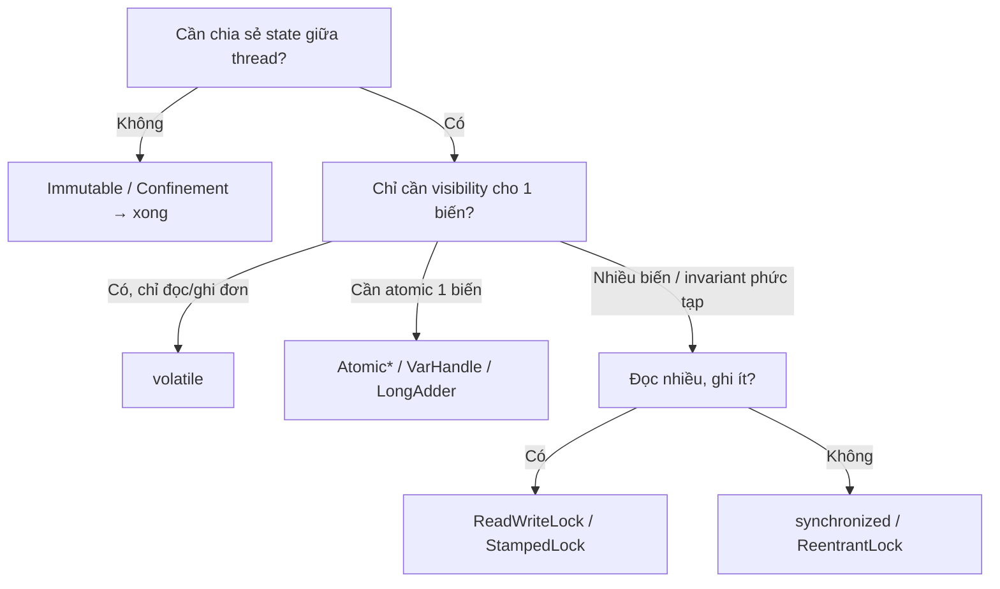

## Mục lục

- [Tổng quan](#tổng-quan)
- [1. Các pitfall thường gặp](#1-các-pitfall-thường-gặp)
- [2. Cây quyết định chọn công cụ](#2-cây-quyết-định-chọn-công-cụ)
- [3. Checklist review code đồng thời](#3-checklist-review-code-đồng-thời)
- [4. Quy tắc vàng](#4-quy-tắc-vàng)
- [Tài liệu tham khảo](#tài-liệu-tham-khảo)

---

## Tổng quan

Bài cuối tổng hợp các lỗi JMM kinh điển và một checklist để review code đồng thời.
Mỗi pitfall đều liên kết tới bài chi tiết tương ứng.

### Tra ngược: thấy triệu chứng này thì nghi lỗi gì

Khi gặp bug đồng thời, đối chiếu "triệu chứng → nghi ngờ" để khoanh vùng nhanh:

| Triệu chứng quan sát được | Nghi ngờ nguyên nhân | Xem |
|---------------------------|----------------------|-----|
| Vòng `while(!flag){}` chạy mãi không thoát | thiếu `volatile` cho `flag` (visibility) | [Volatile](/jmm/05-volatile/) |
| Counter ra số nhỏ hơn kỳ vọng | `count++` không atomic (lost update) | [1.1](#11-dùng-volatile-cho-read-modify-write) |
| Thỉnh thoảng đọc field = 0/null dù đã set | reorder / unsafe publication / DCL thiếu volatile | [1.3](#13-dcl-thiếu-volatile) |
| Lỗi chỉ xảy ra trên ARM/Apple Silicon, không thấy trên x86 | dựa vào TSO của x86, thiếu đồng bộ | [1.9](#19-giả-định-x86--đúng-mọi-nơi) |
| Hai thread cùng tạo/ghi đè một entry | check-then-act không nguyên tử | [1.5](#15-check-then-act-không-khóa) |
| Treo toàn bộ, không tiến triển | deadlock / quên unlock / lock sai object | [1.7](#17-quên-unlock-trong-finally) |
| Throughput giảm khi thêm core | false sharing | [False Sharing](/jmm/13-false-sharing-padding/) |

> [!NOTE]
> **Quy tắc chẩn đoán**: "treo / không thoát" thường là **visibility** (thiếu
> volatile); "ra sai số / mất update" thường là **atomicity** (thiếu atomic/lock);
> "thấy object nửa vời" thường là **ordering/publication** (thiếu volatile/final).

## 1. Các pitfall thường gặp

### 1.1 Dùng volatile cho read-modify-write

```java
volatile int counter;
counter++;   // ❌ 3 bước, không atomic → lost update
```

Sửa: `AtomicInteger.incrementAndGet()` hoặc `synchronized`. Xem
[Volatile](/jmm/05-volatile/) & [CAS/Atomic](/jmm/09-cas-atomic-varhandle-stampedlock/).

### 1.2 Sửa field của object qua volatile reference

```java
volatile Point p;
p.x = 1; p.y = 1;   // ❌ volatile chỉ bảo vệ chính reference p, không bảo vệ x/y
```

Sửa: dùng object **immutable**, gán reference mới vào volatile. Xem
[Safe Publication](/jmm/07-final-field-safe-publication/).

### 1.3 DCL thiếu volatile

```java
private static Singleton I;       // ❌ thiếu volatile → thấy object chưa init xong
```

Sửa: thêm `volatile`, hoặc dùng **IoDH**. Xem [DCL](/jmm/12-double-checked-locking/).

### 1.4 this escape trong constructor

```java
public Listener() {
    registry.register(this);  // ❌ this thoát ra trước khi constructor xong
}
```

Sửa: tách init ra factory method, hoặc đăng ký sau khi dựng xong. Xem
[Escape Analysis](/jmm/14-escape-analysis/).

### 1.5 check-then-act không khóa

```java
if (!map.containsKey(k)) map.put(k, v);   // ❌ hai thread cùng put
```

Sửa: `map.putIfAbsent(k, v)` / `computeIfAbsent`. Xem
[HB trong j.u.c](/jmm/11-happens-before-juc/).

### 1.6 Dùng `if` thay vì `while` quanh wait()

```java
if (queue.isEmpty()) cond.await();   // ❌ spurious wakeup → chạy tiếp khi vẫn rỗng
```

Sửa: luôn `while (điều_kiện) cond.await();`. Xem
[Condition](/jmm/11-happens-before-juc/#6-condition).

### 1.7 Quên unlock trong finally

```java
lock.lock();
doWork();          // ❌ nếu ném exception → lock không bao giờ nhả
lock.unlock();
```

Sửa: `lock(); try { ... } finally { unlock(); }`.

### 1.8 Lock trên object sai

```java
synchronized (Integer.valueOf(1)) { }   // ❌ Integer cache → lock toàn cục bất ngờ
synchronized ("KEY") { }                 // ❌ String intern → lock chung
```

Sửa: `private final Object lock = new Object();`. Xem
[synchronized](/jmm/06-synchronized-monitor/).

### 1.9 Giả định x86 = đúng mọi nơi

Code chạy đúng trên x86 (TSO) có thể sai trên ARM (weak memory). Đừng dựa vào hành
vi phần cứng — dựa vào HB. Xem [Memory Barriers](/jmm/04-memory-barriers/).

### 1.10 ABA với CAS

`compareAndSet` thấy "vẫn là A" nhưng giá trị đã A→B→A. Sửa:
`AtomicStampedReference`. Xem [ABA](/jmm/09-cas-atomic-varhandle-stampedlock/#6-atomicreference--aba).

## 2. Cây quyết định chọn công cụ



## 3. Checklist review code đồng thời

> [!TIP]
> - [ ] Mỗi biến chia sẻ có được bảo vệ (volatile/atomic/lock) hay là immutable?
> - [ ] Có thao tác read-modify-write nào đang dùng `volatile` lầm tưởng là atomic?
> - [ ] Có check-then-act nào chưa atomic (containsKey+put, get+set...)?
> - [ ] Mọi `lock()` có `unlock()` trong `finally`?
> - [ ] `await()` có nằm trong vòng `while` kiểm tra điều kiện?
> - [ ] Object publish ra thread khác có **safe publication** (final/volatile/static/lock/concurrent)?
> - [ ] Constructor có để `this` escape không?
> - [ ] DCL có `volatile`? (hoặc cân nhắc IoDH)
> - [ ] Có lock trên object có thể bị share ngầm (String literal, boxed Integer, `this` public)?
> - [ ] Đã test trên ARM (không chỉ x86)?
> - [ ] Counter "nóng" có cân nhắc `LongAdder` / `@Contended` để tránh false sharing?

## 4. Quy tắc vàng

> [!IMPORTANT]
> 1. **Ưu tiên immutability** — không state chia sẻ thì không có race.
> 2. **Dựa vào happens-before, không dựa vào phần cứng** — đừng tin "x86 chạy đúng".
> 3. **Đừng tự chèn barrier** — dùng primitive cấp cao (`volatile`, `Lock`,
>    `Atomic`, j.u.c); để JIT lo barrier thật.
> 4. **`volatile` cho visibility, lock/atomic cho atomicity** — chọn đúng việc.
> 5. **Đo trước khi tối ưu** — false sharing, lock contention chỉ nên xử lý khi có
>    số liệu (JMH).

## Tài liệu tham khảo

- *Java Concurrency in Practice* — Brian Goetz
- [JLS Chapter 17 — Threads and Locks](https://docs.oracle.com/javase/specs/jls/se21/html/jls-17.html)
- Trước: [Testing concurrency](/jmm/15-testing-concurrency/)
- Quay lại: [Tổng quan JMM](/jmm/01-tong-quan/)
