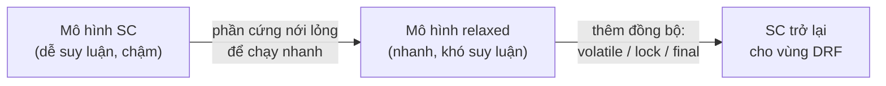
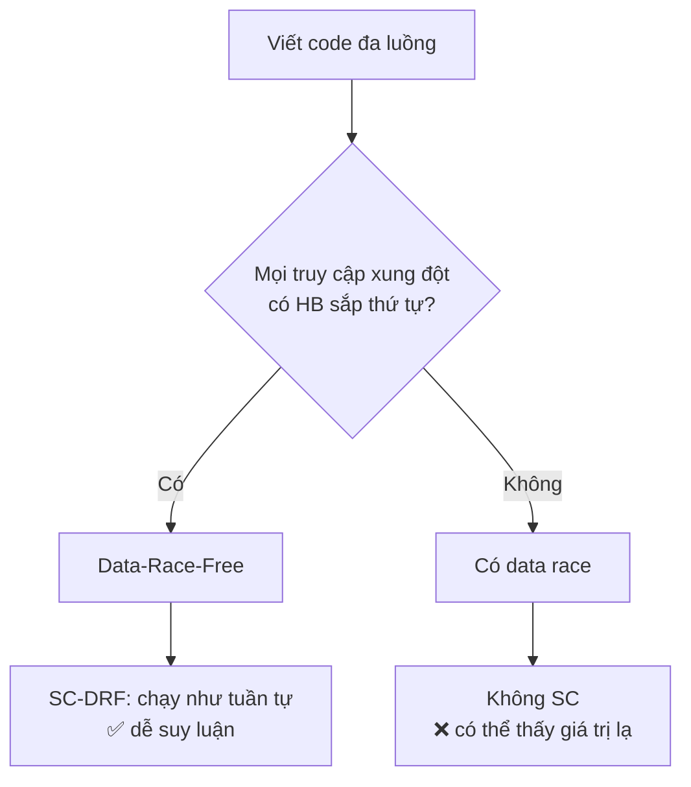

## Mục lục

- [Tổng quan](#tổng-quan)
- [1. Sequential Consistency (SC) là gì](#1-sequential-consistency-sc-là-gì)
- [2. Vì sao phần cứng & JVM không cho SC miễn phí](#2-vì-sao-phần-cứng--jvm-không-cho-sc-miễn-phí)
- [3. Định lý trung tâm: SC-DRF](#3-định-lý-trung-tâm-sc-drf)
- [4. Data-Race-Free nghĩa là gì](#4-data-race-free-nghĩa-là-gì)
- [5. Ví dụ: cùng code, có khóa vs không khóa](#5-ví-dụ-cùng-code-có-khóa-vs-không-khóa)
- [6. Vì sao SC-DRF là "hợp đồng" gốc của JMM](#6-vì-sao-sc-drf-là-hợp-đồng-gốc-của-jmm)
- [Tài liệu tham khảo](#tài-liệu-tham-khảo)

---

## Tổng quan

Tất cả các bài trước (happens-before, volatile, synchronized, barrier...) đều là
**hệ quả** của một định lý nền tảng duy nhất của JMM:

> **SC-DRF** (Sequential Consistency for Data-Race-Free programs):
> *Nếu chương trình của bạn **không có data race**, thì nó chạy y như **tuần tự
> nhất quán** (sequential consistency) — tức là như thể mọi lệnh của mọi thread
> được trộn lại thành **một thứ tự toàn cục duy nhất**, mỗi đọc thấy lần ghi gần
> nhất.*

Đây chính là "hợp đồng" JMM hứa với lập trình viên: bạn chỉ cần làm một việc —
**đồng bộ hóa đủ để không còn data race** — và đổi lại JMM cho bạn một thế giới
dễ suy luận (SC), không phải lo về reorder hay cache.

> [!IMPORTANT]
> Cách dùng JMM thực tế gói gọn trong một câu: **đừng cố hiểu mọi reorder có thể
> xảy ra; hãy làm cho chương trình data-race-free, rồi suy luận như thể nó tuần
> tự.** SC-DRF biến một bài toán "vô số interleaving phần cứng" thành "một thứ
> tự tuần tự".

## 1. Sequential Consistency (SC) là gì

Khái niệm SC do Leslie Lamport định nghĩa (1979). Một lần thực thi đa luồng là
**tuần tự nhất quán** nếu:

1. Tồn tại **một thứ tự toàn cục** (total order) trên tất cả thao tác đọc/ghi của
   mọi thread, và
2. Thứ tự đó **tôn trọng program order** của từng thread (lệnh trong cùng thread
   giữ nguyên thứ tự nguồn), và
3. Mỗi thao tác **đọc** thấy giá trị của lần **ghi gần nhất** đứng trước nó trong
   thứ tự toàn cục đó.

> [!NOTE]
> **Hình dung bằng bộ bài tráo xen kẽ**: mỗi thread là một xấp bài đã xếp theo
> thứ tự (program order). SC nói: kết quả chạy phải giống **một cách tráo** hai
> xấp bài vào nhau thành một chồng duy nhất — bạn có thể xen kẽ tùy ý, **nhưng
> không được đảo thứ tự các lá trong cùng một xấp**. Mọi người đọc/ghi lên cùng
> "một chồng bài" đó, nên ai cũng thấy trạng thái nhất quán.

Trong thế giới SC, ví dụ kinh điển "cả hai đọc 0" (bài [Reordering](/jmm/03-reordering/))
**không thể** xảy ra: vì phải tồn tại một thứ tự toàn cục, một trong hai lệnh ghi
phải đứng trước, nên ít nhất một thread phải thấy giá trị đã ghi.

```java
// x = y = 0 ban đầu
// Thread 1: x = 1;  r1 = y;
// Thread 2: y = 1;  r2 = x;
// Dưới SC: KHÔNG thể có r1 == 0 && r2 == 0.
// Trên phần cứng thật (không đồng bộ): r1 == 0 && r2 == 0 CÓ thể xảy ra.
```

## 2. Vì sao phần cứng & JVM không cho SC miễn phí

SC rất dễ suy luận, nhưng **rất đắt** nếu áp cho mọi lệnh. Để SC tuyệt đối, CPU
phải tắt store buffer, cấm mọi reorder, flush cache liên tục — chậm thê thảm.

Vì vậy phần cứng hiện đại (kể cả x86) và JVM **cố tình không** đảm bảo SC cho biến
thường:

- CPU có **store buffer**: lệnh ghi nằm chờ trong buffer riêng của core trước khi
  lên cache chung → core khác chưa thấy ngay.
- Compiler/JIT **reorder** các lệnh độc lập để tối ưu.
- Cache mỗi core giữ bản sao riêng, đồng bộ trễ.

Kết quả: với biến thường không đồng bộ, chương trình chạy theo mô hình **relaxed**
(lỏng), không phải SC. SC chỉ được "khôi phục" tại các điểm đồng bộ.



## 3. Định lý trung tâm: SC-DRF

JMM chọn một thỏa hiệp thông minh thay vì ép SC mọi nơi:

> [!IMPORTANT]
> **SC-DRF**: JVM **chỉ đảm bảo** hành vi SC cho những chương trình **không có
> data race**. Với chương trình có data race, JMM **không** hứa SC — chỉ hứa một
> số ràng buộc tối thiểu (xem bài [Out-of-thin-air](/jmm/19-out-of-thin-air-causality/)).

Nói cách khác, JMM chia chương trình làm hai lớp:

| Loại chương trình | JMM đảm bảo gì |
|-------------------|---------------|
| **Data-race-free** (đồng bộ đúng) | Chạy **như SC** — suy luận như tuần tự, không lo reorder |
| **Có data race** | Không SC; có thể thấy giá trị "lạ" do reorder/cache; chỉ còn vài ràng buộc tối thiểu |

Đây là lý do mọi quy tắc happens-before tồn tại: **HB là công cụ để loại bỏ data
race**. Khi mọi truy cập xung đột đều được sắp thứ tự bởi HB → không còn data race
→ SC-DRF kích hoạt → bạn được phép suy luận tuần tự.



## 4. Data-Race-Free nghĩa là gì

Định nghĩa hình thức (JLS 17.4.5):

> Hai truy cập tới **cùng một biến** tạo thành **data race** nếu:
> 1. ít nhất một trong hai là **ghi**, và
> 2. chúng **không** được sắp thứ tự bởi quan hệ happens-before.
>
> Chương trình là **data-race-free** nếu **mọi** lần thực thi SC của nó đều không
> chứa data race nào.

Ba điểm cần nhớ:

- **Hai lần đọc không bao giờ là data race** (không có ghi) → đọc chung biến
  immutable luôn an toàn.
- Data race là về **thiếu HB**, không phải về "chạy đồng thời". Hai thread ghi
  cùng biến nhưng có HB giữa chúng (qua lock/volatile) thì **không** phải data race.
- "Race condition" (lỗi logic do thứ tự) **khác** "data race" (lỗi JMM do thiếu
  HB) — xem bài [Data race vs Race condition](/jmm/08-data-race-vs-race-condition/).

> [!TIP]
> Công thức loại data race: với mỗi cặp truy cập xung đột (cùng biến, có ít nhất
> một ghi), hãy đảm bảo có **một cạnh happens-before** nối chúng — bằng `volatile`,
> `synchronized`, `Lock`, `final` + safe publication, hoặc công cụ j.u.c.

## 5. Ví dụ: cùng code, có khóa vs không khóa

### 5.1 Có data race → không SC

```java
class Racy {
    int x = 0;
    boolean ready = false;

    void writer() {            // Thread A
        x = 42;                // (1) ghi biến thường
        ready = true;          // (2) ghi biến thường
    }
    void reader() {            // Thread B
        if (ready) {           // (3) đọc biến thường
            System.out.println(x);  // có thể in 0! (không SC)
        }
    }
}
```

`ready` và `x` đều là biến thường, không HB giữa A và B → **data race**. JMM không
đảm bảo SC → reader có thể thấy `ready == true` nhưng `x == 0` (do reorder (1)(2)
hoặc do visibility).

### 5.2 Thêm `volatile` → DRF → SC

```java
class Fixed {
    int x = 0;
    volatile boolean ready = false;   // volatile tạo cạnh HB

    void writer() {            // Thread A
        x = 42;                // (1)
        ready = true;          // (2) volatile write — release
    }
    void reader() {            // Thread B
        if (ready) {           // (3) volatile read — acquire
            System.out.println(x);  // CHẮC CHẮN in 42
        }
    }
}
```

Ghi `volatile ready = true` **happens-before** đọc `ready == true`. Nhờ tính bắc
cầu, (1) HB (3) → không còn data race trên `x` → SC-DRF đảm bảo reader thấy `x == 42`.

| Phiên bản | Có data race? | JMM đảm bảo SC? | reader thấy |
|-----------|---------------|------------------|-------------|
| `Racy` (5.1) | Có (thiếu HB) | Không | có thể `x == 0` ❌ |
| `Fixed` (5.2) | Không (volatile tạo HB) | Có | luôn `x == 42` ✅ |

## 6. Vì sao SC-DRF là "hợp đồng" gốc của JMM

SC-DRF cho phép lập trình viên **không cần** hiểu chi tiết store buffer, MESI, hay
JIT reorder. Quy trình tư duy gọn lại còn:

1. Xác định mọi biến **chia sẻ** giữa các thread.
2. Với mỗi cặp truy cập xung đột, đảm bảo có **cạnh happens-before** (lock,
   volatile, final + safe publication, j.u.c).
3. Khi đã data-race-free, **suy luận như thể code chạy tuần tự** — bỏ qua mọi
   reorder; chúng không thể quan sát được nữa.

> [!IMPORTANT]
> SC-DRF là lý do "đồng bộ đúng thì khỏi lo reorder". Nhưng nó là hợp đồng **hai
> chiều**: JVM chỉ giữ lời nếu bạn giữ phần của mình (DRF). Còn data race → bạn
> rơi khỏi vùng SC và bước vào thế giới "out-of-thin-air" khó lường.

## Tài liệu tham khảo

- [JLS 17.4 — Memory Model](https://docs.oracle.com/javase/specs/jls/se21/html/jls-17.html#jls-17.4)
- [Leslie Lamport — How to Make a Multiprocessor Computer That Correctly Executes Multiprocess Programs (1979)](https://lamport.azurewebsites.net/pubs/multi.pdf)
- [JSR-133 (Java Memory Model) FAQ](https://www.cs.umd.edu/~pugh/java/memoryModel/jsr-133-faq.html)
- Trước: [Pitfalls & Checklist](/jmm/16-pitfalls-checklist/)
- Tiếp theo: [Atomicity ẩn: long/double & word tearing](/jmm/18-long-double-word-tearing/)
