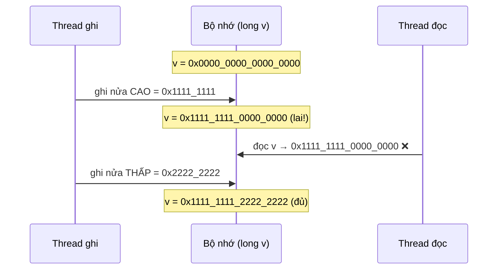
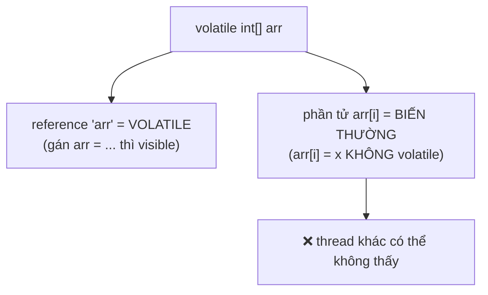

## Mục lục

- [Tổng quan](#tổng-quan)
- [1. Atomicity mặc định của JMM](#1-atomicity-mặc-định-của-jmm)
- [2. long & double: ngoại lệ 64-bit](#2-long--double-ngoại-lệ-64-bit)
- [3. Ví dụ: thấy giá trị "lai" của long](#3-ví-dụ-thấy-giá-trị-lai-của-long)
- [4. Cách sửa: volatile / Atomic](#4-cách-sửa-volatile--atomic)
- [5. Word tearing trên mảng byte/boolean](#5-word-tearing-trên-mảng-byteboolean)
- [6. Bẫy volatile array: chỉ reference là volatile](#6-bẫy-volatile-array-chỉ-reference-là-volatile)
- [7. Tổng kết bảng atomicity](#7-tổng-kết-bảng-atomicity)
- [Tài liệu tham khảo](#tài-liệu-tham-khảo)

---

## Tổng quan

Nhiều người tưởng "đọc/ghi một biến luôn nguyên tử". Điều đó **gần đúng** — trừ
hai cái bẫy mà JLS quy định rõ:

1. `long` và `double` (64-bit) **không** đảm bảo đọc/ghi nguyên tử nếu **không**
   `volatile` → có thể thấy giá trị "lai" nửa cũ nửa mới.
2. `volatile int[] arr` chỉ làm **reference** `arr` volatile, **không** làm các
   **phần tử** `arr[i]` volatile → phần tử vẫn là biến thường.

Cả hai đều khó gặp trên máy phổ biến (x86 64-bit) nhưng có thật trên một số JVM/
phần cứng, và là câu hỏi phỏng vấn kinh điển.

> [!NOTE]
> **Hình dung bằng đồng hồ cơ 2 kim chỉnh tay**: số `long` 64-bit như một đồng hồ
> hiện giờ-phút bằng **hai mặt số riêng** (hai nửa 32-bit). Khi chỉnh từ `09:59`
> sang `10:00`, bạn xoay mặt "giờ" rồi mới xoay mặt "phút". Nếu ai đó liếc nhìn
> **đúng lúc giữa hai thao tác**, họ thấy `10:59` — một giá trị **chưa từng tồn
> tại**. Đó chính là word tearing của `long` không volatile.

## 1. Atomicity mặc định của JMM

JLS 17.6 — *Atomicity*: với biến thường (không volatile), JMM đảm bảo **đọc và ghi
nguyên tử** cho mọi kiểu **trừ** `long` và `double`:

| Kiểu | Đọc/ghi nguyên tử khi KHÔNG volatile? |
|------|----------------------------------------|
| `boolean`, `byte`, `short`, `char`, `int` | ✅ Có |
| `float` | ✅ Có |
| **reference** (con trỏ object) | ✅ Có |
| **`long`** | ⚠️ **Không bắt buộc** (chỉ đảm bảo khi `volatile`) |
| **`double`** | ⚠️ **Không bắt buộc** (chỉ đảm bảo khi `volatile`) |

> [!IMPORTANT]
> "Nguyên tử" ở đây **chỉ** nói về việc *không thấy giá trị lai* của **một** thao
> tác đọc/ghi đơn lẻ. Nó **không** đảm bảo visibility (cần volatile) và **không**
> đảm bảo `x++` an toàn (đó là 3 thao tác — xem [Volatile](/jmm/05-volatile/)).

## 2. long & double: ngoại lệ 64-bit

Lý do lịch sử: trên CPU 32-bit, một biến 64-bit phải được đọc/ghi bằng **hai lệnh
32-bit**. JLS cho phép JVM tách `long`/`double` không volatile thành hai nửa, nên
một thread khác có thể quan sát **nửa cao của giá trị mới + nửa thấp của giá trị
cũ** (hoặc ngược lại).



> [!CAUTION]
> Trên x86-64 và đa số JVM hiện đại, ghi `long`/`double` thường **thực tế** nguyên
> tử (một lệnh 64-bit). Nhưng JMM **không hứa** điều đó — code dựa vào "thực tế
> chạy đúng" sẽ vỡ trên JVM 32-bit hoặc nền tảng khác. Luôn dựa vào **đặc tả**,
> không dựa vào quan sát.

## 3. Ví dụ: thấy giá trị "lai" của long

```java
public class WordTearingDemo {
    static long value = 0;   // KHÔNG volatile

    public static void main(String[] args) {
        // Writer luân phiên ghi hai mẫu bit "toàn 0" và "toàn 1"
        Thread writer = new Thread(() -> {
            for (;;) {
                value = 0x0000_0000_0000_0000L;
                value = 0xFFFF_FFFF_FFFF_FFFFL;
            }
        });
        Thread reader = new Thread(() -> {
            for (;;) {
                long v = value;
                // Hợp lệ chỉ có 0 hoặc -1 (toàn 1). Nếu thấy giá trị khác
                // => đã đọc trúng lúc bị xé nửa cao/nửa thấp.
                if (v != 0L && v != -1L) {
                    System.out.printf("Word tearing! v = 0x%016X%n", v);
                }
            }
        });
        writer.setDaemon(true);
        reader.start();
        writer.start();
    }
}
```

Trên JVM 32-bit cũ, chương trình này có thể in ra các giá trị lai như
`0x00000000FFFFFFFF` hoặc `0xFFFFFFFF00000000`. Trên x86-64 hiện đại thường không
thấy (ghi 64-bit nguyên tử trong thực tế) — nhưng đó là **may mắn của phần cứng**,
không phải đảm bảo của JMM.

## 4. Cách sửa: volatile / Atomic

Chỉ cần `volatile` là JMM **bắt buộc** đọc/ghi `long`/`double` nguyên tử (đồng
thời thêm visibility + ordering):

```java
static volatile long value = 0;   // ✅ đọc/ghi 64-bit nguyên tử + visible
```

Nếu cần thêm thao tác phức hợp (tăng, CAS) thì dùng atomic:

```java
import java.util.concurrent.atomic.AtomicLong;

AtomicLong counter = new AtomicLong();
counter.incrementAndGet();        // ✅ nguyên tử + visible + ordering
counter.addAndGet(10);
counter.compareAndSet(100, 200);
```

| Nhu cầu | Dùng |
|---------|------|
| Chỉ cần đọc/ghi `long` nguyên tử + visible | `volatile long` |
| Tăng/giảm/CAS trên `long` | `AtomicLong` / `LongAdder` |
| `double` chia sẻ | `volatile double`, hoặc `AtomicLong` + `Double.doubleToLongBits` |

## 5. Word tearing trên mảng byte/boolean

JLS 17.6 còn cấm một dạng tearing khác: ghi vào **một phần tử** mảng **không được**
làm hỏng phần tử kề bên. Ví dụ `boolean[]`/`byte[]` được đóng gói sát nhau trong
bộ nhớ, nhưng JVM **phải** đảm bảo ghi `arr[i]` không "đụng" `arr[i+1]`.

> [!NOTE]
> Đây là *bảo đảm* của JMM (no word tearing cho phần tử mảng riêng lẻ), khác với
> *false sharing* — false sharing không sai kết quả, chỉ chậm vì hai phần tử nằm
> chung cache line (xem [False Sharing](/jmm/13-false-sharing-padding/)).

## 6. Bẫy volatile array: chỉ reference là volatile

Đây là lỗi cực kỳ phổ biến:

```java
volatile int[] arr = new int[10];

// Thread A:
arr[5] = 42;        // ❌ ĐÂY LÀ GHI BIẾN THƯỜNG vào phần tử, KHÔNG volatile

// Thread B:
int v = arr[5];     // ❌ đọc biến thường — không đảm bảo thấy 42
```

`volatile` đứng trước `int[] arr` chỉ làm **bản thân reference `arr`** trở nên
volatile (gán `arr = newArray` mới có ngữ nghĩa volatile). Việc đọc/ghi **phần tử**
`arr[i]` vẫn là **truy cập biến thường** → không visibility, không ordering.



### Cách sửa đúng

```java
import java.util.concurrent.atomic.AtomicIntegerArray;
import java.lang.invoke.MethodHandles;
import java.lang.invoke.VarHandle;

// Cách 1: AtomicIntegerArray — mỗi phần tử có ngữ nghĩa volatile/atomic
AtomicIntegerArray arr = new AtomicIntegerArray(10);
arr.set(5, 42);             // ✅ volatile-set phần tử
int v = arr.get(5);         // ✅ volatile-get
arr.incrementAndGet(5);     // ✅ atomic RMW trên phần tử

// Cách 2: VarHandle cho mảng (Java 9+) — chọn access mode mỗi thao tác
VarHandle AH = MethodHandles.arrayElementVarHandle(int[].class);
int[] raw = new int[10];
AH.setVolatile(raw, 5, 42); // ✅ ghi phần tử với ngữ nghĩa volatile
int w = (int) AH.getVolatile(raw, 5);
```

> [!WARNING]
> Quy tắc nhớ đời: **`volatile` trên kiểu mảng/đối tượng chỉ bảo vệ con trỏ, không
> bảo vệ nội dung bên trong.** Muốn phần tử mảng có ngữ nghĩa đồng bộ → dùng
> `AtomicIntegerArray`/`AtomicLongArray`/`AtomicReferenceArray` hoặc `VarHandle`.

## 7. Tổng kết bảng atomicity

| Thao tác | Nguyên tử? | Visible giữa thread? |
|----------|-----------|----------------------|
| đọc/ghi `int`, `boolean`, ref (thường) | ✅ | ❌ (cần volatile) |
| đọc/ghi `long`/`double` (thường) | ⚠️ không bảo đảm | ❌ |
| đọc/ghi `long`/`double` (`volatile`) | ✅ | ✅ |
| `x++` (kể cả `volatile`) | ❌ (3 bước) | — |
| `arr[i] = x` với `volatile T[] arr` | ✅ (vì `int`) | ❌ phần tử không volatile |
| `AtomicIntegerArray.set/get(i)` | ✅ | ✅ |
| `AtomicLong.incrementAndGet()` | ✅ | ✅ |

## Tài liệu tham khảo

- [JLS 17.6 — Word Tearing](https://docs.oracle.com/javase/specs/jls/se21/html/jls-17.html#jls-17.6)
- [JLS 17.7 — Non-atomic Treatment of double and long](https://docs.oracle.com/javase/specs/jls/se21/html/jls-17.html#jls-17.7)
- [AtomicIntegerArray (Javadoc)](https://docs.oracle.com/en/java/javase/21/docs/api/java.base/java/util/concurrent/atomic/AtomicIntegerArray.html)
- Trước: [Sequential Consistency & SC-DRF](/jmm/17-sequential-consistency-drf/)
- Tiếp theo: [Out-of-thin-air & causality](/jmm/19-out-of-thin-air-causality/)
