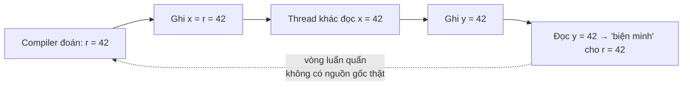
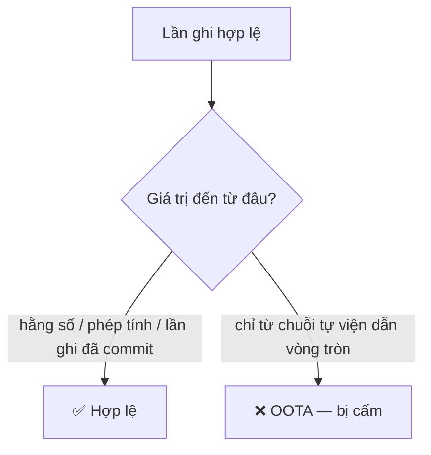

## Mục lục

- [Tổng quan](#tổng-quan)
- [1. Vấn đề: data race không chỉ "thấy giá trị cũ"](#1-vấn-đề-data-race-không-chỉ-thấy-giá-trị-cũ)
- [2. Out-of-thin-air là gì](#2-out-of-thin-air-là-gì)
- [3. Ví dụ kinh điển OOTA](#3-ví-dụ-kinh-điển-oota)
- [4. Vì sao OOTA nguy hiểm](#4-vì-sao-oota-nguy-hiểm)
- [5. JMM cấm OOTA bằng ràng buộc nhân quả](#5-jmm-cấm-oota-bằng-ràng-buộc-nhân-quả)
- [6. Ý nghĩa thực tế cho lập trình viên](#6-ý-nghĩa-thực-tế-cho-lập-trình-viên)
- [Tài liệu tham khảo](#tài-liệu-tham-khảo)

---

## Tổng quan

Bài [SC-DRF](/jmm/17-sequential-consistency-drf/) nói: chương trình **có** data
race thì JMM **không** đảm bảo SC. Nhưng "không SC" không có nghĩa là "hỗn loạn
hoàn toàn". JMM vẫn áp một **mức sàn** an toàn cho cả code có data race:

> [!IMPORTANT]
> JMM **cấm giá trị out-of-thin-air (OOTA)** — tức cấm một biến "tự nhiên xuất
> hiện" một giá trị mà **không lệnh ghi nào** trong chương trình tạo ra nó. Mọi
> giá trị quan sát được phải truy ngược được tới **một nguyên nhân thật**.

Đây là phần khó và hàn lâm nhất của JMM (phần "causality" trong JLS 17.4.8), nhưng
ý tưởng cốt lõi rất trực giác: **kết quả không được tự bịa ra từ hư không.**

## 1. Vấn đề: data race không chỉ "thấy giá trị cũ"

Khi có data race, ngoài "thấy giá trị cũ" (stale), về lý thuyết compiler còn được
phép **đoán trước** (speculation): thực thi sớm một nhánh giả định rồi quay lại
biện minh. Nếu không có ràng buộc, sự đoán trước này có thể tạo ra vòng luẩn quẩn
"giá trị tự xác nhận chính nó".



Giá trị `42` ở đây **không** đến từ một hằng số hay phép tính có thật — nó tự sinh
ra rồi tự chứng minh. Đó là OOTA.

## 2. Out-of-thin-air là gì

> **Out-of-thin-air (OOTA)**: một lần thực thi trong đó một biến nhận giá trị mà
> giá trị đó **chỉ** được "biện minh" bởi một chuỗi suy luận **vòng tròn**, không
> bắt nguồn từ bất kỳ lệnh ghi nào độc lập với chính nó.

> [!NOTE]
> **Hình dung bằng tin đồn tự xác nhận**: A nói "nghe đồn B trúng số" chỉ vì B
> nói "nghe đồn A bảo thế". Hỏi tới cùng thì **không ai** thật sự thấy tờ vé số —
> tin đồn tự nuôi nó. OOTA là phiên bản bộ nhớ của tin đồn tự xác nhận: giá trị
> tồn tại chỉ vì nó tự viện dẫn chính mình.

## 3. Ví dụ kinh điển OOTA

```java
// x = y = 0 ban đầu, KHÔNG đồng bộ (data race)
// Thread 1:               Thread 2:
//   r1 = x;                 r2 = y;
//   y = r1;                 x = r2;
//
// Câu hỏi: có thể kết thúc với r1 == r2 == 42 không?
```

Phân tích:

- `42` **không xuất hiện** trong code (chỉ có `0`, và phép gán chéo `x`↔`y`).
- Cách duy nhất để ra `42` là: T1 đoán `r1 = 42`, ghi `y = 42`; T2 đọc `y = 42`,
  ghi `x = 42`; rồi T1 đọc `x = 42` để "xác nhận" giả định ban đầu.
- Đây là **vòng tròn tự biện minh** → đúng định nghĩa OOTA.

> [!CAUTION]
> Nếu JMM **cho phép** kết quả này, lập trình viên sẽ không bao giờ suy luận được
> giới hạn giá trị của biến — bất kỳ số nào cũng có thể "bốc ra". JMM **cấm** kết
> quả `r1 == r2 == 42`: kết thúc hợp lệ duy nhất là `r1 == r2 == 0`.

## 4. Vì sao OOTA nguy hiểm

Nếu giá trị có thể tự sinh từ hư không, mọi bảo đảm an toàn sụp đổ:

- **Type safety / security**: một reference `Object` có thể "bốc" thành con trỏ
  rác → đọc bộ nhớ bậy bạ, phá sandbox bảo mật.
- **Bất biến (invariant)**: `int age` đáng lẽ luôn ≥ 0 có thể "tự thành" số âm
  điên rồ dù không code nào gán số đó.
- **Suy luận**: không thể chứng minh bất kỳ tính chất nào của chương trình.

Vì các hệ quả an toàn này, OOTA bị cấm **kể cả** cho chương trình có data race —
đây là điểm khác biệt với một số mô hình relaxed thuần lý thuyết.

## 5. JMM cấm OOTA bằng ràng buộc nhân quả

JLS 17.4.8 định nghĩa hành vi hợp lệ qua mô hình **commit dần dần** (committing
executions): một lần thực thi chỉ hợp lệ nếu có thể xây dựng nó bằng cách "commit"
từng thao tác, trong đó **mỗi lần ghi phải được justify bởi các thao tác đã commit
trước đó** — không cho phép biện minh vòng tròn.

Ý tưởng cốt lõi (đơn giản hóa):

1. Bắt đầu từ một lần thực thi SC "khởi tạo" (mọi đọc thấy giá trị mặc định/đã ghi
   thật).
2. Lần lượt commit thêm các thao tác; mỗi giá trị đọc được phải đến từ một lần ghi
   **đã commit** và **độc lập** với chính nó.
3. Không bước nào được dựa vào giả định về tương lai của chính nó.



> [!NOTE]
> Phần causality của JMM nổi tiếng là **khó** và thậm chí có những ca biên mà giới
> nghiên cứu còn tranh luận (xem các bài về "Java causality test cases"). May mắn,
> lập trình viên ứng dụng **không cần** nắm chi tiết hình thức — chỉ cần biết kết
> luận thực tế ở mục 6.

## 6. Ý nghĩa thực tế cho lập trình viên

Bạn gần như **không bao giờ** cần suy luận trực tiếp về OOTA, vì:

> [!IMPORTANT]
> - Nếu code **data-race-free** → [SC-DRF](/jmm/17-sequential-consistency-drf/)
>   bảo đảm SC, OOTA không thể xảy ra. **Đây là con đường nên đi.**
> - Nếu code **có data race** → JMM vẫn cấm OOTA, nên giá trị "rác hoàn toàn" không
>   xuất hiện; nhưng bạn vẫn có thể thấy giá trị **cũ/đảo thứ tự** khó lường. Đừng
>   dựa vào điều này — hãy sửa cho hết data race.

Kết luận hành động: **đừng cố khai thác "mức sàn OOTA" để viết code lock-free thủ
công không đồng bộ.** Hãy luôn đưa code về data-race-free bằng `volatile`, lock,
`final` + safe publication, hoặc công cụ j.u.c. OOTA chỉ là tấm lưới an toàn cuối
cùng của JMM, không phải công cụ để lập trình.

## Tài liệu tham khảo

- [JLS 17.4.8 — Executions and Causality Requirements](https://docs.oracle.com/javase/specs/jls/se21/html/jls-17.html#jls-17.4.8)
- [The Java Memory Model — Causality Test Cases](https://www.cs.umd.edu/~pugh/java/memoryModel/CausalityTestCases.html)
- [JSR-133 FAQ — Causality](https://www.cs.umd.edu/~pugh/java/memoryModel/jsr-133-faq.html)
- Trước: [Atomicity ẩn: long/double & word tearing](/jmm/18-long-double-word-tearing/)
- Tiếp theo: [VarHandle access modes & fences](/jmm/20-varhandle-access-modes-fences/)
