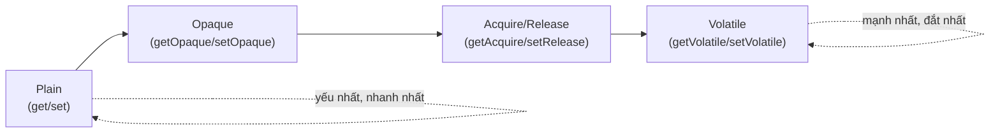

## Mục lục

- [Tổng quan](#tổng-quan)
- [1. Vì sao cần nhiều mức hơn volatile](#1-vì-sao-cần-nhiều-mức-hơn-volatile)
- [2. Bốn mức access mode](#2-bốn-mức-access-mode)
- [3. Bảng đối chiếu & khi nào dùng](#3-bảng-đối-chiếu--khi-nào-dùng)
- [4. Ví dụ từng mức](#4-ví-dụ-từng-mức)
- [5. Fence thủ công của VarHandle](#5-fence-thủ-công-của-varhandle)
- [6. Thread.onSpinWait — gợi ý cho spin-wait](#6-threadonspinwait--gợi-ý-cho-spin-wait)
- [7. Quy tắc dùng an toàn](#7-quy-tắc-dùng-an-toàn)
- [Tài liệu tham khảo](#tài-liệu-tham-khảo)

---

## Tổng quan

`volatile` chỉ cho bạn **một** mức đồng bộ: mạnh nhất (sequential consistency cho
biến đó). Nhưng đôi khi bạn cần **yếu hơn** để nhanh hơn, hoặc cần **release/acquire
một chiều** thay vì full barrier. `VarHandle` (Java 9+) mở ra **bốn mức** ngữ
nghĩa bộ nhớ — tương ứng gần đúng với `memory_order` của C++11.

> [!IMPORTANT]
> Đây là công cụ **chuyên gia** cho thư viện lock-free hiệu năng cao (giống code
> trong `java.util.concurrent`). Code ứng dụng thông thường **nên** dùng `volatile`,
> `Atomic*`, `Lock`. Dùng sai access mode → bug cực khó tái hiện.

> [!NOTE]
> **Hình dung bằng các cấp độ niêm phong bưu kiện**: Plain = gửi hàng không niêm
> phong (nhanh, không đảm bảo gì); Opaque = dán tem "đã đếm" (đảm bảo món hàng
> tồn tại & tiến triển, không ràng thứ tự với hàng khác); Acquire/Release = niêm
> phong một chiều (người nhận mở ra thấy đúng mọi thứ người gửi đã đóng *trước
> đó*); Volatile = niêm phong hai chiều toàn phần (thứ tự tổng thể với mọi bên).

## 1. Vì sao cần nhiều mức hơn volatile

`volatile` chèn full barrier (StoreLoad) — đắt nhất. Trong cấu trúc lock-free,
nhiều chỗ chỉ cần:

- **chỉ visibility, không ordering** (vd. cờ dừng vòng lặp) → Opaque đủ, rẻ hơn.
- **release khi publish + acquire khi đọc** (vd. publish node mới) → Acquire/Release
  rẻ hơn full volatile vì không cần StoreLoad.

Chọn đúng mức = đúng đắn + nhanh hơn. Đó là lý do j.u.c chuyển từ `Unsafe` sang
`VarHandle` access modes.

## 2. Bốn mức access mode

Từ **yếu → mạnh**:



- **Plain** — như biến thường: không atomic-ordering gì thêm, chỉ đảm bảo không
  "ngoài hư không". Tương đương đọc/ghi field bình thường.
- **Opaque** — đảm bảo **tính nguyên tử** và **tiến triển** (writes eventually
  visible, theo program order trên *cùng* biến) nhưng **không** sắp thứ tự với
  truy cập biến **khác**. Tương ứng `memory_order_relaxed` (C++).
- **Acquire/Release** — `setRelease` (release store) + `getAcquire` (acquire load)
  tạo cạnh HB một chiều: mọi thứ trước release sẽ visible cho ai acquire thấy giá
  trị đó. Không có StoreLoad đầy đủ. Tương ứng `memory_order_release/acquire`.
- **Volatile** — mạnh nhất: sequential consistency cho biến đó (full barrier),
  đúng bằng ngữ nghĩa từ khóa `volatile`. Tương ứng `memory_order_seq_cst`.

## 3. Bảng đối chiếu & khi nào dùng

| Mức | Phương thức VarHandle | Đảm bảo | C++11 tương đương | Khi nào dùng |
|-----|----------------------|---------|-------------------|--------------|
| Plain | `get` / `set` | Chỉ atomicity cơ bản (trừ long/double thường) | `relaxed` (gần) | Dữ liệu thread-confined, không chia sẻ |
| Opaque | `getOpaque` / `setOpaque` | Atomic + tiến triển, **không** ordering chéo biến | `memory_order_relaxed` | Cờ dừng đơn giản, counter thống kê gần đúng |
| Acquire/Release | `getAcquire` / `setRelease` | HB một chiều (publish/consume) | `acquire` / `release` | Publish object/node trong cấu trúc lock-free |
| Volatile | `getVolatile` / `setVolatile` | SC cho biến đó (full barrier) | `seq_cst` | Khi cần ngữ nghĩa `volatile` đầy đủ |

Ngoài ra có các biến thể CAS theo mức: `compareAndSet` (volatile),
`weakCompareAndSetPlain`, `compareAndExchangeAcquire`, `compareAndExchangeRelease`,
`getAndAddAcquire`...

> [!TIP]
> Quy tắc chọn nhanh: **mặc định dùng Volatile** (an toàn). Chỉ hạ xuống Acquire/
> Release hoặc Opaque khi (1) bạn đang viết cấu trúc lock-free, (2) đã đo thấy
> `volatile` là điểm nghẽn, và (3) chứng minh được mức yếu hơn vẫn đúng.

## 4. Ví dụ từng mức

```java
import java.lang.invoke.MethodHandles;
import java.lang.invoke.VarHandle;

class Node {
    int value;
    Object data;
    Node next;

    static final VarHandle NEXT;
    static final VarHandle VALUE;
    static {
        try {
            MethodHandles.Lookup l = MethodHandles.lookup();
            NEXT  = l.findVarHandle(Node.class, "next", Node.class);
            VALUE = l.findVarHandle(Node.class, "value", int.class);
        } catch (ReflectiveOperationException e) {
            throw new ExceptionInInitializerError(e);
        }
    }
}
```

```java
Node n = new Node();

// Plain — như field thường
NEXT.set(n, other);
Node a = (Node) NEXT.get(n);

// Opaque — chỉ cần "rồi sẽ thấy", không ràng thứ tự với biến khác
VALUE.setOpaque(n, 1);          // ví dụ: cờ tiến độ, counter thống kê
int v = (int) VALUE.getOpaque(n);

// Release/Acquire — publish an toàn không cần full volatile
n.data = buildData();           // (1) ghi nội dung trước
NEXT.setRelease(n, newNode);    // (2) release: ai acquire thấy newNode → thấy (1)
Node m = (Node) NEXT.getAcquire(n);  // acquire: nếu thấy newNode thì thấy data đã build

// Volatile — mạnh nhất, đúng bằng từ khóa volatile
VALUE.setVolatile(n, 42);
int w = (int) VALUE.getVolatile(n);

// CAS theo mức
boolean ok = NEXT.compareAndSet(n, expected, newNode);          // full (volatile)
Node prev = (Node) NEXT.compareAndExchangeRelease(n, exp, nn);  // release-CAS
```

> [!NOTE]
> Cặp `setRelease` ở (2) + `getAcquire` chính là phiên bản "tự tay" của cơ chế mà
> [final field & safe publication](/jmm/07-final-field-safe-publication/) và
> `volatile` làm tự động. Nó rẻ hơn full volatile vì bỏ được StoreLoad fence.

## 5. Fence thủ công của VarHandle

`VarHandle` cung cấp các fence tĩnh, ánh xạ thẳng tới 4 loại barrier ở bài
[Memory Barriers](/jmm/04-memory-barriers/):

```java
VarHandle.fullFence();        // ~ StoreLoad (mạnh nhất) — chặn mọi reorder qua đây
VarHandle.acquireFence();     // ~ LoadLoad + LoadStore — chặn load/store sau trôi lên
VarHandle.releaseFence();     // ~ LoadStore + StoreStore — chặn load/store trước trôi xuống
VarHandle.loadLoadFence();    // chỉ chặn Load↑Load
VarHandle.storeStoreFence();  // chỉ chặn Store↑Store
```

> [!CAUTION]
> Đây thay thế `sun.misc.Unsafe.*Fence()` cũ và là **API công khai** từ Java 9.
> Nhưng tự chèn fence rất dễ sai — quy tắc vàng vẫn là: **đừng tự chèn barrier;
> hãy dùng access mode cấp cao (`setRelease`/`getAcquire`) hoặc `volatile`.** Fence
> trần chỉ dành cho tác giả thư viện đồng thời.

## 6. Thread.onSpinWait — gợi ý cho spin-wait

Khi buộc phải **spin-wait** (vòng lặp chờ cờ), từ Java 9 hãy gọi
`Thread.onSpinWait()` trong thân vòng lặp:

```java
volatile boolean ready = false;

void awaitReady() {
    while (!ready) {
        Thread.onSpinWait();   // gợi ý cho CPU: "tôi đang bận chờ"
    }
    // ... tiếp tục khi ready == true
}
```

`onSpinWait()` phát ra chỉ thị gợi ý cho CPU (vd. `PAUSE` trên x86) giúp:

- giảm tiêu thụ điện và tài nguyên pipeline khi đang quay vòng,
- giảm hiện tượng *memory order violation* khi thoát vòng → thoát nhanh hơn,
- nhường tài nguyên cho hyper-thread cùng core.

> [!IMPORTANT]
> `onSpinWait()` **không** thay thế đồng bộ — cờ `ready` vẫn phải `volatile` (hoặc
> dùng VarHandle) để đảm bảo visibility. Nó chỉ là **gợi ý hiệu năng** cho vòng
> chờ ngắn. Chờ dài → dùng `wait/notify`, `Lock`/`Condition`, hoặc `BlockingQueue`
> thay vì spin (xem [HB trong j.u.c](/jmm/11-happens-before-juc/)).

## 7. Quy tắc dùng an toàn

> [!TIP]
> 1. **Mặc định: `volatile` / `Atomic*` / `Lock`.** Chỉ chạm VarHandle access mode
>    khi viết cấu trúc lock-free và đã đo thấy nghẽn.
> 2. **Chọn mức tối thiểu đủ đúng**, không "cho chắc" dùng Volatile mọi nơi nếu
>    Acquire/Release đã đủ (và ngược lại, đừng hạ mức nếu chưa chứng minh được).
> 3. **Release ghép với Acquire** trên cùng biến mới tạo HB — dùng lẻ một vế là vô
>    nghĩa.
> 4. **Đừng tự chèn `fullFence`** trừ khi bạn thật sự là tác giả thư viện đồng thời
>    và đã kiểm thử bằng [jcstress](/jmm/15-testing-concurrency/).

## Tài liệu tham khảo

- [VarHandle (Javadoc) — Access Modes](https://docs.oracle.com/en/java/javase/21/docs/api/java.base/java/lang/invoke/VarHandle.html)
- [JEP 193: Variable Handles](https://openjdk.org/jeps/193)
- [Thread.onSpinWait (Javadoc)](https://docs.oracle.com/en/java/javase/21/docs/api/java.base/java/lang/Thread.html#onSpinWait())
- [Doug Lea — Using JDK 9 Memory Order Modes](https://gee.cs.oswego.edu/dl/html/j9mm.html)
- Trước: [Out-of-thin-air & causality](/jmm/19-out-of-thin-air-causality/)
- Tiếp theo: [Lịch sử JSR-133 & so sánh C/C++11](/jmm/21-jsr133-history-cpp-comparison/)
