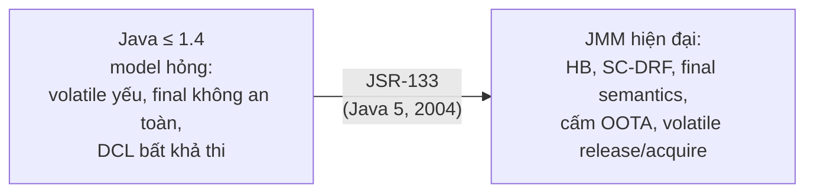

## Mục lục

- [Tổng quan](#tổng-quan)
- [1. Mô hình cũ (Java ≤ 1.4) và vì sao nó hỏng](#1-mô-hình-cũ-java--14-và-vì-sao-nó-hỏng)
- [2. JSR-133 (Java 5+) sửa những gì](#2-jsr-133-java-5-sửa-những-gì)
- [3. Bảng: trước vs sau JSR-133](#3-bảng-trước-vs-sau-jsr-133)
- [4. So sánh với memory model C/C++11](#4-so-sánh-với-memory-model-cc11)
- [5. Bảng ánh xạ Java ↔ C++11](#5-bảng-ánh-xạ-java--c11)
- [6. Bài học rút ra](#6-bài-học-rút-ra)
- [Tài liệu tham khảo](#tài-liệu-tham-khảo)

---

## Tổng quan

JMM mà các bài trước mô tả là **JSR-133**, có từ **Java 5 (2004)**. Trước đó Java
có một mô hình bộ nhớ **hỏng**: `volatile` yếu, `final` không an toàn, và DCL
không thể sửa đúng. Hiểu lịch sử này giúp bạn biết **vì sao** các quy tắc hiện
tại tồn tại, và vì sao "code Java cũ trên mạng" có thể sai.

> [!NOTE]
> Nếu chỉ cần dùng JMM thực tế, bạn có thể bỏ qua bài này. Nhưng nó trả lời hai
> câu hỏi hay gặp: *"vì sao trước kia DCL không sửa được?"* và *"JMM khác C++ thế
> nào?"*.

## 1. Mô hình cũ (Java ≤ 1.4) và vì sao nó hỏng

Mô hình bộ nhớ trong JLS phiên bản đầu (Chapter 17 cũ) có nhiều khiếm khuyết
nghiêm trọng:

- **`volatile` quá yếu**: ghi `volatile` **không** đảm bảo flush các biến thường
  ghi trước đó; đọc `volatile` không cấm reorder với biến thường. → không thể
  dùng `volatile` để publish object an toàn.
- **`final` không bất biến**: một thread khác có thể thấy `final` field ở **giá
  trị mặc định** (0/null) **trước** khi constructor set xong → object "immutable"
  vẫn có thể thay đổi quan sát được. `String` (dựa trên `final char[]`) về lý
  thuyết không an toàn.
- **DCL bất khả thi**: [Double-Checked Locking](/jmm/12-double-checked-locking/)
  **không** thể sửa đúng kể cả khi thêm `volatile`, vì `volatile` cũ không tạo HB
  đủ mạnh.
- **Reorder không có ràng buộc nhân quả rõ**: cho phép nhiều kết quả "kỳ quặc",
  không bảo đảm cấm out-of-thin-air một cách hình thức.

> [!CAUTION]
> Đây là lý do nhiều bài blog/sách Java **trước 2004** dạy sai (vd. "DCL không cần
> volatile", "volatile chỉ để tắt cache"). Luôn kiểm tra tài liệu có theo JSR-133
> hay không.

## 2. JSR-133 (Java 5+) sửa những gì

JSR-133 (do Bill Pugh, Doug Lea, Sarita Adve... soạn) viết lại hoàn toàn Chapter
17 dựa trên nền tảng **happens-before** và **SC-DRF**:

- **`volatile` mạnh lên**: ghi `volatile` = **release** (flush mọi ghi trước),
  đọc `volatile` = **acquire** (thấy mọi thứ trước lần ghi đó). Tạo cạnh HB thật.
- **Final Field Semantics**: object được publish đúng cách thì `final` field
  **đảm bảo** visible với giá trị đã set trong constructor, **không cần** đồng bộ
  thêm (xem [Final Field](/jmm/07-final-field-safe-publication/)). Đây là cái làm
  `String` thật sự an toàn.
- **DCL sửa được**: chỉ cần đánh dấu field `volatile` là DCL đúng.
- **Ràng buộc nhân quả hình thức**: cấm out-of-thin-air (xem
  [OOTA](/jmm/19-out-of-thin-air-causality/)).
- **Mô hình HB + SC-DRF**: cho lập trình viên một hợp đồng rõ ràng để suy luận.

## 3. Bảng: trước vs sau JSR-133

| Khía cạnh | Java ≤ 1.4 (cũ) | Java 5+ (JSR-133) |
|-----------|------------------|--------------------|
| Ghi `volatile` flush biến thường? | ❌ Không | ✅ Có (release) |
| Đọc `volatile` cấm reorder biến thường sau? | ❌ Không | ✅ Có (acquire) |
| `final` đảm bảo visible sau publish? | ❌ Không | ✅ Có (final field semantics) |
| DCL sửa được bằng `volatile`? | ❌ Không | ✅ Có |
| Cấm out-of-thin-air hình thức? | ❌ Mơ hồ | ✅ Có (causality) |
| Nền tảng lý thuyết | không rõ ràng | happens-before + SC-DRF |

## 4. So sánh với memory model C/C++11

Java đi **trước** C/C++ về memory model chuẩn hóa: JSR-133 (2004) ra trước C++11
(2011). Cả hai dùng chung nền tảng "happens-before / synchronizes-with" và "DRF →
SC", nhưng khác biệt quan trọng:

- **C/C++11 cho chọn `memory_order` mỗi thao tác** (`relaxed`, `acquire`, `release`,
  `acq_rel`, `seq_cst`). Java cổ điển chỉ có `volatile` = mạnh nhất; mãi tới Java 9
  `VarHandle` mới cho các mức tương tự (xem
  [VarHandle access modes](/jmm/20-varhandle-access-modes-fences/)).
- **Data race là Undefined Behavior trong C/C++** → có thể crash, format ổ cứng,
  bất cứ gì. Trong **Java**, data race **không** phải UB: vẫn type-safe, vẫn cấm
  OOTA, chỉ cho kết quả khó lường trong phạm vi an toàn. Đây là khác biệt **rất
  lớn** do Java cần đảm bảo an toàn cho sandbox/bảo mật.
- **`volatile` nghĩa khác nhau**: trong C/C++, `volatile` chỉ chống tối ưu compiler
  (cho MMIO/signal), **không** đảm bảo đồng bộ đa luồng. Trong Java, `volatile`
  **là** công cụ đồng bộ. Đừng nhầm hai khái niệm cùng tên này.

> [!WARNING]
> Lập trình viên đến từ C/C++ hay mắc hai lỗi: (1) tưởng `volatile` Java cũng "chỉ
> chống tối ưu" (sai — nó đồng bộ); (2) tưởng data race Java là UB như C++ (sai —
> Java an toàn hơn nhưng vẫn cho kết quả sai logic).

## 5. Bảng ánh xạ Java ↔ C++11

| Ý niệm | Java | C++11 |
|--------|------|-------|
| Mạnh nhất (SC) | `volatile`, `VarHandle.getVolatile/setVolatile` | `memory_order_seq_cst` |
| Release store | `VarHandle.setRelease` | `memory_order_release` |
| Acquire load | `VarHandle.getAcquire` | `memory_order_acquire` |
| Relaxed (atomic, không ordering) | `VarHandle.getOpaque/setOpaque` | `memory_order_relaxed` |
| Full barrier thủ công | `VarHandle.fullFence()` | `std::atomic_thread_fence(seq_cst)` |
| CAS | `compareAndSet`, `AtomicReference.compareAndSet` | `std::atomic::compare_exchange_*` |
| Hành vi khi có data race | type-safe, cấm OOTA, kết quả khó lường | **Undefined Behavior** |
| `volatile` từ khóa | công cụ đồng bộ (release/acquire) | chỉ chống tối ưu, **không** đồng bộ |

## 6. Bài học rút ra

> [!IMPORTANT]
> 1. Mọi quy tắc trong blog này là **JSR-133 (Java 5+)** — đừng tin tài liệu Java
>    trước 2004 về `volatile`/`final`/DCL.
> 2. `final` an toàn và DCL-with-volatile đúng **chỉ vì** JSR-133; chúng từng bất
>    khả thi.
> 3. Đừng mang trực giác `volatile` của C/C++ sang Java (và ngược lại) — cùng tên,
>    khác nghĩa.
> 4. Data race trong Java **không** crash như C++, nhưng vẫn là **bug** cần loại
>    bỏ — đừng dựa vào "Java an toàn hơn" để bỏ qua đồng bộ.

## Tài liệu tham khảo

- [JSR-133: Java Memory Model and Thread Specification](https://jcp.org/en/jsr/detail?id=133)
- [JSR-133 FAQ — Bill Pugh](https://www.cs.umd.edu/~pugh/java/memoryModel/jsr-133-faq.html)
- [The Java Memory Model — Pugh et al. (POPL 2005)](https://www.cs.umd.edu/users/jmanson/java/journal.pdf)
- [C++ memory_order (cppreference)](https://en.cppreference.com/w/cpp/atomic/memory_order)
- Trước: [VarHandle access modes & fences](/jmm/20-varhandle-access-modes-fences/)
- Tiếp theo: [reachabilityFence, Cleaner & ordering GC](/jmm/22-reachability-fence-gc-ordering/)
