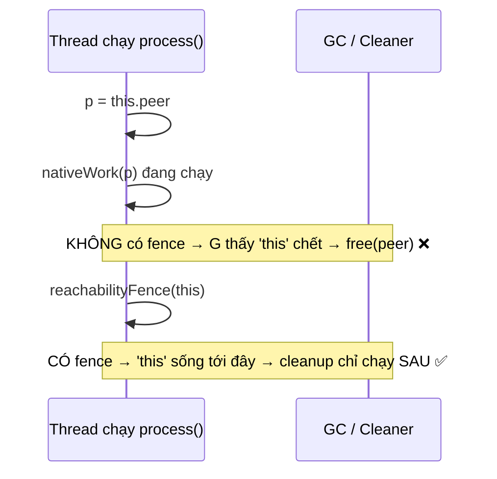

## Mục lục

- [Tổng quan](#tổng-quan)
- [1. Vấn đề: GC thu hồi object "vẫn đang dùng"](#1-vấn-đề-gc-thu-hồi-object-vẫn-đang-dùng)
- [2. Vì sao điều này xảy ra](#2-vì-sao-điều-này-xảy-ra)
- [3. Reference.reachabilityFence](#3-referencereachabilityfence)
- [4. Ví dụ với tài nguyên native](#4-ví-dụ-với-tài-nguyên-native)
- [5. Cleaner thay cho finalize()](#5-cleaner-thay-cho-finalize)
- [6. Quy tắc thực tế](#6-quy-tắc-thực-tế)
- [Tài liệu tham khảo](#tài-liệu-tham-khảo)

---

## Tổng quan

Đây là góc **niche nhưng hiểm** của mô hình bộ nhớ + GC: một object có thể bị
**garbage collector thu hồi và chạy cleanup** **trong khi** một method của chính
nó vẫn đang thực thi — nếu sau thời điểm đó nó không còn được tham chiếu. Hệ quả:
giải phóng tài nguyên native quá sớm → crash JVM, dùng con trỏ đã free.

`Reference.reachabilityFence` (Java 9+) là công cụ để chặn điều này.

> [!NOTE]
> **Hình dung bằng việc dọn bàn khi khách còn ăn**: GC giống nhân viên dọn dẹp
> "thấy đĩa nào không còn ai *cầm đũa gắp* thì bưng đi". Nếu bạn đã gắp xong miếng
> cuối nhưng **vẫn đang nhai** (JNI đang dùng buffer của object), nhân viên có thể
> bưng đĩa đi mất. `reachabilityFence(đĩa)` nghĩa là "giữ đĩa trên bàn **tới tận
> đây** đã, đừng bưng sớm".

## 1. Vấn đề: GC thu hồi object "vẫn đang dùng"

JVM xác định object "sống" dựa trên **reachability** (còn ai trỏ tới không), không
phải "method của nó còn chạy không". Trình tối ưu có thể nhận ra một biến/`this`
**không còn được dùng về sau** và coi object là rác **ngay giữa chừng** method.

```java
class NativeBuffer {
    private long peer;            // con trỏ tới bộ nhớ native

    void process() {
        long p = this.peer;       // đọc con trỏ vào biến cục bộ
        // SAU dòng này, 'this' có thể không còn reachable!
        // GC có thể chạy cleanup → free(peer) trong khi nativeWork đang chạy:
        nativeWork(p);            // ❌ p có thể đã bị free → crash
    }
    native void nativeWork(long ptr);
}
```

Sau khi `p = this.peer`, nếu không gì khác giữ `this`, JIT/GC có thể xem object là
không reachable, chạy `Cleaner`/`finalize` → `free(peer)` **trước/đang khi**
`nativeWork(p)` chạy → con trỏ treo.

## 2. Vì sao điều này xảy ra

- GC dựa vào **reachability analysis**, có thể coi object chết ngay khi không còn
  tham chiếu mạnh — kể cả khi luồng đang ở giữa một method của object đó.
- JIT có thể **rút ngắn vòng đời** `this`: nếu phần còn lại của method không đụng
  `this`, nó "buông" sớm.
- `Cleaner`/`finalize()` chạy trên **thread khác**, không có HB với method đang
  chạy → vừa là vấn đề ordering vừa là vấn đề thời điểm.

> [!CAUTION]
> Đây không phải lỗi lý thuyết suông: các API như `DirectByteBuffer`, JNI wrapper,
> `sun.misc.Unsafe` cấp phát native từng dính. Nó hiếm vì cần đúng lúc GC chạy +
> JIT đã tối ưu, nên cực khó tái hiện.

## 3. Reference.reachabilityFence

`Reference.reachabilityFence(obj)` đảm bảo `obj` được coi là **reachable** (không
bị GC thu hồi) **cho tới ít nhất** điểm gọi fence. Nó không sinh lệnh máy thật
(no-op runtime) nhưng **chặn** JIT/GC rút ngắn vòng đời object qua điểm đó.

```java
import java.lang.ref.Reference;

void process() {
    long p = this.peer;
    try {
        nativeWork(p);
    } finally {
        Reference.reachabilityFence(this);  // ✅ giữ 'this' sống tới đây
    }
}
```

Đặt fence **sau** đoạn dùng tài nguyên (thường trong `finally`) → object không thể
bị cleanup trước khi `nativeWork` xong.



## 4. Ví dụ với tài nguyên native

```java
import java.lang.ref.Cleaner;
import java.lang.ref.Reference;

class FileHandle implements AutoCloseable {
    private static final Cleaner CLEANER = Cleaner.create();
    private final long fd;                 // file descriptor native
    private final Cleaner.Cleanable cleanable;

    FileHandle(long fd) {
        this.fd = fd;
        // Cleaner state KHÔNG được giữ reference tới FileHandle (tránh rò rỉ)
        long captured = fd;
        this.cleanable = CLEANER.register(this, () -> closeNative(captured));
    }

    void write(byte[] data) {
        try {
            writeNative(fd, data);
        } finally {
            Reference.reachabilityFence(this);  // ✅ chặn close sớm khi đang write
        }
    }

    @Override public void close() { cleanable.clean(); }

    static native void writeNative(long fd, byte[] data);
    static native void closeNative(long fd);
}
```

> [!WARNING]
> Lambda đăng ký với `Cleaner` **không được** giữ reference tới object đang theo
> dõi (`this`), nếu không object **không bao giờ** thành rác → Cleaner không bao
> giờ chạy. Vì vậy ví dụ trên *capture* `fd` (một `long`), **không** capture `this`.

## 5. Cleaner thay cho finalize()

`finalize()` đã **deprecated** (JDK 9) và bị loại bỏ dần — nó chậm, không xác
định, có thể "hồi sinh" object, và gây nhiều bug ordering. Thay bằng:

| Cách | Khi nào dùng |
|------|--------------|
| `AutoCloseable` + try-with-resources | **Ưu tiên số 1** — giải phóng tất định, ngay khi hết scope |
| `java.lang.ref.Cleaner` | Lưới an toàn (safety net) khi quên `close()`, cho tài nguyên native |
| `finalize()` | ❌ Không dùng — deprecated, sẽ bị xóa |

```java
// Cách tốt nhất: tất định, không phụ thuộc GC
try (FileHandle fh = new FileHandle(openNative("a.txt"))) {
    fh.write(data);
}   // close() gọi ngay tại đây — không chờ GC, không cần reachabilityFence cho path này
```

> [!TIP]
> Dùng try-with-resources thì tài nguyên đóng **tất định** ngay khi hết khối → tự
> nhiên tránh được vấn đề thu hồi sớm. `Cleaner` + `reachabilityFence` chỉ là lưới
> an toàn cho trường hợp caller quên `close()`.

## 6. Quy tắc thực tế

> [!IMPORTANT]
> 1. **99% code không cần** `reachabilityFence` — nó chỉ liên quan khi bạn ôm tài
>    nguyên **native** (con trỏ off-heap, JNI, `Unsafe`, `DirectByteBuffer`).
> 2. Ưu tiên **`AutoCloseable` + try-with-resources** cho giải phóng tất định;
>    dùng **`Cleaner`** làm lưới an toàn, **không** dùng `finalize()`.
> 3. Khi truyền con trỏ native rút từ một object Java vào lệnh gọi native, bọc
>    `Reference.reachabilityFence(object)` trong `finally` để chặn thu hồi sớm.
> 4. Đăng ký `Cleaner` **không** được capture object đang theo dõi — chỉ capture
>    state cần để dọn (vd. fd, con trỏ).

## Tài liệu tham khảo

- [Reference.reachabilityFence (Javadoc)](https://docs.oracle.com/en/java/javase/21/docs/api/java.base/java/lang/ref/Reference.html#reachabilityFence(java.lang.Object))
- [java.lang.ref.Cleaner (Javadoc)](https://docs.oracle.com/en/java/javase/21/docs/api/java.base/java/lang/ref/Cleaner.html)
- [JEP 421: Deprecate Finalization for Removal](https://openjdk.org/jeps/421)
- Trước: [Lịch sử JSR-133 & so sánh C/C++11](/jmm/21-jsr133-history-cpp-comparison/)
- Quay lại: [Tổng quan JMM](/jmm/01-tong-quan/)
